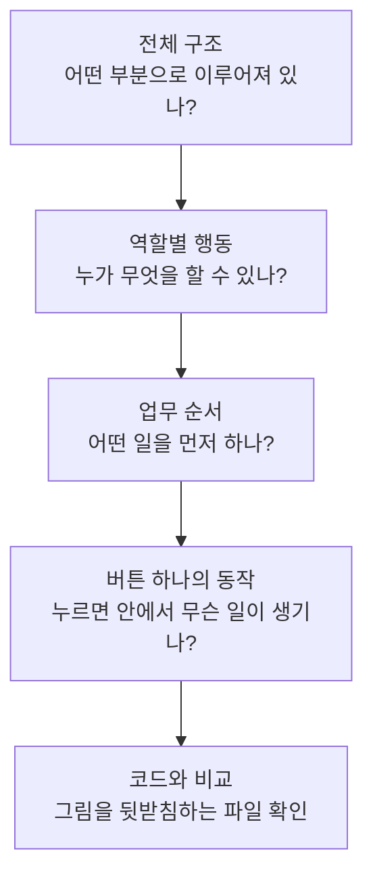

# /archify 목적별 사용 매뉴얼

## 먼저 읽는 용어 정리

처음 보는 말이 많아도 외울 필요는 없습니다. **‘학교 축제 공지 게시판을 AI와 함께 만든다’**고 생각하며 읽어보세요. 선생님은 공지를 올리고, 학생은 휴대폰으로 공지를 읽는 작은 사이트입니다. 아래 설명은 모두 이 예시로 이어집니다.

### 1. 에이전트 — 부탁을 받고 실제로 작업하는 AI

일반적인 질문에서는 AI가 설명을 답해 줍니다. 에이전트는 사용할 수 있는 도구와 권한이 있다면 **파일을 읽고, 코드를 고치고, 제대로 작동하는지 검사하는 작업**까지 할 수 있습니다.

학교 축제 준비로 비유하면, ‘포스터 만드는 법’을 알려주는 데서 그치지 않고 자료를 찾아 포스터 초안을 만들고 오탈자도 확인하는 조원과 비슷합니다.

예를 들어 ‘공지 제목을 안 쓰고 저장하면 안내 문구가 나오게 해줘’라고 부탁하면, 에이전트는 관련 코드를 찾아 수정하고 빈 제목으로 저장했을 때의 결과를 확인할 수 있습니다. 다만 일을 맡겼다고 언제나 맞게 끝내는 것은 아닙니다. **무엇을 바꿨고 어떻게 확인했는지** 결과를 봐야 합니다.

### 2. 스킬 — 특정 일을 할 때 따라 읽는 작업 안내서

스킬은 에이전트에게 **‘이 종류의 일은 이런 순서로 처리하자’**고 알려주는 안내서입니다. 안내 문장뿐 아니라 예시나 일을 돕는 작은 프로그램이 함께 들어 있기도 합니다.

축제 포스터를 만든다고 해 봅시다. ‘행사 이름 확인 → 날짜 확인 → 초안 작성 → 오탈자 검사’라는 안내서가 있으면 중요한 일을 빠뜨릴 가능성이 줄어듭니다. 스킬도 이런 역할을 합니다.

이 문서의 `/grill-with-docs`는 ‘필요한 질문을 하고, 용어의 뜻과 중요한 결정 이유를 기록하라’는 안내를 따르게 합니다. `/archify`는 시스템의 연결이나 일의 순서를 그림으로 설명할 때 쓰는 안내서입니다.

**스킬을 설치하는 것과 일을 실행하는 것은 다릅니다.** 요리책을 책장에 넣었다고 음식이 완성되지는 않죠. 설치한 뒤 실제 작업을 요청해야 합니다. 앞의 `/`가 붙은 이름은 이 가이드에서 스킬을 불러 쓰는 표시입니다.

### 3. 하네스 — AI가 일할 수 있도록 도구를 갖춘 작업 공간

AI가 답을 생각하더라도 파일을 읽거나 프로그램을 실행하려면 그런 일을 할 수 있는 환경이 필요합니다. 그 환경을 하네스라고 부릅니다.

요리 수업에 비유하면 **에이전트는 요리하는 조원, 스킬은 조리법, 하네스는 조리 도구가 있는 실습실**입니다. 조리법에 ‘오븐에 굽기’가 있어도 실습실에 오븐이 없으면 그대로 할 수 없습니다.

같은 스킬을 사용해도 실행 환경에 따라 쓸 수 있는 도구나 허용된 작업이 다를 수 있습니다. 그래서 안내서에 적힌 일을 실제로 수행할 수 있는지도 확인합니다.

### 4. 서브 에이전트 — 일을 나눠 맡은 다른 AI 조원

주 에이전트가 전체 작업을 진행하면서 **일부를 따로 맡기는 에이전트**입니다. 주 에이전트가 조장이라면 서브 에이전트는 분담한 일을 하는 조원입니다.

예를 들어 주 에이전트가 사용자와 공지 작성 규칙을 정하는 동안, 서브 에이전트에게 ‘지금 코드에서 누가 공지를 삭제할 수 있는지 조사해 줘’라고 맡길 수 있습니다. 조사 결과를 받은 주 에이전트가 전체 논의에 반영합니다.

여럿이 나눠서 할 수 있는 일에는 도움이 됩니다. 하지만 앞사람의 답이 나와야 시작할 수 있는 일을 무조건 동시에 시키면 진행하기 어렵습니다. 일을 나누고 결과를 모으는 데도 시간이 듭니다.

**스킬을 한 번 부를 때마다 서브 에이전트가 자동으로 생기는 것은 아닙니다.** 스킬의 지침, 사용자의 요청, 실행 환경에 따라 달라집니다.

### 5. 세션 — 하나의 맥락으로 작업을 이어가는 대화 구간

이 가이드에서 세션은 **AI와 한 작업의 이야기를 이어가는 한 차례의 대화·작업 구간**을 말합니다. 내가 메시지를 한 번 보냈다고 세션 하나가 끝나는 것은 아닙니다. 질문과 답을 여러 번 주고받을 수 있습니다.

조별 과제 회의를 떠올려 보세요. 한 번 모여서 ‘누가 공지를 쓸 수 있는가’를 여러 질문으로 정리할 수 있습니다. 나중에 다시 모여 지난 회의록을 읽고 ‘삭제한 공지를 복구할 것인가’를 논의할 수도 있습니다.

‘여러 세션에 걸친 작업’이라는 말은 이렇게 **한 번의 작업 구간에서 끝내기 어려워, 기록을 바탕으로 이어서 진행하는 작업**이라는 뜻입니다. 도구마다 세션을 구분하는 방식은 다를 수 있으므로 ‘한 시간’이나 ‘메시지 열 번’처럼 고정된 크기를 뜻하지는 않습니다.

### 6. 토큰 — AI가 글을 읽고 쓸 때 사용하는 작은 조각

AI 모델은 글을 처리할 때 문장을 작은 조각들로 나눕니다. 이 조각을 토큰이라고 부릅니다. 우리가 ‘몇 글자 썼는가’를 세듯, 모델이 처리하는 양을 설명할 때는 토큰 수를 사용합니다.

예를 들어 공지 한 줄보다 공지 수백 개와 긴 프로그램 코드를 함께 읽을 때 처리할 토큰이 많아집니다. AI가 길게 답을 쓸 때도 토큰을 사용합니다.

단, **토큰 하나가 한글 한 글자나 단어 하나와 꼭 같지는 않습니다.** 어떤 말은 한 조각으로, 어떤 말은 여러 조각으로 나뉠 수 있고 모델에 따라서도 달라집니다. 따라서 글자 수만 보고 정확한 토큰 수를 계산하면 안 됩니다.

‘한 세션에 담기에는 토큰이 너무 많다’는 말은 대략 ‘이번 작업에서 한꺼번에 읽고 참고해야 할 내용이 너무 많다’는 뜻으로 이해하면 됩니다. 토큰 자체가 분·초 같은 시간 단위인 것은 아닙니다.

### 7. 컨텍스트 — AI가 지금 답할 때 펼쳐 보는 자료

컨텍스트는 **AI가 이번 응답을 만들 때 참고하는 내용**입니다. 작업 지침, 지금까지의 대화 내용, 읽어 온 파일, 도구로 확인한 결과 등이 들어갈 수 있습니다.

시험 문제를 풀 때 책상 위에 펼쳐 둔 문제지와 참고 자료를 생각하면 쉽습니다. 도서관에 책이 아무리 많아도 책상에 가져오지 않은 책의 내용을 바로 참고할 수는 없겠죠.

우리 게시판 작업에서는 ‘선생님만 공지를 작성한다’는 합의와 방금 읽은 로그인 코드가 참고 자료가 됩니다. **프로젝트 폴더에 파일이 있다고 해서 그 내용 전체가 항상 컨텍스트에 들어 있는 것은 아닙니다.** 필요한 파일을 찾아 읽는 과정이 필요합니다.

### 8. 컨텍스트 용량 — 한 번에 펼쳐 놓고 다룰 수 있는 자료의 한도

컨텍스트가 책상 위 자료라면 컨텍스트 용량은 **책상에 한 번에 올려놓고 다룰 수 있는 양**과 비슷합니다. 모델이 한 번에 처리할 수 있는 내용에는 한도가 있고, 이를 토큰 수로 설명합니다.

대화가 길어지고 읽은 코드가 많아지면 모든 내용을 그대로 계속 참고하기 어려워집니다. 그래서 중요한 결정을 문서에 남기고, 이후 작업에서는 필요한 부분을 다시 읽습니다. 요약을 사용해 이어가는 환경도 있습니다.

다만 요약에는 세부사항이 빠질 수 있습니다. ‘지난번에 얘기했으니 다 알겠지’라고 기대하기보다, **어떤 문서의 어느 결정을 이어서 작업할지** 알려주면 좋습니다. 자료를 문서로 보관하는 것과 그 자료가 지금 컨텍스트에 들어 있는 것은 별개입니다.

### 9. 결정 지도 — ‘무엇부터 정해야 하지?’를 정리한 지도

학교 축제 공지 게시판에서 다음 질문이 나왔다고 해 봅시다.

- 누가 공지를 올릴 수 있지?
- 학생도 글을 올린다면 선생님의 승인을 받아야 할까?
- 승인을 받는다면 승인 전 글은 누구에게 보일까?

두 번째와 세 번째 질문은 앞의 선택에 따라 필요 여부나 답이 달라집니다. **결정 지도는 이런 질문들과 먼저 정해야 할 관계를 정리한 것**입니다. ‘의존 관계’라는 어려운 말도 여기서는 ‘이 답이 나와야 저 질문을 제대로 논의할 수 있다’는 뜻입니다.

Wayfinder에서는 전체를 안내하는 지도와 각각의 질문을 작업 관리 도구에 기록합니다. 이미 정한 것, 아직 정하지 않은 것, 앞으로 더 알아봐야 할 것을 여러 세션에서 이어서 볼 수 있게 합니다.

질문 몇 개를 한 번에 정할 수 있다면 큰 지도가 필요하지 않을 수 있습니다. 반대로 권한·결제·기존 데이터 이전을 여러 차례 논의해야 한다면 도움이 됩니다.

**건물 배치도 같은 시스템 구조 그림과도 다릅니다.** ‘화면이 서버에 요청하고 서버가 DB를 읽는다’는 것은 구조 설명입니다. ‘어떤 사용자가 어떤 자료를 읽을 수 있도록 할까?’는 결정할 질문입니다.

### 10. 결정 티켓 — 답을 정해야 끝나는 질문 카드

티켓은 여기서 입장권이 아니라 **질문이나 할 일을 적어 관리하는 카드 한 장**이라고 생각하면 됩니다. 결정 티켓에는 해결할 질문을 적습니다.

예를 들어 ‘학생도 공지를 삭제할 수 있게 할까?’가 결정 티켓입니다. 담당자와 논의해 ‘학생은 삭제할 수 없고 선생님만 삭제한다’고 정하고 이유를 기록하면 그 질문을 해결한 것입니다.

코드를 작성하지 않아도 결정 티켓은 끝날 수 있습니다. 이 티켓의 목표는 **무엇을 만들지 판단하는 데 필요한 답을 얻는 것**이기 때문입니다. 실제 코드에서 확인할 사실은 조사하고, 운영자가 선택해야 할 정책은 그 사람의 답을 받아야 합니다.

### 11. 구현 티켓 — 정한 동작을 실제로 만드는 작업 카드

구현은 **정한 내용을 코드로 만들어 실제로 작동하게 하는 일**입니다. 구현 티켓에는 만들 동작과 완료를 확인할 조건을 적습니다.

앞에서 ‘선생님만 공지를 삭제한다’고 정했다면, 구현 티켓은 ‘선생님에게 삭제를 허용하고 학생의 삭제 요청을 차단한다’가 될 수 있습니다. 버튼을 숨기는 것뿐 아니라 서버에서도 학생의 삭제 요청을 막는지 확인해야 합니다.

| 질문 | 어떤 티켓인가요? | 언제 끝나나요? |
| --- | --- | --- |
| 학생도 공지를 삭제할 수 있게 할까? | 결정 티켓 | 허용 여부와 이유를 합의하고 기록했을 때 |
| 선생님만 삭제할 수 있게 만들자 | 구현 티켓 | 코드를 만들고 선생님은 성공·학생은 차단되는지 확인했을 때 |

이 차이를 놓치면 ‘회의에서 정했다’를 ‘기능을 다 만들었다’로 착각하게 됩니다.

### 12. 이슈 트래커 — 질문 카드와 작업 카드를 모아 두는 관리판

‘할 일 / 진행 중 / 완료’ 칸이 있는 교실 게시판을 떠올려 보세요. 해야 할 일을 포스트잇에 적고 진행 상태에 따라 옮길 수 있습니다. 이슈 트래커는 이런 관리를 컴퓨터에서 하는 도구나 방식입니다.

어떤 질문이 남았는지, 누가 맡았는지, 무엇이 끝났는지, 어떤 작업을 먼저 끝내야 하는지 기록합니다. 여기서 ‘이슈’는 오류만 뜻하지 않습니다. 새 기능 요청이나 결정할 질문도 들어갈 수 있습니다.

이 가이드에서는 프로젝트 설정에 따라 GitHub 이슈를 쓰거나, 컴퓨터의 Markdown 파일로 관리할 수 있습니다. **Markdown은 제목·목록 등을 간단한 기호로 적는 문서 형식**이며 보통 파일 이름 끝에 `.md`가 붙습니다.

### 13. 기획문서 — ‘이런 것을 만들고 싶다’를 설명한 자료

기획문서는 **누가 왜 이 제품을 쓰고, 어떤 기능과 화면이 필요한지** 설명한 자료입니다. 글로 된 문서일 수도 있고 화면 그림이나 표가 함께 있을 수도 있습니다.

게시판 기획서에는 ‘선생님은 공지를 올린다’, ‘학생은 공지를 읽는다’, ‘제목과 내용을 입력하는 화면이 있다’고 적혀 있을 수 있습니다.

하지만 제목을 비워도 되는지, 인터넷이 끊겨 저장에 실패하면 어떻게 하는지까지 모두 적혀 있다는 보장은 없습니다. 그래서 **문서를 읽은 뒤 빠진 조건과 서로 맞지 않는 내용을 확인**합니다. 그렇다고 모든 기획문서가 불완전한 것은 아닙니다. 이미 충분히 자세하다면 같은 질문을 다시 할 필요는 없습니다.

### 14. 명세 — ‘이렇게 동작하면 된다’를 구체적으로 합의한 기준

명세는 만들 동작과 완료 기준을 자세히 정리한 문서입니다. 만들 사람과 확인할 사람이 같은 결과를 떠올릴 수 있도록 씁니다.

기획문서에 ‘공지 등록 기능’이라고 적혀 있다면, 논의 후 명세에는 다음과 같은 기준을 적을 수 있습니다.

- 선생님으로 로그인한 사람만 등록할 수 있다.
- 제목은 앞뒤 공백을 뺀 뒤 1자 이상 100자 이하여야 한다.
- 저장에 실패하면 이유를 보여주고 작성한 내용은 지우지 않는다.
- 저장에 성공하면 등록한 공지의 상세 화면을 보여준다.

이렇게 쓰면 개발자도 무엇을 만들지 알 수 있고, 확인하는 사람도 어떤 경우를 검사할지 알 수 있습니다. **기획문서라는 이름이면 무조건 모호하고 명세라는 이름이면 무조건 정확한 것은 아닙니다.** 실제 내용이 충분히 합의되고 구체적인지가 중요합니다.

### 15. CONTEXT.md — 우리 프로젝트에서 쓰는 말의 사전

같은 말을 서로 다르게 이해하면 프로그램도 엉뚱하게 만들 수 있습니다. ‘관리자’가 선생님 전체를 뜻하는지, 학교에서 지정한 한 사람만 뜻하는지부터 맞춰야 합니다.

`CONTEXT.md`는 이런 **업무 용어의 뜻을 모아 놓는 파일**입니다. 예를 들어 ‘작성자: 해당 공지를 처음 등록한 사람’이라고 적어 놓으면 이후에도 같은 뜻으로 사용할 수 있습니다.

앞에서 설명한 컨텍스트와 이름이 비슷하지만 구분하세요. **컨텍스트는 AI가 지금 참고하는 자료 전체를 뜻하고, `CONTEXT.md`는 프로젝트 용어를 적은 특정 파일**입니다. 이 파일에 개발 계획이나 모든 대화 기록을 몰아넣는 것은 아닙니다.

### 16. ADR — 중요한 선택을 왜 했는지 적은 기록

프로젝트를 만들다 보면 여러 방법 중 하나를 골라야 합니다. 나중에 다른 사람이 ‘왜 이렇게 만들었지?’라고 물었을 때 이유를 알 수 있도록 남기는 기록이 ADR입니다. 영어 이름은 Architecture Decision Record이며, 설계 결정 기록이라고 이해하면 됩니다.

예를 들어 학교 공용 계정 하나를 함께 쓸지, 선생님마다 계정을 만들지 고민했다고 해 봅시다. ‘누가 공지를 수정했는지 확인해야 하므로 개인별 계정을 사용한다’고 선택했다면, 검토한 다른 방법과 선택 이유를 남길 수 있습니다.

사소한 선택마다 작성할 필요는 없습니다. 이 가이드에서 사용하는 스킬은 **나중에 바꾸기 어렵고, 이유를 모르면 이해하기 어렵고, 실제로 다른 대안과 비교해 선택한 결정**일 때 ADR을 제안합니다. ‘버튼의 글자를 한 글자 줄였다’까지 모두 기록하라는 뜻은 아닙니다.

### 17. 워크플로우 — 지금 상황에 맞게 일을 이어 가는 순서

워크플로우는 여러 작업을 어떤 순서로 이어서 할지 정한 흐름입니다. 축제 준비에서 ‘할 일 정하기 → 역할 나누기 → 준비하기 → 최종 확인하기’처럼 생각하면 됩니다.

기획문서를 받아 게시판을 만들 때는 다음 흐름을 사용할 수 있습니다.

**기획문서 읽기 → 빠진 조건 질문하기 → 명세 정리 → 구현 티켓 나누기 → 만들기 → 제대로 되는지 확인하기**

반면 이미 있는 버튼의 글자만 바꾼다면 짧게 확인하고 수정하면 될 수 있습니다. 모든 일에 같은 긴 절차가 필요한 것은 아닙니다. 뒤의 ‘자주 사용되는 워크플로우 10개’는 지금 상황에 맞는 출발점을 고르는 예시입니다.

### 18. 트리아지(triage) — 들어온 요청을 살펴보고 다음 할 일을 정하기

게시판을 공개했더니 세 가지 요청이 들어왔다고 해 봅시다. ‘로그인이 안 돼요’, ‘공지 검색을 넣어 주세요’, ‘휴대폰에서 제목이 잘려요’. 모두 개발할 일처럼 보이지만 필요한 대응은 다릅니다.

**트리아지는 요청이 어떤 종류인지 확인하고, 정보가 충분한지 살펴보고, 다음에 누가 무엇을 해야 하는지 정리하는 일**입니다. 학교 건의함을 열어 고장 신고와 새 물품 요청을 나누고, 설명이 부족한 쪽지에는 추가 확인을 하는 것과 비슷합니다.

| 들어온 요청 | 먼저 확인할 것 | 트리아지 후의 예 |
| --- | --- | --- |
| 로그인이 안 돼요 | 언제, 어떤 기기에서, 무슨 오류가 나오는가? | 정보가 부족하므로 추가 설명을 기다림 |
| 공지 검색을 넣어 주세요 | 제목만 검색할지, 본문도 검색할지 정했는가? | 필요한 동작을 합의한 뒤 구현할 수 있는 요청으로 정리 |
| 휴대폰에서 제목이 잘려요 | 같은 조건에서 실제로 잘리는가? | 재현 결과와 수정 범위를 적어 개발할 준비 완료 |

‘급한 순서로 줄 세우기’만 뜻하지는 않습니다. 실제 문제인지 확인하고, 중복이나 범위 밖 요청을 살피고, 담당자가 실행할 수 있도록 설명을 보완하는 것도 포함합니다. **분류를 마쳤다고 고장까지 고친 것은 아닙니다.**

이 가이드의 `/triage`는 이런 작업을 돕는 스킬입니다. 예를 들어 `needs-info`는 ‘정보를 더 기다리는 중’, `ready-for-agent`는 ‘에이전트가 작업을 시작할 만큼 준비됨’이라는 상태입니다. `ready`는 준비됐다는 뜻이지 완료됐다는 뜻이 아닙니다. 실제 상태 이름은 프로젝트 설정에 따라 달라질 수 있습니다.

### 19. 그릴링(grilling) — 애매한 계획을 질문으로 분명하게 만들기

‘질문으로 꼼꼼하게 따져 본다’고 이해하면 됩니다. 사람을 혼내거나 무조건 반대하는 일이 아닙니다. **같은 설명을 듣고 서로 다른 기능을 떠올리는 일을 줄이려는 대화**입니다.

‘선생님이 공지를 관리해요’라는 말만으로는 부족할 수 있습니다. 모든 선생님이 남의 글도 수정할 수 있는지, 작성한 선생님만 수정하는지, 삭제하면 복구할 수 있는지 질문합니다. 답에 따라 다음 질문이 달라집니다.

코드를 읽으면 알 수 있는 사실은 에이전트가 조사하고, ‘앞으로 어떤 규칙을 쓸 것인가’는 결정할 사람과 합의합니다. `/grill-with-docs`는 이 질문 과정에 용어와 중요한 결정의 기록을 함께 연결합니다.

### 20. 리서치(research) — 모르는 사실을 근거를 찾아 확인하기

‘우리 학교 계정으로 외부 로그인 서비스를 연결할 수 있을까?’처럼 **선택하기 전에 알아야 하는 사실을 조사하는 일**입니다. 공식 설명서와 관련 자료를 찾아 출처와 확인 결과를 남깁니다.

수학여행을 준비할 때 박물관 운영 시간과 단체 입장 조건을 알아보는 일에 비유할 수 있습니다. 그 정보를 조사하는 것과 ‘우리 반은 어느 박물관에 갈까’를 결정하는 것은 다른 일입니다.

개발에서도 ‘이 서비스가 파일 20MB 업로드를 지원하는가’는 조사할 사실이고, ‘우리는 파일 크기를 몇 MB로 제한할까’는 선택할 정책입니다. 문서에 지원한다고 적혀 있는 것과 우리 프로그램에 연결해 직접 성공을 확인한 것도 구분합니다.

### 21. 프로토타입(prototype) — 결정에 도움을 주는 시험용 모형

처음부터 완성품을 만들기 전에 **궁금한 점 하나를 확인하려고 작게 만든 시제품**입니다. 축제 부스 전체를 짓기 전에 종이로 배치를 만들어 사람이 지나가기 편한지 보는 것과 비슷합니다.

공지 목록을 표로 보여줄지 카드로 보여줄지 고민한다면 같은 글을 두 모양으로 만들어 휴대폰에서 비교할 수 있습니다. ‘읽기 편한 쪽은 무엇인가?’라는 질문에 답하면 실험의 목적을 달성한 것입니다.

버튼을 누를 수 있어도 실제 저장이나 로그인은 연결되지 않았을 수 있습니다. **시제품이 그럴듯하게 보인다는 이유로 제품이 완성됐다고 판단하지 않습니다.** 무엇을 확인했고 무엇은 시험하지 않았는지 함께 기록합니다.

### 22. 디버깅(debugging) — 고장이 생기는 이유를 찾아 고치기

버그는 프로그램이 기대한 대로 움직이지 않는 문제입니다. 디버깅은 그 문제를 확인하고 원인을 좁혀 수정하는 과정입니다.

‘공지 저장을 누르면 가끔 실패한다’면 실패한 요청, 입력 내용, 오류 기록을 살펴봅니다. 특정 조건에서 다시 실패하게 만드는 것을 **재현**이라고 합니다. 예를 들어 ‘제목이 101자일 때만 실패한다’를 확인하면 원인을 찾을 범위가 줄어듭니다.

**로그**는 프로그램이 실행 중 남긴 기록입니다. 자전거가 어디서 덜컹거리는지 살피듯 로그와 코드로 원인을 찾고, 수정한 뒤 같은 조건에서 문제가 사라졌는지 확인합니다. 오류 문구 하나만 보고 원인을 바로 확정하지 않습니다.

### 23. 테스트 — 기대한 결과가 나오는지 검사하기

테스트는 조건을 정해 프로그램을 실행하고 **실제 결과가 기대한 결과와 같은지 확인하는 일**입니다. 사람이 직접 할 수도 있고 프로그램으로 자동 검사할 수도 있습니다.

‘제목은 100자까지 허용한다’면 100자는 저장되고 101자는 거부되는지 확인합니다. ‘선생님만 삭제 가능’이라면 선생님의 삭제 성공뿐 아니라 학생의 삭제 실패도 확인합니다.

고친 버그가 다시 나타나지 않는지 검사하는 테스트를 **회귀 테스트**라고 합니다. 다만 테스트가 통과했다는 것은 검사한 조건에서 통과했다는 뜻입니다. 세상의 모든 입력과 모든 기기에서 절대 고장 나지 않는다는 보장은 아닙니다.

### 24. 리팩터링(refactoring) — 겉으로 하는 일은 유지하며 내부를 정리하기

책가방 안의 준비물을 용도별로 다시 넣는다고 해 봅시다. 준비물 자체는 같지만 찾기 쉬워집니다. 리팩터링도 **사용자가 기대하는 동작을 유지하면서 코드의 내부 구조를 개선하는 작업**입니다.

제목 길이 규칙이 여러 파일에 복사돼 있어 바꿀 때마다 놓친다면, 책임을 정리해 변경을 쉽게 만들 수 있습니다. 정리 전후에 같은 입력이 같은 결과를 내는지 확인합니다.

검색 기능이 없던 게시판에 검색을 추가하는 것은 새 기능 개발입니다. 검색 결과는 그대로 유지하면서 내부 코드를 이해하기 쉽게 바꾸는 것이 리팩터링입니다. 실제 작업에 두 종류가 함께 포함될 수 있으므로 무엇을 바꾸는지 구분해 설명합니다.

### 25. 저장소(repository)와 브랜치(branch) — 프로젝트 기록과 작업의 갈래

**저장소는 프로젝트 파일과 변경 이력을 관리하는 곳**입니다. Git이라는 도구로 내 컴퓨터에서 관리할 수 있고, GitHub 같은 서비스에 원격 저장소를 둘 수도 있습니다. Git과 GitHub는 같은 이름의 도구가 아닙니다.

브랜치는 같은 프로젝트에서 작업을 별도로 이어 가는 갈래입니다. 학교 신문 원고를 유지하면서 ‘축제 특집을 넣는 안’을 따로 발전시키는 것과 비슷합니다. 검토가 끝나면 그 변경을 기준 갈래에 합칠 수 있습니다.

이 가이드에서 자주 보는 `main`은 기준으로 쓰는 브랜치 이름입니다. 브랜치를 만들었다고 새 폴더나 새 에이전트가 자동으로 생기는 것은 아닙니다.

### 26. 워크트리(worktree) — 같은 저장소의 다른 작업을 펼쳐 놓는 별도 폴더

한 책상에서는 원래 게시판을 유지하고, 다른 책상에서는 새 화면을 시험하고 싶을 수 있습니다. Git의 워크트리는 **같은 저장소의 이력을 공유하면서 별도 폴더에서 작업할 수 있게 하는 기능**입니다. 보통 서로 다른 브랜치를 각 폴더에서 작업합니다.

브랜치가 ‘작업 이력의 갈래’라면 워크트리는 ‘그 작업 파일을 실제로 펼쳐 놓은 자리’입니다. 서브 에이전트마다 별도 워크트리를 쓰면 같은 파일을 동시에 고치는 충돌을 줄이는 데 도움이 됩니다.

다만 폴더가 분리됐다고 모든 것이 분리되는 것은 아닙니다. 같은 데이터베이스나 같은 서버 포트를 사용하면 서로 영향을 줄 수 있습니다. 워크트리를 지우는 것과 실행 중인 서버를 종료하는 것도 별개입니다.

### 27. 커밋(commit)과 푸시(push) — 내 변경 기록 남기기와 원격에 보내기

**커밋은 선택한 파일 변경을 Git 이력에 기록하는 일**입니다. ‘제목 길이 검사를 추가했다’는 설명과 함께 나중에 비교할 수 있는 변경 기록을 남깁니다. 파일을 편집기에서 저장하는 것만으로 커밋이 생기지는 않습니다.

**푸시는 내 컴퓨터의 커밋을 원격 저장소로 보내는 일**입니다. 과제 수정본을 내 컴퓨터에 기록해 두는 것과 반 공용 보관함에 올리는 차이로 생각하면 됩니다.

따라서 ‘커밋 완료’라고 해도 GitHub에는 아직 안 올라갔을 수 있습니다. 반대로 ‘푸시 완료’라고 해서 운영 사이트까지 새 버전으로 바뀌었다고 단정할 수도 없습니다. 배포가 별도로 필요하거나 자동 배포가 실패했을 수 있습니다.

### 28. PR과 머지(merge) — 변경을 검토해 달라는 요청과 합치기

PR은 Pull Request의 줄임말로, 보통 **‘이 브랜치의 변경을 확인하고 다른 브랜치에 합쳐 주세요’라는 검토 요청**입니다. 무엇을 고쳤고 어떻게 검사했는지 다른 사람이 볼 수 있습니다.

머지는 두 갈래의 변경을 합치는 일입니다. PR을 만들어도 바로 머지되는 것은 아닙니다. 검토 의견에 따라 수정하거나, 합치지 않기로 할 수도 있습니다. PR 없이 머지를 하는 경우도 있습니다.

두 사람이 같은 부분을 다르게 고쳤다면 어떻게 합칠지 판단해야 할 수 있습니다. 이를 **충돌**이라고 부릅니다. 나중에 저장한 사람이 무조건 이기는 것으로 처리하면 필요한 변경이 사라질 수 있습니다.

### 29. 빌드(build)와 배포(deploy) — 실행할 결과물 준비와 서비스에 반영하기

빌드는 코드를 실행하거나 배포할 수 있는 형태로 준비하는 과정입니다. 프로젝트에 따라 코드 변환, 파일 묶기 같은 작업이 포함됩니다. 배포는 그 결과물을 실제 실행 환경에 반영하는 일입니다.

축제 공연에 비유하면 빌드는 공연에 쓸 영상 파일을 만드는 과정이고, 배포는 공연장의 재생 장치에 옮겨 사용하는 과정입니다. 영상 파일이 만들어졌어도 공연장에서는 이전 영상이 재생되고 있을 수 있습니다.

**빌드 성공, 배포 명령 성공, 사용자가 보는 기능의 정상 동작은 각각 확인할 내용이 다릅니다.** 실제 서비스가 실행되는지, 새 버전인지, 공지를 저장하고 다시 읽을 수 있는지까지 필요한 범위에서 확인해야 합니다.

### 30. CI/CD — 검사와 배포를 정해 둔 절차로 자동 실행하기

코드를 바꿀 때마다 사람이 검사 명령을 빠뜨리지 않도록, 미리 정한 검사를 자동 실행하게 할 수 있습니다. CI는 변경을 자주 합치면서 빌드와 테스트 등으로 문제를 확인하는 방식입니다.

CD는 검사한 변경을 배포 가능한 상태로 준비하거나 실제 배포까지 이어 가는 방식입니다. **최종 배포 전에 사람의 승인을 받을지, 자동으로 배포할지는 프로젝트 설정에 따라 다릅니다.**

이 가이드에서 사용하는 GitHub Actions는 이런 자동 절차를 실행하는 데 쓸 수 있는 도구입니다. ‘푸시하면 검사를 돌리고, 통과하면 배포한다’처럼 정할 수 있습니다. 자동화가 있다고 모든 오류를 잡는 것은 아니며, 무엇을 검사하도록 설정했는지 살펴야 합니다.

### 31. 메인 에이전트(main agent) — 사용자 요청을 중심에서 맡아 진행하는 AI

이 문서에서 **메인 에이전트와 주 에이전트는 같은 뜻**입니다. 사용자의 요청을 받아 전체 작업을 진행하고, 필요하면 일부 일을 서브 에이전트에게 맡기고, 결과를 모아 설명하는 역할입니다.

학교 조별 과제라면 조장에 비유할 수 있습니다. 조장은 친구들에게 자료 조사를 나눠 맡길 수도 있지만, 직접 조사하고 발표 자료를 만들 수도 있습니다. 메인 에이전트도 모든 일을 남에게 맡기기만 하는 것은 아닙니다.

예를 들어 ‘공지 삭제 기능을 고쳐줘’라는 요청을 받으면 메인 에이전트가 수정 범위를 파악합니다. 필요하다면 서브 에이전트에게 기존 권한 검사를 조사하게 하고, 자신은 관련 코드를 확인하며 수정합니다. 돌아온 조사 결과를 검토해 반영하고 무엇을 고쳤는지 사용자에게 보고합니다.

**‘메인’은 이 작업에서 맡은 역할을 뜻합니다.** 서브 에이전트보다 반드시 더 똑똑한 모델이라는 뜻은 아닙니다. 서브 에이전트 없이 혼자 작업을 끝낼 수도 있습니다. 어느 에이전트가 메인인지는 어떤 작업을 기준으로 부르는지에 따라 달라집니다.

### 헷갈리는 개념 비교 — 같은 이야기 속에서 구분하기

#### 에이전트와 세션: ‘일하는 주체’와 ‘작업을 이어가는 구간’

에이전트는 **누가 일하는가**, 세션은 **어떤 대화·실행 맥락에서 작업을 이어가는가**에 대한 말입니다. 사람과 회의의 차이를 생각하면 쉽습니다. 조원 한 명과 회의 한 번은 같은 단위가 아닙니다.

| 구분 | 에이전트 | 세션 |
| --- | --- | --- |
| 중심 질문 | 누가 이 일을 맡았나? | 어떤 작업 맥락을 이어가고 있나? |
| 학교 비유 | 자료를 조사하는 조원 | 그 자료를 가지고 이야기하는 한 차례의 회의 |
| 게시판 예 | 기존 삭제 권한을 조사하는 AI | 공지 삭제 정책을 질문하고 합의하는 대화 구간 |
| 새로 만들면 | 일을 맡길 별도 주체를 두는 것 | 작업할 별도 대화·실행 맥락을 시작하는 것 |

한 에이전트가 같은 세션에서 질문을 받고 코드를 읽고 여러 차례 답할 수 있습니다. 주 에이전트가 일을 나누면 서브 에이전트도 별도 작업 맥락에서 조사할 수 있습니다. **새 세션을 열었다고 이전 내용을 모두 아는 조원이 한 명 더 생겼다고 생각하면 안 됩니다.** 무엇을 이어받는지는 실행 환경에 따라 다르며, 필요한 문서와 결정을 전달해야 합니다.

#### 세션 vs 메인 에이전트: ‘회의 한 차례’와 ‘그 회의를 진행하는 조장’

둘은 같은 종류의 대상을 부르는 말이 아닙니다. **세션은 작업을 이어가는 대화·실행 구간이고, 메인 에이전트는 그 작업을 중심에서 맡는 AI**입니다. ‘회의가 자료를 조사한다’고 말하지 않는 것처럼, 세션 자체가 코드를 고치는 주체는 아닙니다.

| 비교할 점 | 세션 | 메인 에이전트 |
| --- | --- | --- |
| 무엇을 가리키나요? | 작업을 이어가는 대화·실행 구간 | 사용자 요청을 중심에서 처리하는 역할의 AI |
| 학교 비유 | 축제 준비 회의 한 차례 | 회의를 진행하고 일을 모으는 조장 |
| 무엇이 이어지나요? | 질문·답변·도구 사용 등 작업의 흐름 | 자료 확인·수정·일 분담·결과 검토 등의 활동 |
| 서브 에이전트와의 관계 | 분담된 작업은 환경에 따라 별도 작업 맥락에서 진행될 수 있음 | 필요한 일을 맡기고 결과를 받아 검토함 |
| 끝났다는 말의 뜻 | 해당 대화·실행 구간이 끝남 | 맡은 작업의 진행이나 응답을 마침. 무엇이 완료됐는지는 보고 내용으로 확인 |

**예를 들어 이렇게 진행됩니다.** 사용자가 ‘학생은 공지를 삭제하지 못하게 해줘’라고 요청합니다. 메인 에이전트는 현재 코드를 읽고 ‘선생님은 다른 선생님의 공지도 삭제할 수 있나요?’라고 질문합니다. 사용자가 답하면 수정하고 검사합니다. 이 질문·답변·작업을 이어가는 구간을 세션이라고 설명할 수 있습니다.

그동안 메인 에이전트가 서브 에이전트에게 테스트 조사만 맡길 수도 있습니다. 그렇다고 ‘메인 세션이 서브 에이전트로 바뀌었다’고 표현하지 않습니다. **일을 맡는 주체와 작업이 이어지는 구간을 구분**해야 합니다.

‘새 세션에서 계속하자’는 말은 새 작업 맥락에서 이어가자는 뜻입니다. 이전 대화 전체나 다른 에이전트의 조사 내용이 자동으로 전달된다고 가정하면 안 됩니다. 실행 환경의 지원 범위를 확인하고, 필요한 결정 문서와 진행 상황을 읽어 이어갑니다.

#### 메인 에이전트 vs 서브 에이전트: ‘전체 요청 담당’과 ‘나눠 맡은 부분 담당’

| 비교할 점 | 메인 에이전트 | 서브 에이전트 |
| --- | --- | --- |
| 주로 맡는 범위 | 사용자 요청 전체의 진행과 결과 정리 | 분담받은 구체적인 조사·검토·구현 등 |
| 게시판 예 | 삭제 정책 확인 → 수정 → 검사 → 사용자 보고 | 기존 코드에서 삭제 권한이 검사되는 위치 조사 |
| 결과를 다루는 방식 | 여러 결과를 검토해 전체 작업에 반영 | 맡은 작업의 결과와 한계를 전달 |
| 반드시 필요한가요? | 이 가이드에서 중심 담당을 가리키는 이름 | 분담할 필요가 없으면 만들지 않아도 됨 |

서브 에이전트가 ‘조사를 마쳤다’고 해도 전체 기능이 완성된 것은 아닙니다. 메인 에이전트가 결과를 검토하고 필요한 수정과 검증을 마쳐야 할 수 있습니다. 또한 역할이 다르다고 파일·도구·자원이 항상 완전히 분리되는 것은 아닙니다. 함께 쓰는 파일이 있다면 작업 범위를 조정해야 합니다.

#### 세션·컨텍스트·토큰: ‘회의’와 ‘펼친 자료’와 ‘자료를 세는 단위’

| 용어 | 학교 비유 | 헷갈리기 쉬운 점 |
| --- | --- | --- |
| 세션 | 회의를 이어가는 한 구간 | 메시지 한 번이나 고정된 시간과 같지 않음 |
| 컨텍스트 | 지금 회의에서 펼쳐 보는 자료 | 폴더에 저장된 모든 자료가 자동으로 들어오지는 않음 |
| 토큰 | 자료의 양을 세는 작은 조각 단위 | 글자 수·단어 수·작업 시간과 같지 않음 |
| 컨텍스트 용량 | 한 번에 다룰 수 있는 자료의 한도 | 저장소에 보관할 수 있는 파일 용량과 다름 |

같은 세션에서도 새 코드를 읽거나 이전 내용을 요약하면 참고하는 자료가 달라질 수 있습니다. 대화를 계속 열어 두었다는 사실만으로 처음부터 끝까지 모든 세부사항을 똑같이 참고한다고 보장할 수는 없습니다.

#### 스킬·서브 에이전트·워크플로우: ‘안내서’와 ‘조원’과 ‘일의 순서’

‘리서치 스킬을 써라’는 **어떤 안내를 따라 조사할지**를 지정합니다. ‘서브 에이전트에게 조사를 맡겨라’는 **누구에게 일을 나눌지**를 지정합니다. ‘조사 후 질문하고 구현하자’는 **어떤 순서로 진행할지**를 지정합니다.

셋은 함께 쓸 수 있습니다. 예를 들어 서브 에이전트가 리서치 스킬에 따라 서비스 제약을 조사하고, 주 에이전트가 그 결과로 사용자와 정책을 정하는 워크플로우를 만들 수 있습니다. 스킬 수와 에이전트 수가 같은 것은 아닙니다.

#### 트리아지·그릴링·디버깅: 지금 막힌 이유에 따라 고르기

| 지금 상황 | 먼저 필요한 일 | 적합한 개념 |
| --- | --- | --- |
| 서로 다른 사용자 요청이 잔뜩 쌓였다 | 요청의 종류·정보·처리 준비 상태 확인 | 트리아지 |
| ‘관리자는 모든 것을 할 수 있다’가 구체적으로 무슨 뜻인지 모르겠다 | 허용할 행동과 예외를 질문해 합의 | 그릴링 |
| 어제 되던 공지 저장이 오늘 실패한다 | 같은 실패를 재현하고 원인 확인 | 디버깅 |

서로 완전히 분리된 작업은 아닙니다. 트리아지 중 정보가 충분한 버그를 발견하면 디버깅으로 이어가고, 새 기능의 조건이 모호하면 그릴링으로 이어갈 수 있습니다. 모든 요청을 접수하자마자 구현하는 것이 트리아지는 아닙니다.

#### 그릴링과 Wayfinder: ‘질문으로 결정하기’와 ‘큰 결정을 여러 세션에서 관리하기’

그릴링도 질문의 선후관계를 따져 진행합니다. 그래서 ‘질문 순서를 정하려면 무조건 Wayfinder가 필요하다’는 설명은 맞지 않습니다.

공지 삭제 규칙 몇 가지를 정한다면 그릴링과 기록으로 충분할 수 있습니다. 반면 계정·권한·결제·데이터 이전의 결정을 여러 세션에서 이어가야 한다면 Wayfinder로 미결정 질문과 해결 기록을 관리할 수 있습니다. **큰 코드베이스에서도 작은 변경이면 그릴링부터 시작해도 됩니다.**

#### 프로토타입과 구현: ‘답을 얻기 위한 모형’과 ‘사용할 기능 만들기’

프로토타입의 완료 기준은 ‘표와 카드 중 무엇이 읽기 좋은지 판단했다’처럼 실험 질문에 답하는 것입니다. 구현의 완료 기준은 ‘선택한 목록이 실제 데이터를 읽고 권한·오류 조건까지 만족한다’처럼 합의한 동작을 제공하는 것입니다.

프로토타입 코드를 활용할 수는 있지만, 그대로 운영에 써도 되는지는 별도 검토가 필요합니다. 시제품을 만들었다는 말만 듣고 실제 저장 기능까지 완성됐다고 생각하지 않습니다.

#### 기획문서·명세·티켓·ADR: 어떤 내용을 어디서 찾을까?

| 알고 싶은 것 | 주로 찾아볼 자료 | 게시판 예 |
| --- | --- | --- |
| 왜 만들고 누가 사용하는가? | 기획문서 | 학생이 축제 공지를 쉽게 확인하도록 만든다 |
| 정확히 어떻게 동작해야 하는가? | 명세 | 제목은 1–100자, 등록 실패 시 입력을 보존한다 |
| 무엇을 먼저 결정해야 하는가? | 결정 지도·결정 티켓 | 학생에게 작성 권한을 줄 것인가? |
| 이번에 무엇을 만들고 검사할 것인가? | 구현 티켓 | 선생님 공지 등록 기능과 권한 검사 |
| 이 단어가 여기서 무슨 뜻인가? | CONTEXT.md | ‘작성자’는 처음 등록한 사람이다 |
| 왜 이 방법을 선택했는가? | ADR | 수정한 사람을 구분하기 위해 개인 계정을 쓴다 |

문서끼리 내용이 겹칠 수는 있습니다. 하지만 질문에 대한 답이 어디에 있는지 연결해 두면 같은 설명을 매번 처음부터 찾거나 서로 다르게 고치는 일을 줄일 수 있습니다.

#### 저장·커밋·푸시·머지·배포: ‘완료’가 어디까지인가?

| 들은 말 | 확인된 단계 | 아직 별도로 확인할 것 |
| --- | --- | --- |
| 파일 저장했어요 | 편집한 내용이 파일에 기록됨 | Git 변경 이력에 남겼는가? |
| 커밋했어요 | 선택한 변경을 Git 이력에 기록함 | 원격 저장소에 보냈는가? |
| 푸시했어요 | 커밋을 원격 저장소로 보냄 | 원하는 브랜치에 반영됐는가? 배포됐는가? |
| PR 만들었어요 | 변경을 검토할 요청을 만듦 | 검토·머지가 끝났는가? |
| 머지했어요 | 변경을 대상 브랜치에 합침 | 실행 환경에 배포됐는가? |
| 배포했어요 | 새 결과물을 실행 환경에 반영하는 작업을 수행함 | 새 버전이 실제로 실행되고 기능이 정상인가? |

이 표는 항상 모든 단계를 순서대로 거쳐야 한다는 뜻은 아닙니다. `main`에 직접 커밋·푸시하는 작업도 있고, PR 검토 후 합치는 작업도 있습니다. 중요한 것은 **지금 보고받은 ‘완료’가 어떤 단계의 완료인지 구분하는 것**입니다.

### 한 가지 예로 다시 연결해 보기

기획자가 ‘학생이 읽을 공지 게시판을 만들자’는 **기획문서**를 줍니다. **에이전트**는 **하네스**의 파일 읽기 도구를 사용하고, 요구사항을 질문하는 **스킬**을 따라 일을 시작합니다. 필요하면 기존 코드 조사를 **서브 에이전트**에게 나눠 맡깁니다.

한 **세션**에서 여러 질문과 답을 주고받습니다. 이때 참고하는 대화와 코드는 **컨텍스트**이고, 그 양은 **토큰**으로 셉니다. 내용이 너무 커지면 중요한 내용을 기록하고 다음 작업에서 필요한 부분을 다시 읽습니다.

질문이 여러 세션에 걸칠 정도로 많다면 **결정 지도**와 **결정 티켓**을 **이슈 트래커**에 남깁니다. 합의한 용어는 **CONTEXT.md**, 필요한 중요한 선택 이유는 **ADR**에 기록합니다. 만들 동작을 **명세**로 정리한 다음 **구현 티켓**으로 나눠 만들고 검사합니다. 이 일을 이어 가는 흐름이 **워크플로우**입니다.

## 초간단 요약

**1. 전체 스킬 설치** — 터미널에 붙여 넣습니다.

```powershell
npx --yes skills@latest add tt-a1i/archify --global --skill "*" --agent codex claude-code --copy --yes
```

설치 후 Claude Code·Codex를 완전히 종료하고 다시 실행합니다. 그래도 스킬이 보이지 않으면 설치 상태를 확인하고 PC를 재부팅합니다.

**2. 알고 싶은 프로젝트 폴더를 열고 대화창에 입력합니다.**

```text
/archify 처음 보는 사람이 이해할 수 있도록 이 프로젝트의 전체 구조를 그려줘.
실제 코드를 읽고 각 부분이 하는 일과 연결을 표시해줘.
확인하지 못한 내용은 따로 표시하고, 열어볼 수 있는 HTML 파일로 만들어줘.
```

**3. 그림을 열고 궁금한 부분을 더 자세히 요청합니다.**

```text
/archify 방금 그림에서 저장 버튼을 누른 뒤 일어나는 일을 자세히 그려줘.
화면 → 서버 → DB → 화면 갱신 순서와 실패했을 때의 처리를 보여줘.
```

처음에는 **전체 구조 → 역할별로 할 수 있는 일 → 업무 순서 → 버튼 하나의 동작** 순서로 보면 됩니다. 아래 12개 예시 중 지금 궁금한 것을 골라 복사하세요.

## 이 매뉴얼로 할 수 있는 일

프로젝트에서 **무엇을 알고 싶은지**에 따라 바로 복사해서 사용하는 프롬프트 모음입니다. `/archify`는 프로그램의 연결, 일이 진행되는 순서, 데이터가 이동하거나 바뀌는 과정을 그림으로 만듭니다. 결과는 브라우저에서 열고 살펴볼 수 있는 HTML 파일입니다.

> **쉬운 비유:** 처음 간 학교에서 교실 이름만 나열한 종이보다 위치와 이동 경로가 표시된 지도가 보기 쉽습니다. Archify는 코드 파일만 줄줄이 읽는 대신 ‘어디에서 무슨 일을 하고 서로 어떻게 연결되는지’ 보여주는 지도를 만드는 도구입니다.

> 아래 12개 예시는 학생·교사·문제배정·몰입일지를 다루는 **교육 운영 프로젝트용 요청문**입니다. 실제 구현을 확인한 설명이 아닙니다. 해당 프로젝트를 작업 폴더로 열고 실행하세요. 이 저장소에는 튜토리얼 문서만 있으므로 교육 서비스 코드나 외부 PDF 서버의 존재를 확인할 수 없습니다.

## 설치 방법

### 먼저 알아둘 말: 스킬과 실행 환경

`archify`는 **스킬**, 즉 구조도를 만드는 절차와 자료·보조 프로그램을 묶은 작업 안내서입니다. Claude Code 같은 코딩 도구의 **하네스**는 모델이 파일을 읽고 프로그램을 실행해 결과를 만들도록 돕는 환경입니다.

> **미술실 비유:** 스킬은 ‘학교 안내 지도 그리는 법’이라는 실습 안내서, 하네스는 책상과 도구가 준비된 미술실입니다. 실제 프로젝트를 조사하고 그림을 만드는 과정이 있어야 결과물이 나옵니다. 설치만 했는데 학교 지도가 완성되는 것은 아닙니다.

먼저 **Git과 Node.js LTS(npm·npx 포함)**를 설치합니다. GitHub 저장소·PR을 CLI로 다룰 예정이면 **GitHub CLI(`gh`)**도 설치하세요. 설치 링크는 [게시판 튜토리얼의 필수 도구 안내](README.md#시작-전-필수-설치)에 있습니다.

터미널에서 확인합니다.

```powershell
git --version
node --version
npm --version
```

### 전체 스킬을 Codex·Claude Code에 자동 전역 설치

아래 명령 하나를 실행합니다. 저장소에서 발견한 **모든 스킬**을 **사용자 전역**에 설치하며, **Codex와 Claude Code 모두**에 확인 질문 없이 복사합니다. [Archify 설치 안내](https://tt-a1i.github.io/archify/start.html), [Skills CLI 옵션](https://github.com/vercel-labs/skills)

```powershell
npx --yes skills@latest add tt-a1i/archify --global --skill "*" --agent codex claude-code --copy --yes
```

| 옵션 | 의미 |
| --- | --- |
| `npx --yes` | 패키지 실행 확인 생략 |
| `--global` | 사용자 전역 설치, 여러 프로젝트에서 사용 |
| `--skill "*"` | 해당 저장소에서 발견한 전체 스킬 |
| `--agent codex claude-code` | 두 에이전트를 설치 대상으로 지정 |
| `--copy` | 각 대상 위치에 파일 복사 |
| 마지막 `--yes` | 설치 확인 질문 생략 |

Claude Code는 기본적으로 `~/.claude/skills/`에 설치됩니다. `.agents/skills` 같은 공용 위치뿐 아니라 Claude용 위치도 확인하세요. `~`는 사용자 홈 폴더이며 Windows의 기본 예시는 `C:\Users\사용자명`입니다. 별도 경로 설정이 있다면 설치기가 출력한 실제 위치를 확인합니다.

> **쉬운 비유:** 스킬 세트 전체를 개인 보관함에 넣고, Codex와 Claude가 각각 사용할 위치에 복사하는 것입니다. 프로젝트를 바꿀 때마다 설치 과정을 반복하지 않아도 됩니다.

### 설치 확인과 첫 사용

**설치 후에는 Claude Code와 Codex를 완전히 종료한 뒤 다시 실행하세요.** 실행 중인 작업을 먼저 저장하고 앱이나 터미널 세션을 다시 엽니다. 설치기가 출력한 경로에 `archify/SKILL.md`가 있는지 확인하고, 재시작한 에이전트의 스킬 목록에서 `archify`를 찾습니다.

그래도 인식되지 않으면 설치 경로와 설치 성공 여부를 확인한 다음 **PC를 재부팅하고 다시 확인하세요.** 재부팅 후에도 보이지 않으면 설치 오류나 대상 경로 문제를 확인해야 합니다.

분석할 코드 저장소를 열고 다음을 입력합니다.

```text
/archify 이 프로젝트의 전체 구조를 그려줘.
현재 코드에 근거해 주요 구성 요소의 책임과 연결을 표시하고,
확인되지 않은 외부 서비스는 미확인으로 구분해줘.
```

설치는 스킬을 추가하는 단계이고, 위 호출이 실제 다이어그램 생성 요청입니다. Matt Pocock 스킬 설치와는 별개로 진행합니다.

## 시작 방법

### 먼저 코드가 있는 폴더인지 확인하세요

이 `matt-user-guide` 폴더에는 설명 문서가 있습니다. **게시판의 실제 구조를 그리려면 게시판 코드가 있는 폴더를 열어야 합니다.** 빈 폴더에서는 구현된 구조를 확인할 수 없습니다. GitHub 주소를 알고 있는 것과 그 코드를 현재 작업 폴더에서 읽을 수 있는 것도 다릅니다.

게시판 실습을 진행했다면 6강에서 만든 `notice-board`를 그대로 엽니다. 새 폴더·새 대화를 만들 필요는 없습니다. 아직 코드가 없고 완성된 예제를 분석하려면, 프로젝트를 보관할 상위 폴더의 PowerShell에서 한 번 실행합니다.

```powershell
git clone https://github.com/jhs512/2nd-matt-user-guide.git
cd 2nd-matt-user-guide
```

이미 복제했다면 다시 실행하지 말고 그 폴더를 에이전트의 작업 프로젝트로 엽니다. 처음에는 다음 요청으로 작업 위치부터 확인하세요.

```text
현재 작업 폴더의 전체 경로와 파일 목록을 확인해줘.
backend와 frontend의 코드가 있는지 알려주고 아직 수정하지 마.
```

> **쉬운 비유:** 학교 지도를 그리려면 그 학교의 도면을 가져와야 합니다. 지도 그리는 도구만 설치한 빈 책상에는 교실 위치를 알아낼 자료가 없습니다.

코드만 읽어 구조를 그리는 데 앱 실행이 항상 필요한 것은 아닙니다. 실제 버튼 동작이나 응답을 확인하려면 해당 프로젝트의 실행 준비가 추가로 필요합니다. 그림에는 **코드에서 확인한 내용**과 **직접 실행해서 확인한 내용**을 구분해 달라고 요청하세요.

### 요청을 보내고 결과를 여는 순서

프로젝트에 `CLAUDE.md`나 `AGENTS.md`가 있다면 작업 규칙을, `CONTEXT.md`가 있다면 업무 용어를, ADR이 있다면 중요한 설계 결정의 이유를 확인합니다. 정확한 이름은 `CLAUDE.md`이며 `CLUADE.md`가 아닙니다. 파일마다 읽히는 방식은 사용 도구에 따라 확인해야 합니다.

> **학교 지도 비유:** 학생회실을 지도에 그리기 전에 ‘학생회실’이 어디를 가리키는지 용어를 맞추고, 왜 그 건물로 이전했는지도 확인하는 셈입니다. 규칙 안내판과 용어 사전, 이전 결정 기록을 함께 보면 그림의 뜻을 틀리게 전달할 가능성이 줄어듭니다.

자세한 차이는 [게시판 튜토리얼](README.md)의 스킬·하네스, `CLAUDE.md`·`AGENTS.md`, `CONTEXT.md`·ADR 설명에서 이어서 읽을 수 있습니다.

1. 분석할 프로젝트 폴더를 에이전트에서 엽니다.
2. 설치된 스킬 목록에서 `archify`를 확인합니다.
3. 아래 목적에 맞는 프롬프트를 대화창에 붙여 넣습니다.
4. 에이전트가 알려준 HTML 파일 링크를 누르거나, 파일 탐색기에서 해당 파일을 찾아 브라우저로 엽니다. HTML은 브라우저가 화면으로 보여주는 파일 형식입니다.
5. 파일이 어디 있는지 모르겠다면 “생성한 HTML의 전체 경로와 여는 방법을 알려줘”라고 같은 대화에 적습니다.
6. 그림이 나오면 근거·미확인 사항을 함께 읽습니다. 그림 생성만으로 앱이 정상 작동한다고 확인된 것은 아닙니다.

`/archify`는 터미널 명령이 아니라 스킬 호출입니다. 도구가 스킬 선택 UI를 제공하면 해당 스킬을 선택해 요청하세요. `archify`가 설치되어 있지 않다면 설치 출처를 확인해 먼저 설치해야 합니다. Matt Pocock 스킬 묶음에 자동으로 포함된다고 가정하지 않습니다.

설치된 버전 기준으로 다크·라이트 테마, 확대·이동, 검색, 관계 추적, 이미지·SVG 등의 내보내기를 지원합니다. 기본은 움직임 없는 다이어그램이며 발표용 흐름 애니메이션은 별도로 요청합니다. 설명은 한국어로 작성할 수 있지만 그림을 보는 도구의 기본 메뉴는 영어로 표시될 수 있습니다.

## 빠르게 읽는 순서

**아래 12개를 모두 순서대로 실행할 필요는 없습니다.** 공지사항 게시판을 따라 만든 분은 먼저 [게시판 전용 예시](#공지사항-게시판-튜토리얼에-적용하기)를 사용하세요. 학생·담임·몰입일지 예시는 그런 기능이 있는 다른 프로젝트를 위한 것입니다. 없는 기능을 그려 달라고 하면 실제 구조가 아니라 미확인 내용이나 설계 제안이 됩니다.

**전체 구조 → 역할별 권한 → 실제 업무 순서 → 관심 있는 버튼의 내부 동작** 순서로 보면 전체 맥락에서 세부 코드로 자연스럽게 들어갈 수 있습니다.



이 그림은 매뉴얼을 읽는 순서입니다. 실제 프로젝트 구조를 분석해 만든 결과는 아닙니다.

| 알고 싶은 것 | 추천 번호 | 주로 적합한 표현 |
| --- | --- | --- |
| 시스템이 어떻게 연결되는가 | 1 | 구성도 |
| 누가 무엇을 할 수 있는가 | 2 | 역할·화면·권한 관계도 |
| 업무가 어떤 순서로 진행되는가 | 3 | 업무 흐름도 |
| 버튼을 누르면 내부에서 무슨 일이 생기는가 | 4 | 호출 순서도 |
| 로그인과 접근 제한이 어떻게 동작하는가 | 5 | 인증 순서도 |
| 데이터가 어떻게 연결되는가 | 6 | 데이터 관계도와 관계 표 |
| 생성·변경·취소가 무엇을 바꾸는가 | 7 | 상태가 바뀌는 과정을 그린 그림 |
| 숫자와 통계가 어디서 오는가 | 8 | 데이터 흐름도 |
| 기능을 바꾸면 어디까지 영향이 가는가 | 9 | 변경 영향 관계도 |
| 오류 원인을 어디서 찾아야 하는가 | 10 | 진단 흐름도 |
| 무엇을 테스트해야 하는가 | 11 | 테스트 흐름도 |
| 새 기능을 어떻게 추가할 것인가 | 12 | 현재·제안 구조 비교 |

## 1. 프로젝트 전체 파악

처음 보는 프로젝트의 구성 요소와 책임, 연결 경로를 파악합니다.

> **쉬운 비유:** 학교 안내도에서 교무실·도서관·급식실의 위치와 역할부터 확인하는 것입니다. 처음부터 각 교실 책상 배치까지 볼 필요는 없습니다.

```text
/archify 처음 보는 개발자가 이 프로젝트를 이해할 수 있도록
프론트엔드, 백엔드, DB, 외부 PDF 서버의 연결 구조를 그려줘.
각 구성 요소의 책임과 주요 코드 경로를 표시해줘.
현재 코드와 배포 문서에 근거하고, 미확인 사항은 구분해줘.
```

**예상 결과:** 브라우저·API·DB·PDF 서버의 관계와 호출 방향, 각 구성 요소를 구현한 코드 위치가 연결됩니다. PDF 서버가 코드에서 확인되지 않으면 미확인으로 남습니다.

**전 → 후:** 폴더 이름만 아는 상태 → 어떤 기능이 어느 서비스와 파일에 있는지 파악.

## 2. 역할별로 가능한 일 파악

화면 접근과 서버의 권한 검사를 함께 확인합니다.

> **쉬운 비유:** 학생에게 방송실 버튼이 안 보이는 것과, 실제 방송실 문이 잠겨 있는 것은 다릅니다. 화면에서 버튼을 숨겼는지와 서버가 허용되지 않은 요청을 막는지 둘 다 확인합니다.

```text
/archify 학생, 담임, 수학 운영 관리자, 시스템 관리자가
각각 어떤 화면에서 어떤 일을 할 수 있는지 그려줘.
조회·작성·수정 권한과 접근 가능한 학생 범위를 구분하고,
화면에서 숨기는 기능과 서버가 차단하는 기능도 구분해줘.
```

**예상 결과:** 역할 → 화면 → 동작 → 대상 학생 범위의 관계도와 권한 표가 생성됩니다.

**전 → 후:** “관리자니까 가능할 것”이라는 추측 → 화면 표시 조건과 API에서 허용하는 권한 조건을 각각 확인.

## 3. 실제 업무 순서 이해

사용자의 실제 업무를 담당자·데이터·먼저 갖춰야 하는 조건으로 연결합니다.

> **쉬운 비유:** 도서관에서 ‘책 고르기 → 학생증 확인 → 대출 기록 → 책 가져가기’를 따라가는 것입니다. 무엇을 먼저 해야 하고 어느 단계에서 기록이 생기는지 확인합니다.

```text
/archify 학생 등록 → 수강 설정 → 담임배정 → 문제배정 →
종이 풀이 → 채점 → 일일평가 과정을 업무 흐름도로 그려줘.
각 단계의 담당자, 생성되는 데이터, 다음 단계의 조건을 표시해줘.
코드가 강제하지 않는 순서는 필수 절차처럼 표현하지 말아줘.
```

**예상 결과:** 시스템에서 강제하는 단계와 현장에서 수행하는 단계가 구분됩니다. 종이 풀이처럼 코드 밖의 활동은 업무 가정으로 표시됩니다.

**전 → 후:** 메뉴를 각각 알고 있음 → 업무가 이어지는 조건과 데이터 인계 지점을 이해.

## 4. 버튼 하나의 내부 동작 추적

특정 사용자 행동에서 시작해 저장과 화면 갱신까지 따라갑니다.

> **쉬운 비유:** 급식 신청 버튼을 눌렀을 때 신청이 전달되고, 담당자가 확인하고, 명단에 이름이 들어간 뒤, 내 화면에 ‘신청 완료’가 뜨는 과정을 따라갑니다. 버튼 모양보다 버튼 뒤에서 일어나는 일이 궁금할 때 사용합니다.

```text
/archify 담임이 문제배정 화면에서 저장 버튼을 누른 뒤
DB에 배정과 채점 기록이 생성되고 화면이 갱신될 때까지 그려줘.
React 컴포넌트 → API 함수 → Controller → Service → Repository →
DB 순서와 권한 검사, 함께 성공하거나 취소되어야 하는 저장 작업, 실패 시 응답을 포함해줘.
실제 코드에서 생략되거나 추가되는 계층이 있으면 그 구조를 따라줘.
```

**예상 결과:** 호출 순서, 요청·응답, 여러 저장을 함께 성공시키거나 함께 취소하는 범위, 성공 후 화면 갱신과 실패했을 때 이어지는 처리가 나타납니다. 채점 기록의 생성 시점도 실제 구현에서 확인합니다.

**전 → 후:** “저장하면 된다” → 어떤 API가 어떤 조건으로 어떤 데이터를 저장하는지 이해.

## 5. 로그인과 보안 이해

인증 정보가 어디에 있고, 언제 바뀌거나 무효가 되는지 확인합니다.

> **쉬운 비유:** 출입증을 어디에 보관하고 언제 만료되는지, 만료됐을 때 새 출입증을 받을 수 있는지 확인하는 것입니다. 이 프로젝트가 실제로 사용하는 방식을 조사하며, 없는 갱신 기능을 만들어 그리지 않습니다.

```text
/archify 로그인, 첫 비밀번호 변경, 인증 유지, 토큰 만료,
갱신 실패, 로그아웃을 요청과 응답이 오가는 순서를 보여주는 그림로 그려줘.
access token과 refresh 쿠키의 위치, 프록시 통과 경로,
서버의 역할 검사와 학생 데이터 범위 검사를 포함해줘.
요청한 기능이나 토큰·쿠키가 없다면 실제 방식을 표시하고 차이를 설명해줘.
```

**예상 결과:** 브라우저·프록시·서버 간 인증 경로와 만료·재시도·로그아웃의 차이를 확인합니다.

**전 → 후:** 로그인 성공 화면만 확인 → 토큰 보관·갱신·권한 검사의 전체 경로 파악.

## 6. 데이터 관계 파악

업무 용어가 실제 데이터에 어떻게 연결되는지 확인합니다.

```text
/archify 계정, 교사, 학생, 수강, 담임배정, 문제세트,
배정, 채점 기록, 일일평가, 안내, 몰입일지의 관계를 그려줘.
DB에 저장할 대상을 정의한 코드(엔티티)와 DB 구조 변경 기록을 확인해줘.
어떤 값으로 서로 연결되는지, 하나에 여러 개가 연결될 수 있는지 표시하고,
DB 외래 키로 강제하는 관계와 코드에서만 사용하는 관계를 구분해줘.
```

**예상 결과:** ‘학생 한 명에게 여러 수강 기록이 연결된다’처럼 데이터 사이의 관계를 그림과 표로 확인할 수 있습니다. `1:1`은 하나와 하나, `1:N`은 하나와 여러 개가 연결된다는 뜻입니다. 관계가 많으면 학생 정보·문제 배정·평가처럼 나눠 봅니다.

> **쉬운 비유:** 학생 한 명이 도서관에서 여러 권을 빌릴 수 있는 것과 같습니다. 학생 번호는 대출 기록이 누구의 것인지 연결해주는 값입니다. 다만 실제 DB가 잘못된 학생 번호를 막는지, 프로그램만 검사하는지는 따로 확인해야 합니다.

**전 → 후:** 테이블 목록 → 어떤 레코드가 무엇을 참조하고 어디에서 관계가 보장되는지 이해.

## 7. 상태 변경과 예외 규칙 이해

상태값과 데이터 변경, 조회에서 제외되는 조건을 확인합니다.

> **쉬운 비유:** 도서관 책이 ‘대출 가능 → 대출 중 → 반납 완료’로 바뀌는 것과 같습니다. 상태 이름만 보는 것이 아니라, 어떤 행동을 해야 다음 상태로 바뀌는지도 확인합니다.

```text
/archify 문제배정과 채점 기록의 상태가 바뀌는 과정을 그려줘.
배정 생성·취소, 채점 저장·취소가 각각 어떤 상태와 데이터를 바꾸는지,
취소된 배정이 조회·통계에서 어떻게 제외되는지 확인해줘.
저장되는 상태와 계산해서 보여주는 상태를 구분해줘.
```

**예상 결과:** 현재 상태 → 사건·조건 → 다음 상태와 함께 바뀌는 다른 데이터가 표현됩니다. 취소가 삭제인지 상태 변경인지, 통계 제외가 실제 적용되는지도 확인합니다.

**전 → 후:** 상태 이름만 앎 → 어떤 변경이 가능하고 불가능한지, 어떤 데이터를 보여주는지 확인.

## 8. 통계 숫자의 출처 확인

숫자가 계산되는 과정을 원본 입력까지 거슬러 올라갑니다.

> **쉬운 비유:** 반 평균이 80점이라고 할 때 결석한 학생도 인원에 포함했는지에 따라 뜻이 달라집니다. 계산 결과만 보지 않고 어떤 점수를 모아 몇 명으로 나눴는지 확인합니다.

```text
/archify 몰입일지 통계 화면의 숫자가 만들어지는 과정을 그려줘.
입력 항목 → DB의 저장 항목 → 조회 범위 → 평균·비율 계산 →
API 응답 → 표·그래프까지 연결해줘.
기간 기준, 분모, 작성하지 않은 날, 값이 없는 경우(null)의 처리도 실제 코드로 확인해줘.
```

**예상 결과:** 원본 데이터부터 최종 표시까지의 흐름과 계산 규칙 표가 생성됩니다. 계산 예시를 추가하면 실제 데이터와 가상 예시를 구분합니다.

**전 → 후:** 평균값만 보임 → 누구의 어느 기간 데이터로 어떤 분모를 사용했는지 확인.

## 9. 기능 수정의 영향 범위 파악

코드를 바꾸기 전에 수정 대상과 함께 바뀌는 부분를 예상합니다.

> **쉬운 비유:** 급식 신청서에 ‘알레르기’ 칸을 추가하면 종이 양식뿐 아니라 취합 명단과 조리실 전달 내용도 바뀝니다. 화면에 칸 하나만 추가하면 끝나는지, 함께 바꿔야 할 곳을 찾아보는 것입니다.

```text
/archify 몰입일지에 '집중도' 항목을 추가한다고 할 때
수정이 필요한 화면, 타입, API, 검증, 엔티티, DB,
통계, 테스트의 영향 범위를 그려줘.
현재 구조와 변경 제안을 구분하고 코드는 수정하지 말아줘.
```

**예상 결과:** 현재 경로와 제안 경로, 바꿔야 할 요청·응답 약속, DB 구조 변경, 추가할 테스트가 구분됩니다. 점수 범위나 기존 데이터 기본값처럼 아직 정하지 않은 조건도 표시됩니다.

**전 → 후:** 입력칸 하나 추가라는 생각 → 저장·조회·계산·호환성까지 포함한 수정 범위 파악.

## 10. 버그 원인 추적

가능한 원인을 확인 순서와 증거로 정리합니다.

> **쉬운 비유:** 교실 스피커가 안 들릴 때 볼륨·전원·연결선을 차례로 확인하는 점검표입니다. 아직 확인하지 않은 전선을 ‘고장 원인’으로 단정하지 않는 것이 중요합니다.

```text
/archify '담임이 맡은 학생의 몰입일지를 조회할 수 없다'는 상황에서
확인해야 할 요청 경로와 조건을 진단 흐름도로 그려줘.
로그인 역할, 교사 계정 연결, 활성 수강, 현재 담임배정,
API 응답, 화면 오류 처리를 포함해줘.
확인된 사실과 원인 후보를 구분해줘.
```

**예상 결과:** 요청 도착 여부 → 인증·권한 → 관계 데이터 → 조회 결과 → 화면 처리 순으로 조사 경로가 보입니다. 아직 확인하지 않은 경우는 원인 후보로 남습니다.

**전 → 후:** “권한 문제 같다” → 어떤 요청·조건·데이터를 확인하면 원인을 좁힐 수 있는지 파악.

다이어그램 생성만으로 원인이 확정되는 것은 아닙니다. 실제 요청·로그·재현 결과가 필요하면 별도로 조사하고, 접근할 수 없는 증거는 미확인으로 표시합니다.

## 11. 테스트 시나리오 만들기

이미 검증한 행동과 빠진 행동을 비교합니다.

> **쉬운 비유:** 자판기에서 정상 결제만 확인하지 않고 돈이 부족할 때, 품절일 때, 버튼을 두 번 눌렀을 때도 살펴보는 것입니다. 시험 목록이 있는 것과 실제 시험에 통과한 것은 구분합니다.

```text
/archify 몰입일지의 정상·권한 거부·입력 오류·재저장 시나리오를
테스트 흐름도로 그려줘.
기존 테스트를 확인해 검증된 사례와 빠진 사례를 구분하고,
각 사례의 준비 조건, 행동, 기대 결과를 표시해줘.
테스트 코드 존재 여부와 이번에 실제 실행한 결과도 구분해줘.
```

**예상 결과:** 정상·실패 경로와 준비 조건·행동·기대 결과 표가 생성됩니다. 기존 테스트가 있다는 사실과 실제 통과 여부를 따로 표시합니다.

**전 → 후:** 테스트 파일 수만 확인 → 사용자가 할 수 있는 행동과 거부되어야 하는 행동 중 무엇을 아직 확인하지 않았는지 파악.

## 12. 새로운 상담·알림 기능 설계

현재 구현을 출발점으로 새 업무와 데이터 구조를 제안합니다.

> **쉬운 비유:** 학교에 상담실을 새로 만들 때 현재 교실 배치도와 공사 후 배치도를 따로 그리는 것입니다. 이미 있는 시설과 앞으로 만들 시설이 섞이면 준비가 끝났다고 오해할 수 있습니다.

```text
/archify 학생 상담 요청 → 관리자 확인 → 담당 담임 처리 →
상담 결과 기록 → 학생 알림 → 피드백 확인 과정을 설계해줘.
먼저 현재 코드에 존재하는 기능을 확인하고,
현재 구현과 추가할 기능을 별도 구조도로 보여줘.
새로 필요한 데이터, 권한, API와 결정이 필요한 사항을 표시해줘.
코드는 수정하지 말아줘.
```

**예상 결과:** 현재 구조도와 제안 구조도가 나뉘고, 새 상태·담당자·알림 시점·권한·미결정 사항이 표시됩니다.

**전 → 후:** 기능 아이디어 → 합의해야 할 조건과 실제 변경 영역이 보이는 설계 초안.

## 모든 요청에 붙일 수 있는 결과물 옵션

로컬 코드로 확인할 수 있는 것은 파일을 읽어 조사합니다. 실제 배포 상태처럼 외부 정보가 필요한 경우에는 인증된 CLI나 연결된 MCP가 필요할 수 있습니다. **MCP는 도구·자료를 연결하는 표준 방식**이며, Archify 설치만으로 외부 계정 연결까지 생기지는 않습니다.

> **현장 조사 비유:** 학교 건물 도면을 읽는 것과 오늘 체육관 문이 열려 있는지 관리실에 확인하는 것은 다릅니다. 스킬은 조사·그리기 순서를 안내하고, CLI나 MCP는 실제 관리실에 확인할 수 있는 통로입니다. 연락하지 못했다면 ‘열려 있음’으로 그리지 않고 ‘미확인’으로 남깁니다.

아래를 원하는 프롬프트 끝에 붙이면 결과를 다시 검토하고 공유하기 편합니다. 경로는 이 매뉴얼의 제안 규칙이며 스킬의 고정 저장 경로가 아닙니다.

```text
결과는 docs/diagrams/<주제>.html로 저장해줘.
사용한 다이어그램 원본 JSON과 근거 문서도 같은 폴더에 남겨줘.
근거에는 분석한 커밋, 코드 파일 위치, 함수·클래스 이름과 확인한 조건을 기록해줘.
현재 구현, 문서상 설명, 미확인 사항, 변경 제안을 명확히 구분해줘.
한 화면에 너무 복잡하면 전체 그림과 상세 그림으로 나눠줘.
HTML 생성 검증, 브라우저 동작 확인, 그림을 직접 보고 읽기 쉬운지 확인 결과를 각각 알려줘.
실행하지 못한 검증은 미실행으로 기록해줘.
```

`<주제>`는 `login-flow`, `assignment-save` 같은 실제 이름으로 바꿉니다. 공개할 결과물에는 토큰·비밀번호·학생 개인정보를 넣지 않고, 필요한 경우 비식별 예시를 사용합니다.

### 예상 결과물 묶음

```text
docs/diagrams/
├── assignment-save.html          # 열어서 탐색할 그림
├── assignment-save.json          # 다시 생성·수정할 원본
└── assignment-save-evidence.md   # 코드 근거와 미확인 사항
```

실제 생성 과정에서 검증 보고서나 스크린샷이 추가될 수 있습니다. **HTML 생성 성공**, **브라우저 확인**, **그림을 직접 보고 읽기 쉬운지 확인**, **설명 내용의 코드 근거**는 서로 다른 확인 항목입니다.

## 결과를 읽을 때 확인할 것

| 질문 | 확인 포인트 |
| --- | --- |
| 실제 코드를 그렸나? | 확인한 파일·함수 이름·코드 버전이 있는가 |
| 화살표 의미가 분명한가? | 호출·응답·저장·의존 관계를 구분하는가 |
| 권한을 확인했나? | UI 숨김과 서버의 권한 검사가 각각 표시되는가 |
| 빈칸을 추측으로 채우지 않았나? | 없는 기능과 미확인 기능을 구분하는가 |
| 현재와 제안이 섞이지 않았나? | 별도 그림이나 분명한 설명로 나뉘는가 |
| 정상 흐름만 있지 않나? | 실패·취소·만료·재시도 경로가 필요한 만큼 있는가 |
| 너무 복잡하지 않나? | 전체 그림에서 상세 그림으로 이동해 읽을 수 있는가 |

## 공지사항 게시판 튜토리얼에 적용하기

이 저장소의 [게시판 튜토리얼](README.md)을 따라 실제 앱을 만든 뒤에는 교육 도메인 명칭을 게시판 용어로 바꿉니다. 아래는 바로 쓸 수 있는 세 가지 예시입니다.

### 전체 구조와 배포

```text
/archify 공지사항 게시판의 Vite React shadcn/ui 프론트,
Kotlin Spring 백엔드, local H2 파일·test H2 메모리·운영 PostgreSQL,
GitHub Actions, Railway, Cloudflare Pages의 연결을 그려줘.
사용자 요청 경로와 CI/CD 배포 경로를 별도 그림으로 구분해줘.
현재 코드와 워크플로우를 근거로 하고 문서에만 있는 계획은 표시해줘.
```

### 관리자 공지 등록

```text
/archify 관리자가 공지 작성 화면에서 저장을 누른 뒤
JWT 검증, ADMIN 권한 검사, 입력 검증, JPA 저장,
상세 화면 이동과 공개 목록 반영까지 요청과 응답이 오가는 순서를 보여주는 그림로 그려줘.
인증 실패, 권한 부족, 입력 오류가 있거나 저장에 실패했을 때의 처리를 포함해줘.
실제 컴포넌트·API·서비스·테스트 경로를 근거로 표시해줘.
```

### 배포 실패 확인

```text
/archify main 반영 후 게시판의 새 버전이 보이지 않을 때
GitHub Actions 검사, Railway 배포 ID·커밋·health,
Pages 빌드 시 API 주소, Pages 배포 커밋, CORS,
브라우저 응답을 확인하는 진단 흐름도를 그려줘.
배포 명령 성공과 실제 서비스 준비 완료를 구분하고,
접근 가능한 증거와 미확인 원인 후보를 나눠줘.
```

아직 앱 코드가 없다면 “튜토리얼을 근거로 **제안 구조**를 그려줘”라고 요청합니다. 문서만 읽고 실제 서비스가 구현·배포됐다고 표시하면 안 됩니다.

## 자주 사용되는 워크플로우 10개

[Matt 가이드의 10개 워크플로우](README.md#자주-사용되는-워크플로우-10개)를 실제 코드 이해와 연결하는 예시입니다. **각 항목의 세 사례는 가상 실무 상황**이며 이 저장소에서 확인한 시스템이 아닙니다. Archify는 현재 구조나 제안 구조를 그리는 도구입니다. 질문에 대한 합의, 버그 수정, 배포 완료는 각 작업에서 따로 확인합니다. 그림이 판단에 도움이 될 때만 추가하세요.

### 1. 기획문서로부터 작업할 때

**상황:** 기획서와 화면 시안은 받았는데 기존 시스템에서 무엇을 바꿔야 하는지 불명확합니다. 먼저 문서와 실제 코드를 대조해 현재 구조와 변경 제안을 나눠 봅니다.

**흐름:** 기획문서·코드 읽기 → 필요하면 `/archify`로 현재·제안 비교 → `/grill-with-docs`로 미정 정책 합의 → 명세·티켓·구현.

- **환불 관리 개편:** 기획서는 상품별 환불인데 코드는 주문 전체 취소만 지원합니다. 현재 취소 경로와 제안한 부분 환불 경로를 나눠 그리고, 쿠폰·배송비 배분과 승인 권한은 미정 질문으로 표시합니다. 그림이 정책을 대신 확정하지 않습니다.
- **견적 승인 화면:** 시안에는 승인 버튼만 있고 승인 후 수정 규칙은 빠져 있습니다. 현재 수정 경로와 제안한 재승인 흐름을 비교하고 담당자가 선택한 정책을 반영합니다. 기획서에 없는 재승인을 확정 요구사항으로 그리지 않습니다.
- **현장 점검 앱:** 사진 3장 첨부 후 제출하도록 기획됐지만 통신 단절 처리는 없습니다. 정상 업로드 경로와 미정인 임시 저장·실패 복구 지점을 표시해 현업 담당자가 답할 질문을 구체화합니다.

```text
/archify 기획문서 docs/planning/refund-v3.md와 현재 환불 코드를 읽고
현재 구현과 기획서의 변경 제안을 별도 그림으로 비교해줘.
각 변경의 문서 절·관련 코드 경로를 표시하고,
부분 환불·쿠폰·배송비·승인 권한 중 문서가 정하지 않은 내용은 미정으로 남겨줘.
```

**판단:** 예시 경로는 실제 기획문서 경로로 바꿉니다. 문서를 읽지 못했다면 내용을 추측하지 않습니다. 그림에서 드러난 미결정은 인터뷰로 해결하며, 이미 명확한 명세라면 전체 인터뷰를 반복하지 않아도 됩니다. 구체적인 개발 요청은 [Matt 가이드 1번](README.md#1-기획문서로부터-작업할-때)을 참고하세요.
### 2. 기존 기능의 작은 동작을 바꿀 때

**흐름:** 코드 확인·`/grill-with-docs` → 필요한 경우 영향 경로만 `/archify` → 짧은 명세 → 구현·검증.

- **거래처명 80자 제한:** 입력 → API 검증 → 외부 전송 경로에서 제한이 적용되는 곳을 표시합니다. 81자 거부와 입력 보존은 구현 후 검증합니다.
- **주문 기본 정렬:** 화면 정렬 옵션과 서버 조회·페이지 이동의 연결을 확인합니다. 한 쿼리의 수정으로 명확하다면 그림은 생략합니다.
- **CSV 버튼 표시 누락:** 역할 → 버튼 표시 → 다운로드 API 검사 → 대상 데이터 범위를 그려 화면과 서버 정책이 일치하는지 봅니다.

**판단:** 큰 저장소 안의 작은 변경도 이 흐름으로 충분할 수 있습니다. 코드베이스 크기만으로 결정 지도를 만들지 않습니다.

### 3. 화면이나 상태 모델을 실험할 때

**흐름:** 답할 질문 지정 → `/prototype` 또는 최소 연결 실험 → 사람이 결과 확인 → 필요하면 `/archify`로 선택한 흐름 설명.

- **피킹 화면:** 목록형과 한 품목씩 넘기는 시제품을 직접 써 본 뒤, 선택한 화면의 스캔 → 수량 확인 → 완료 흐름을 그립니다.
- **부분 취소:** 세 상품 중 한 상품만 취소한 상태를 시제품에서 확인하고, 허용·금지 전이를 상태도로 정리합니다. 실제 결제 연동 검증과 구분합니다.
- **20MB 업로드:** 실제 테스트 환경에서 프록시 통과를 확인한 뒤 요청 크기·응답·제한 지점을 표시합니다. 시퀀스 그림만으로 업로드 성공을 판정하지 않습니다.

**판단:** Archify 그림은 조작 가능한 UI 시제품이나 실제 연결 실험을 대신하지 않습니다. 실험 결과를 설명하는 데 사용합니다.

### 4. 외부 서비스 제약을 조사한 뒤 결정할 때

**흐름:** `/research` → `/grill-with-docs` → 필요한 경우 `/archify`로 선택안과 확인된 제약 표시 → 명세.

- **기업 SSO:** 공급자의 공식 문서·계약 조건을 확인한 뒤 브라우저·인증 공급자·앱 간 로그인 경로를 그립니다. 미확인 계정 연결 정책은 결정 항목으로 남깁니다.
- **정산 파일 보관:** 저장소의 공식 지원 조건을 조사하고 파일 생성 → 업로드 → 권한 확인 → 다운로드 경로를 제안합니다. 보관 기간과 접근 정책은 따로 합의합니다.
- **예약 알림:** 발송 취소와 결과 통지 지원을 확인한 뒤 예약 변경·취소·발송 결과의 흐름을 그립니다. 공급자마다 다를 수 있는 동작을 추측하지 않습니다.

**판단:** 조사한 사실과 팀의 선택을 구분하고 출처를 연결합니다. 최신 서비스 조건은 실제 조사 시점에 검증합니다.

### 5. 접수된 요청이 여러 종류로 쌓였을 때

**흐름:** `/triage` → 필요한 정보 보완 → 복잡한 경로만 `/archify`로 설명 → 준비된 작업 구현.

- **로그인 불가 12건:** 재현 조건과 오류 응답을 먼저 모읍니다. 서로 다른 인증 경로가 확인되면 경로별로 그림을 나누고 같은 원인으로 섣불리 합치지 않습니다.
- **엑셀 내보내기:** 요청한 열과 권한이 확정되면 데이터 조회 → 가공 → 파일 생성 경로를 그려 작업 범위를 확인합니다.
- **외부 버그 수정 PR:** 외부 PR을 접수 대상으로 관리하는 프로젝트라면 변경 전후 경로를 비교해 검토를 돕습니다. 그림을 그렸다고 수정 검증이나 병합이 끝난 것은 아닙니다.

**판단:** 요청 분류는 triage의 역할이며, 그림은 필요한 설명 자료입니다.

### 6. 운영 오류의 원인을 좁힐 때

**흐름:** `/diagnosing-bugs`로 재현·증거 확보 → 필요하면 `/archify`로 실패 지점 정리 → 수정·재검증.

- **주소 없는 주문의 500:** 실패 요청이 어떤 조회·변환 경로를 지나는지 그리고 로그가 확인한 지점만 확정 표시합니다.
- **특정 API 응답 지연:** DB 쿼리·외부 호출의 관측 시간을 경로에 붙입니다. 소요 시간을 확인하지 못한 연결에는 추정 숫자를 넣지 않습니다.
- **결제 콜백 중복:** 같은 이벤트의 두 요청과 주문 저장 경로를 그려 재현 테스트와 연결합니다. 동시 요청에서 실제로 중복이 차단되는지는 테스트로 확인합니다.

**판단:** 흐름도는 가설과 증거를 정리합니다. 원인을 단정하거나 수정 성공을 입증하는 자료는 실제 로그·재현·검증 결과입니다.

### 7. 변경 때마다 여러 모듈을 함께 고칠 때

**흐름:** `/improve-codebase-architecture`의 조사·후보 보고·grilling → 필요한 기록 보완 → 명세·구현. 별도 설명 자료가 필요하면 `/archify` 추가.

- **배송비 중복 규칙:** 장바구니·주문·견적의 계산 호출을 현재 구조로 그리고, 책임을 모으는 안을 별도 제안으로 표시합니다.
- **저장소 교체:** 업로드·조회·삭제 세부사항이 노출된 호출부를 표시해 무엇을 모듈 안으로 숨길지 논의합니다.
- **할인 테스트 개선:** 현재 내부 함수 테스트와 제안한 공개 동작 테스트의 범위를 비교합니다. 그림이 단순해졌다는 이유만으로 구조가 좋아졌다고 판정하지 않습니다.

**판단:** 구조 개선 스킬 자체가 시각적 보고와 grilling을 포함합니다. Archify나 새 인터뷰를 매번 추가할 필요는 없습니다.

### 8. 현업 담당자의 답이 있어야 결정할 수 있을 때

**흐름:** `/to-questionnaire` → 사람이 전달·답변 수집 → `/grill-with-docs` → 필요한 경우 `/archify`로 합의한 업무 흐름 확인.

- **환불 승인:** 금액별 승인자와 배송 후 예외에 대한 운영팀 답을 받은 뒤 분기도를 그립니다. 미응답 금액 구간은 미정으로 남깁니다.
- **라벨 재출력:** 현장 담당자가 정한 기존 라벨 무효화·중복 스캔 처리 기준을 흐름에 반영합니다.
- **관리자 퇴사:** 고객이 합의한 권한 인계자·승인 절차를 표시합니다. 현재 코드에 없는 복구 경로는 제안으로 구분합니다.

**판단:** 그림으로 질문을 쉽게 설명할 수 있지만 실제 담당자의 답을 대신 만들 수는 없습니다.

### 9. 기존 서비스의 큰 변경을 여러 세션에서 결정할 때

**흐름:** 필요하면 `/archify`로 현재 구조 확인 → `/grill-with-docs`로 시작하거나 바로 `/wayfinder` → 지도 작성 → 후속 세션마다 결정 티켓 해결 → 합의한 목적지에 따라 명세 등으로 연결.

- **개인 SaaS → 조직 계정:** 프로젝트·파일·구독의 현재 `user_id` 연결을 그리고, 소유권이 바뀌면 영향을 받는 경로를 표시합니다. Wayfinder에는 ‘자료 소유권’ → ‘퇴사 시 접근’·‘과금 주체’ → ‘이전 기준’ 같은 결정과 의존 관계를 유지합니다. 실제 코드가 없는 조직 구조는 제안으로 표시합니다.
- **결제사 이전:** 기존 주문과 신규 주문의 결제·환불 경로를 나눠 그립니다. ‘기존 승인 취소 지원 조사’가 끝나야 ‘이전 주문 환불 경로’를 결정할 수 있습니다. 이 의존 관계와 다음 논의는 Wayfinder 티켓으로 관리하며 그림만 보고 지원 여부를 확정하지 않습니다.
- **재고 서비스 분리 검토:** 현재 주문·재고 트랜잭션과 관측한 병목을 그립니다. Wayfinder의 첫 목적지는 ‘분리가 필요한가’일 수 있습니다. 필요하다고 결정된 경우에만 예약·해제 책임과 실패 처리·전환 조건으로 논의를 확장합니다.

**그릴 위드 독스로 시작하면 안 되나요?** 시작해도 됩니다. `grilling` 자체도 선행 결정이 끝난 질문부터 다룹니다. Wayfinder의 차이는 여러 세션에 걸친 결정 티켓·의존 관계·해결 기록을 이슈 트래커에 유지하는 데 있습니다. 이미 한 세션을 넘는 의사결정 작업임을 알면 바로 Wayfinder를 쓰고, 작게 시작해 커졌다면 기존 합의를 이어받아 전환할 수 있습니다.

**Archify 그림과 Wayfinder 지도는 다릅니다.** 전자는 시스템 구조를 설명하는 자료이고, 후자의 기준 기록은 트래커의 지도 이슈와 자식 결정 티켓입니다. 그림이 생겨도 결정 티켓이 해결된 것은 아닙니다. 상세한 질문·세션 진행·복사용 프롬프트는 [Matt 가이드 9번](README.md#9-운영-중인-서비스의-큰-변경을-여러-세션에서-결정해야-할-때)을 참고하세요.

### 10. 사람이 처리해야 하는 계정·배포 설정이 남았을 때

**흐름:** 사람이 할 단계 확인 → `/wizard` → 사람의 설정 완료 → 구현·배포 검증 재개 → 필요하면 `/archify`에 확인 결과 반영.

- **DNS 권한 부재:** 도메인 관리자에게 필요한 변경 내용을 안내하고, 실제 조회·HTTPS 확인 후 도메인과 배포 대상 연결을 확정 표시합니다.
- **SSO 관리자 동의:** 고객 관리자 승인 단계를 안내하고 승인 후 로그인 요청이 어디까지 성공하는지 확인합니다. 승인 대기는 실패한 코드와 구분합니다.
- **운영 결제 계정 승인:** 샌드박스와 운영 경로를 분리해 표시합니다. 운영 승인·설정·검증이 남아 있으면 완료 표시를 하지 않습니다.

**판단:** `/wizard`는 사람이 직접 할 일을 위한 Bash 안내 스크립트를 만듭니다. 에이전트가 처리할 수 있는 작업에는 불필요하며, 스크립트 작성만으로 설정 완료가 되지 않습니다.

### 원문 대조와 이 예시의 범위

2026-09-06에 로컬 설치본의 `wayfinder`, `grill-with-docs`, `grilling`, `domain-modeling`, `implement`, `to-spec`, `improve-codebase-architecture`, `prototype`, `triage` 원문을 대조했습니다. 최신 원격 원문은 조회에 실패했으므로 최신 버전과 동일하다고 주장하지 않습니다. [상세 점검 결과](README.md#설명을-원문과-대조한-결과)에 확인 근거를 정리했습니다.

Archify를 앞뒤에 붙이는 순서는 이 가이드의 활용 제안입니다. 스킬 원문이 요구하는 고정 파이프라인이 아닙니다. 특히 **큰 코드베이스이면 Wayfinder 필수**, **지도 작성 직후 바로 구현**, **구조도를 그리면 실제 연동도 검증됨**이라는 해석은 하지 않습니다.

## 파일은 생겼는데 다음에 무엇을 해야 할지 모르겠다면

| 상황 | 같은 대화에 보낼 요청 |
| --- | --- |
| HTML 파일을 찾지 못함 | “결과 파일의 전체 경로와 클릭할 링크를 알려줘.” |
| 그림에 낯선 기능이 등장 | “이 기능이 실제 어느 코드에 있는지 보여줘. 없으면 그림에서 제외하거나 제안으로 표시해줘.” |
| 너무 많은 상자가 나옴 | “처음에는 화면·서버·DB만 보여주고 세부 내용은 따로 나눠줘.” |
| 코드를 바꾼 뒤 그림이 오래됨 | “현재 코드로 다시 확인해 그림을 갱신하고 달라진 부분을 알려줘.” |

## 결과가 너무 어렵거나 복잡하면 이렇게 요청하세요

```text
/archify 방금 그림을 처음 보는 사람도 읽기 쉽게 다시 정리해줘.
어려운 용어는 풀어 쓰고, 꼭 필요한 용어는 옆에 짧게 설명해줘.
전체 그림에는 중요한 부분만 남기고 자세한 내용은 별도 그림으로 나눠줘.
실제 코드에서 확인한 연결과 아직 확인하지 못한 내용을 유지해줘.
```

**그림이 예쁜지와 설명이 맞는지는 따로 확인합니다.** 코드 근거, 실패했을 때의 처리, 확인하지 못한 내용까지 함께 읽으면 프로젝트를 이해하는 데 도움이 됩니다.

[Matt Pocock 스킬 사용 순서로 돌아가기](README.md#초간단-요약)
