# Matt Pocock 스킬 튜토리얼 — 공지사항 게시판을 배포까지

## 초간단 요약

**1. 전체 스킬 설치** — 터미널에 붙여 넣습니다.

```powershell
npx --yes skills@latest add mattpocock/skills --global --skill "*" --agent codex claude-code --copy --yes
```

설치 후 Claude Code·Codex를 완전히 종료하고 다시 실행합니다. 그래도 스킬이 보이지 않으면 설치 상태를 확인하고 PC를 재부팅합니다.

**2. 프로젝트 폴더를 열고 아래 순서로 진행** — 대화창에서 하나씩 호출합니다.

| 순서 | 스킬 | 하는 일 |
| --- | --- | --- |
| 처음 한 번 | `/setup-matt-pocock-skills` | 이 프로젝트의 작업 규칙 설정. 명세·티켓은 파일 관리 추천 |
| 무엇을 만들지 정하기 | `/grill-with-docs` | 질문에 답하며 기능을 정하고, 용어와 결정 이유를 기록 |
| 만들 내용 정리 | `/to-spec` | 함께 정한 기능과 완성 조건을 문서로 작성 |
| 작은 일로 나누기 | `/to-tickets` | 하나씩 만들고 확인할 작업으로 나누기 |
| 실제로 만들기 | `/implement` | 명세·티켓을 읽고 코드 작성과 테스트 진행 |

각 단계의 결과를 확인한 뒤 다음으로 넘어갑니다. 새 기능은 보통 `/grill-with-docs`부터 시작하며, 같은 프로젝트에서 setup은 반복하지 않습니다.

**3. 다음에 무엇을 할지 모르겠다면**

```text
/ask-matt 나 이제 뭐해야 해?
```

추천 이유를 읽고 추천받은 `/스킬이름`을 실행하면 됩니다.

함께 읽기: [목적별 /archify 프롬프트 매뉴얼](ARCHIFY-GUIDE.md) — 전체 구조, 권한, 업무 흐름, 데이터, 보안, 변경 영향과 테스트를 시각화하는 12가지 요청 예시.

처음부터 모든 용어를 외울 필요는 없습니다. 이 문서는 **학교 축제에서 사용할 공지 게시판을 친구와 함께 만든다**고 생각하며 읽으면 됩니다. 어려운 설명 아래에는 같은 뜻의 비유를 붙였습니다. 명령어는 비유로 바꾸지 않고 그대로 복사해 사용합니다.

## 시작 전 필수 설치

이 튜토리얼은 **Git, GitHub CLI(`gh`), Node.js(npm·npx 포함)**가 설치되어 있어야 합니다. 게시판 백엔드 실습에는 **JDK 25**도 필요합니다.

> **학교생활 비유:** Git은 과제의 수정 이력을 남기는 공책, GitHub는 그 공책을 팀원과 공유하는 보관함, `gh`는 보관함을 명령어로 다루는 도구입니다. Node.js와 JDK는 각각 프론트 도구와 백엔드 프로그램을 실행하는 데 필요한 장비입니다. 장비를 준비한 뒤 실습을 시작하는 순서입니다.

| 도구 | 필요한 이유 | 설치 |
| --- | --- | --- |
| Git | 버전 관리·커밋·푸시 | [Git 다운로드](https://git-scm.com/downloads) |
| GitHub CLI (`gh`) | GitHub 인증·저장소·PR·Actions 확인 | [GitHub CLI 설치](https://cli.github.com/) |
| Node.js LTS | 스킬 설치·프론트 실행·빌드 | [Node.js 다운로드](https://nodejs.org/en/download) |
| JDK 25 | Kotlin/Spring 백엔드 실행·검증 | [Temurin 다운로드](https://adoptium.net/temurin/releases/?version=25) |

설치 후 터미널을 다시 열고 확인합니다.

```powershell
git --version
gh --version
node --version
npm --version
java -version
```

GitHub 계정으로 로그인합니다. 이미 인증되어 있다면 상태 확인만 하면 됩니다.

```powershell
gh auth login
gh auth status
```

**설치 → `/setup-matt-pocock-skills` → `/grill-with-docs` → `/to-spec` → `/to-tickets` → `/implement`로 전체 구현**을 진행합니다. 하나의 공지사항 게시판을 설계하고, Kotlin/Spring 백엔드와 React 프론트엔드를 만들어 GitHub Actions로 배포하는 실습입니다.

각 강에는 **복사용 입력 → 예상 결과물 → 사용 전후 차이 → 완료 확인**이 있습니다.

> 이 문서는 실습 시나리오입니다. 파일 내용·대화·화면은 예상 예시이며, 실제 앱 구현·테스트·배포 로그가 아닙니다. 확인 기준은 2026-09-06의 공식 문서와 현재 설치된 스킬입니다. `/...`는 에이전트 대화창의 스킬 호출 표기이며 터미널 명령이 아닙니다. 사용 도구에서 해당 스킬을 선택해 호출하세요.

## 만들 제품: 작은 공지사항 게시판

방문자는 로그인 없이 공지 목록과 상세를 읽습니다. 관리자 한 명은 로그인해 공지를 등록·수정·삭제합니다. 작성 즉시 공개되며, 초안·첨부파일·댓글·회원가입은 이번 범위에서 제외합니다.

이 기능 범위와 아래 세부 동작은 **튜토리얼의 제안값**입니다. 3강의 인터뷰에서 확인하고 확정하는 흐름으로 사용합니다.

아래는 화면의 배치가 아니라 **역할별 화면 이동과 가능한 동작**입니다. 쓰기 권한은 서버에서도 검사합니다.

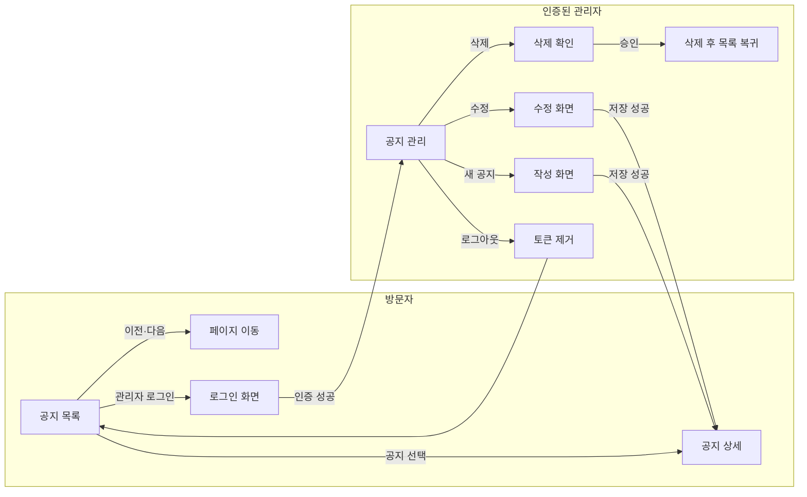

### 기술 구성

프론트엔드는 사람이 보는 화면, 백엔드는 요청을 받아 규칙을 검사하고 처리하는 프로그램, DB는 데이터를 저장하는 곳입니다.

> **학교생활 비유:** 도서관의 대출 신청 화면이 프론트, 학생증과 대출 가능 여부를 확인하는 사서가 백엔드, 대출 기록 장부가 DB입니다. 화면에서 ‘대출’ 버튼을 누르는 것과 장부에 실제 대출을 기록하는 것은 서로 다른 일입니다.

| 영역 | 실습 기준 |
| --- | --- |
| 백엔드 | Kotlin + Spring Boot, Gradle Kotlin DSL, Spring MVC |
| DB에 데이터 저장 | Spring Data JPA, Hibernate, Flyway |
| 로그인과 사용 권한 확인 | Spring Security, 관리자 로그인, 쓰기 API 권한 검사 |
| 로컬 DB | H2 파일 DB: 서버 재시작 후에도 개발 데이터 유지 |
| 테스트 DB | H2 인메모리: 테스트마다 데이터 격리 |
| 운영 DB | Railway PostgreSQL |
| 프론트 | Vite + React + TypeScript + shadcn/ui + Tailwind CSS |
| 백엔드 배포 | Railway API 서비스 |
| 프론트 배포 | Cloudflare Pages, GitHub Actions에서 빌드 후 업로드 |
| CI/CD | GitHub Actions: PR 검증, main 반영 후 검증·배포 |
| 코드 구성 | 한 저장소의 `backend/`, `frontend/`; 하나의 공지 도메인 |

현재 공식 문서와 Spring Initializr에서 확인한 최신 안정 Spring Boot는 **4.1.1**입니다. 실습 JDK는 **25**로 통일합니다. Kotlin·Gradle은 해당 Boot 버전을 선택한 Initializr 생성 결과를 기준으로 고정하고, JPA·Security는 Boot가 관리하는 라이브러리 버전을 사용합니다. [Spring 요구사항](https://docs.spring.io/spring-boot/system-requirements.html), [Kotlin 지원](https://docs.spring.io/spring-boot/reference/features/kotlin.html)

‘최신’은 최초 생성 시점에 확인합니다. 이후 CI에서는 고정된 플러그인 버전, Gradle Wrapper와 npm lockfile을 사용합니다. 프론트도 처음 설치할 때 호환되는 안정 버전을 선택하고 확정된 버전을 기록합니다.

> **쉽게 풀면:** React는 화면을 만들고, shadcn/ui는 버튼·입력창 같은 부품을 제공하며, Vite는 개발 중 화면을 실행하고 배포할 파일로 묶습니다. JPA는 프로그램의 공지 객체를 DB 기록으로 다루게 해줍니다. 버전 고정은 조별 실습에서 모두 같은 교재 판본을 쓰는 것과 같습니다. 친구마다 페이지가 다르면 설명을 따라가기 어려우니까요.

### 목표 배포 구조

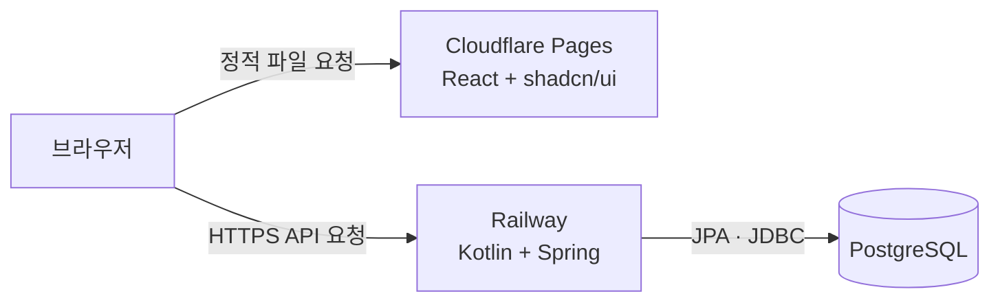

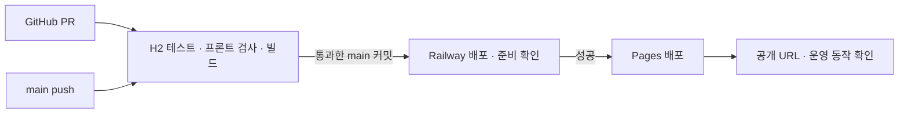

Pages는 **Direct Upload 프로젝트**를 만들고 Actions에서 Wrangler로 자동 배포합니다. 서비스의 Git 연동 자동 배포를 동시에 켜지 않아, 검증 전 배포되거나 같은 커밋이 중복 배포되는 일을 피합니다. [Pages Direct Upload](https://developers.cloudflare.com/pages/get-started/direct-upload/)

## 수업 지도

| 강 | 호출 / 작업 | 강이 끝나면 보이는 결과 |
| --- | --- | --- |
| 1강 | 설치 | 필요한 스킬 목록 |
| 2강 | 하네스 세팅 — `/setup-matt-pocock-skills` | 프로젝트 지침·설정 문서 |
| 3강 | `/grill-with-docs` | 합의된 동작, 용어집, 필요한 ADR |
| 4강 | `/to-spec` | 기능·권한·DB·배포·검증 기준을 담은 명세 |
| 5강 | `/to-tickets` | 직접 실행해볼 작은 작업과 먼저 끝내야 할 작업 |
| 6강 | `/implement` | 앱 코드·테스트·워크플로우·배포 확인 기록 |

## 1강. 설치

### 설치 전에: 모델·하네스·스킬은 각각 무엇인가요?

**모델**은 글과 코드를 이해하고 다음 행동을 판단하는 AI입니다. **하네스(harness)**는 모델이 파일을 읽고, 명령을 실행하고, 결과를 받아 다음 행동을 이어가도록 지원하는 실행 환경입니다. 대화 기록·도구 연결·권한 확인 같은 장치도 여기에 포함됩니다. 이 문서에서는 Claude Code나 Codex 같은 코딩 에이전트의 실행 환경을 설명할 때 이 말을 사용합니다.

> **기술실 비유:** 모델은 문제를 생각하는 학생, 하네스는 작업대·공구·실습 규칙이 갖춰진 기술실입니다. 학생이 똑똑해도 사용할 공구가 없으면 나무를 자를 수 없습니다. 반대로 공구만 놓여 있다고 책상이 저절로 만들어지지도 않습니다.

**스킬(skill)**은 특정 작업을 수행하는 절차와 참고 자료를 묶어 재사용하는 작업 안내서입니다. 보통 `SKILL.md`가 처음 읽는 문서이고, 필요하면 예제·템플릿·보조 스크립트를 함께 포함합니다. `/to-spec`은 명세 작성법, `/archify`는 구조도를 만드는 방법을 안내합니다. 스킬을 설치한다고 모델 자체를 다시 학습시키는 것은 아닙니다. [스킬 설명](https://support.claude.com/en/articles/12512176-what-are-skills)

> **실습 비유:** 기술실에서 ‘나무 의자 만들기 안내서’를 꺼내 읽는 것이 스킬 사용입니다. 책에는 준비물·작업 순서·확인 방법이 적혀 있습니다. 학생은 안내서를 읽고 실제 공구로 작업해야 합니다. 안내서만 설치했다고 의자가 완성되지는 않습니다.

| 용어 | 담당하는 일 | 게시판에서의 예 |
| --- | --- | --- |
| 모델 | 이해하고 판단하기 | 로그인 오류의 설명과 코드를 해석 |
| 하네스 | 작업을 실행할 환경 제공 | 파일 읽기·터미널 실행·결과 전달 |
| 스킬 | 특정 작업의 진행 방법 안내 | `/to-tickets`로 명세를 작은 작업으로 분리 |
| 도구 | 구체적인 행동 실행 | 파일 저장, 테스트 실행, 배포 상태 조회 |

같은 스킬을 사용해도 연결된 도구·접근 권한·모델·프로젝트 상태에 따라 가능한 행동과 결과가 달라질 수 있습니다. `/스킬이름`이라는 호출 표기도 사용하는 도구에서 지원하는 방식으로 선택해야 합니다.

### 준비

위 필수 도구와 코딩 에이전트를 준비합니다. 프론트 생성 시 선택된 Vite 버전의 Node 요구사항을 확인하고, 로컬과 CI에서 같은 Node 메이저 버전을 사용합니다.

터미널에서 확인합니다.

```powershell
java -version
node --version
npm --version
git --version
gh --version
```

새 실습 폴더가 필요한 경우에만 다음을 실행합니다.

```powershell
mkdir notice-board
cd notice-board
git init
```

### 설치: 터미널 입력

```powershell
npx --yes skills@latest add mattpocock/skills --global --skill "*" --agent codex claude-code --copy --yes
```

위 명령은 저장소의 **전체 스킬을 사용자 전역에 설치**하고, **Codex와 Claude Code 모두를 대상**으로 지정합니다. 확인 질문 없이 파일을 복사하므로 Claude Code의 기본 전역 경로인 `~/.claude/skills/`에도 설치합니다. 공용 경로만 설치하고 끝내는 방식이 아닙니다. 아래 목록은 전체 설치 중 이 튜토리얼에서 주로 사용하는 스킬입니다. [스킬 설치 옵션](https://github.com/vercel-labs/skills)

| 옵션 | 뜻 |
| --- | --- |
| `npx --yes` | npx의 패키지 실행 확인 생략 |
| `--global` | 현재 프로젝트가 아닌 사용자 전역 설치 |
| `--skill "*"` | 저장소에서 발견한 모든 스킬 설치 |
| `--agent codex claude-code` | Codex와 Claude Code 모두 설치 대상으로 지정 |
| `--copy` | 에이전트 설치 위치에 다른 위치를 가리키는 링크 대신 실제 파일 복사 |
| 마지막 `--yes` | 스킬 설치기의 확인 질문 생략 |

`~`는 사용자 홈 폴더입니다. 기본 설정의 Windows에서는 `C:\Users\사용자명`에 해당합니다. `.agents/skills` 같은 공용 위치와 에이전트별 경로는 설치기 출력으로 확인하고, Claude Code의 `~/.claude/skills/`도 확인합니다. 에이전트 경로를 별도로 설정한 환경에서는 실제 출력 경로를 따릅니다.

> **학교생활 비유:** 필요한 준비물을 하나씩 고르는 대신 세트 전체를 준비하고, 내 개인 보관함에 넣어 어느 프로젝트에서도 꺼내 쓰게 합니다. Codex용과 Claude용 위치에 각각 복사하므로 두 도구에서 사용할 수 있습니다. 스킬은 전역 설치해도 `/setup-matt-pocock-skills`로 정하는 프로젝트 규칙은 저장소마다 다릅니다.

| 스킬 | 역할 |
| --- | --- |
| `setup-matt-pocock-skills` | 저장소별 작업 규칙 |
| `grill-with-docs` | 질문과 문서화를 연결 |
| `grilling`, `domain-modeling` | 인터뷰, 용어집과 설계 결정 기록 |
| `to-spec`, `to-tickets` | 명세 작성, 구현 단위 분해 |
| `implement`, `tdd`, `code-review` | 구현, 검증, 리뷰 |
| `triage` | 이번 실습의 기본 분류 라벨 |
| `ask-matt` | 현재 상황에 맞는 다음 스킬·진행 순서 추천 |

`grill-with-docs`는 설치된 원문에서 `grilling`과 `domain-modeling`을 함께 호출합니다. 세 스킬이 모두 설치되어 있는지 확인합니다.

### 사용 전 → 후

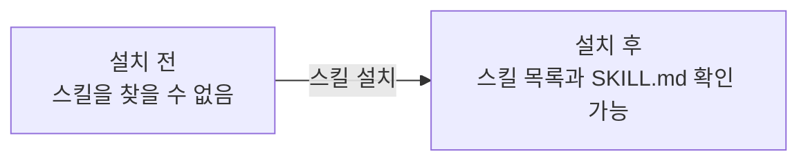

**설치 후에는 Claude Code와 Codex를 완전히 종료한 뒤 다시 실행하세요.** 실행 중인 작업을 먼저 저장하고, 앱이나 터미널 세션을 종료한 뒤 다시 열어 스킬 목록을 확인합니다. 그래도 스킬이 보이지 않으면 설치 경로와 설치 성공 여부를 확인한 다음 **PC를 재부팅하고 다시 확인하세요.** 재부팅 후에도 보이지 않으면 설치 오류나 대상 경로 문제를 확인해야 합니다.

**완료 확인:** 설치기가 출력한 경로와 재시작한 에이전트의 스킬 목록에 필요한 스킬이 있는지 확인합니다. 아직 앱 파일은 생기지 않습니다.

## 2강. 하네스 세팅 — /setup-matt-pocock-skills

**새 프로젝트를 시작할 때 딱 한 번 실행하면 됩니다.** 같은 프로젝트에서 새 기능을 만들거나 대화를 새로 열 때마다 반복할 필요는 없습니다. 다른 프로젝트를 시작하면 그 프로젝트에서 한 번 설정합니다. 나중에 이슈 관리 방식을 바꾸고 싶다면 설정 문서를 수정하거나 이 스킬을 다시 실행할 수 있습니다.

여기서 ‘하네스 세팅’은 **코딩 에이전트가 이 프로젝트에서 일할 규칙을 설정한다**는 뜻입니다. 프로그램 설치나 계정 로그인이 아니라, 프로젝트 지침과 이슈·문서 관리 규칙을 파일로 남기는 작업입니다.

> **쉬운 비유:** 새 동아리방을 사용할 때 ‘회의록은 이 서랍, 할 일 카드는 저 게시판’이라고 처음에 정하는 것입니다. 모일 때마다 서랍 위치를 다시 정할 필요는 없습니다. 다른 동아리방으로 옮기거나 관리 방식을 바꿀 때만 다시 정하면 됩니다.

튜토리얼의 명세와 티켓은 로컬 Markdown으로 기록합니다. **코드는 GitHub에서 관리하고 CI/CD를 실행하면서, 작업 티켓은 저장소 안의 파일로 관리할 수 있습니다.** GitHub Issues가 필수인 것은 아닙니다.

### 이슈를 GitHub에서 관리할까요, 파일로 관리할까요?

이슈는 해결할 문제나 구현할 작업을 기록한 것입니다. 이 흐름에서는 명세와 구현 티켓을 어디에 저장하고 찾아볼지 선택합니다.

| 비교 | GitHub Issues | 저장소 안의 Markdown 파일 |
| --- | --- | --- |
| 저장 위치 | GitHub의 이슈 페이지 | `.scratch/<기능>/` 아래 파일 |
| 장점 | 여러 사람이 댓글·담당자·라벨로 협업하기 편함 | 에이전트가 코드와 함께 바로 읽고 수정하기 편함 |
| 변경 기록 | 이슈의 활동 기록으로 확인 | Git에 포함하면 코드와 함께 diff·커밋으로 확인 |
| 외부 사용자 요청 | 이슈 링크를 공유해 접수하기 편함 | 파일 전달이나 저장소 변경 절차가 필요함 |
| 준비 | GitHub 계정·저장소·접근 권한, 도구 인증 필요 | 파일을 읽고 쓸 수 있으면 바로 시작 가능 |
| 주의점 | 온라인 접근과 권한에 의존하고 코드와 이슈를 오가야 함 | 담당자·알림·상태 관리를 위한 별도 규칙이 필요함 |
| 협업 시 부담 | 이슈와 코드 변경의 연결을 유지해야 함 | 같은 파일을 수정하면 Git 충돌을 해결해야 할 수 있음 |

**이 튜토리얼에서는 파일 관리를 더 추천합니다.** 개인이나 작은 팀이 에이전트와 개발할 때는 명세·티켓·코드가 같은 작업 폴더에 있어 다음 작업에 전달하기 쉽고, 이슈를 다루기 위한 계정 연결 없이 시작할 수 있습니다. 특히 새 대화에서도 “이 명세와 티켓을 읽어줘”라고 파일 경로를 지정해 이어가기 편합니다.

파일을 쓴다고 GitHub를 사용하지 않는 것은 아닙니다. 명세와 티켓도 Git에 포함해 푸시하면 코드와 함께 공유할 수 있습니다. `.scratch/`가 `.gitignore`에 포함되어 있으면 업로드되지 않으므로 공유할 때 확인하세요. 파일 이름이나 폴더 이름만으로 자동 백업되는 것은 아닙니다.

> **쉬운 비유:** GitHub Issues는 팀원들이 댓글과 담당자를 붙일 수 있는 온라인 업무 게시판입니다. 파일 관리는 작업물과 체크리스트를 같은 과제 폴더에 넣는 방식입니다. 혼자 또는 몇 명이 과제를 할 때는 같은 폴더에서 바로 확인하는 편이 간단합니다. 여러 반에서 요청을 받고 담당자를 배정해야 한다면 온라인 게시판이 더 편할 수 있습니다.

외부 사용자 요청이 많거나 담당자 배정·알림·여러 사람의 논의가 중요해지면 GitHub Issues를 고려하세요. 처음에는 파일로 시작하고 필요해졌을 때 전환해도 됩니다. 전환할 때는 기존 티켓과 새 이슈의 연결을 남겨 미완료 작업이 빠지지 않게 합니다.

> **학교 축제 비유:** 일을 시작하기 전에 ‘회의록은 이 폴더, 할 일 카드는 저 폴더’라고 정하는 단계입니다. `/setup-matt-pocock-skills`가 게시판을 만들어주는 것은 아닙니다. 앞으로 사용할 공책의 위치와 작성 규칙을 정해줍니다. `.scratch/`라는 이름이어도 여기 담은 명세와 티켓은 다음 작업에 필요한 자료입니다.

### 입력

```text
/setup-matt-pocock-skills

공지사항 게시판 실습 저장소를 설정해줘.
이슈와 명세는 로컬 Markdown, triage는 기본 라벨을 사용해.
backend/와 frontend/를 둘 예정이지만 도메인은 공지사항 하나이므로
단일 CONTEXT.md와 docs/adr/를 사용하는 구성을 원해.
AGENTS.md와 CLAUDE.md가 모두 없다면 AGENTS.md를 생성해줘.
초안을 보여줘.
```

초안을 확인한 뒤 답합니다.

```text
초안대로 작성해줘.
```

### 예상 결과물

```text
notice-board/
├── AGENTS.md
└── docs/agents/
    ├── issue-tracker.md
    ├── triage-labels.md
    └── domain.md
```

기존 `CLAUDE.md`가 있으면 그것을, 없으면 기존 `AGENTS.md`를 편집하는 것이 스킬의 선택 규칙입니다. 위 트리는 두 파일이 없었던 실습 폴더 기준입니다.

### CLAUDE.md와 AGENTS.md — 프로젝트에서 일하는 방법을 적는 안내판

정확한 파일 이름은 **`CLAUDE.md`**입니다. `CLUADE.md`처럼 철자가 바뀌면 같은 이름으로 인식되지 않습니다. `.md`는 Markdown 형식의 글 문서라는 뜻입니다.

`CLAUDE.md`는 Claude Code에 전달할 프로젝트 지침을 적는 파일입니다. 예를 들어 어떤 문서를 먼저 읽을지, 어떤 검증을 해야 할지, 팀에서 지키는 작업 규칙을 적습니다. 파일 자체가 실행되는 프로그램은 아닙니다. [Claude Code의 프로젝트 지침](https://code.claude.com/docs/en/memory)

> **학교생활 비유:** 과학실 문에 붙은 ‘실험 전에 준비물을 확인하고, 끝나면 결과를 기록하세요’라는 안내판입니다. 실험마다 길게 다시 설명하지 않도록 공통 규칙을 적어둡니다. 하지만 안내판에 ‘불을 끄세요’라고 써놓는 것만으로 전등이 꺼지지는 않듯, 실제 실행과 검증은 별도입니다.

`AGENTS.md`도 지원하는 코딩 에이전트가 읽을 작업 지침 파일입니다. 두 이름을 모든 도구가 똑같이 읽는다고 가정하지 말고, 사용하는 도구에서 어떤 파일을 읽는지 확인합니다. **스킬을 Codex·Claude 양쪽에 설치하는 것과 프로젝트 지침 파일을 양쪽에서 읽게 하는 것은 다른 설정**입니다.

두 도구를 함께 쓸 때는 공통 규칙을 한곳에 두고 각 도구의 지침에서 참조하도록 구성하면 서로 다른 규칙으로 수정되는 일을 줄일 수 있습니다. setup이 선택한 파일은 확인하되, 같은 규칙을 두 파일에 복사한 뒤 각각 따로 바꾸지 않도록 주의합니다.

프로젝트 지침에 넣을 수 있는 내용 예시입니다. 아래는 설명용 일부 내용이며 지금 이 저장소에 지침 파일을 추가하는 명령이 아닙니다.

```markdown
## 작업 규칙

- 기능을 논의하기 전에 CONTEXT.md와 관련 ADR을 읽는다.
- 명세와 티켓의 위치는 docs/agents/issue-tracker.md를 따른다.
- 백엔드 테스트는 test 프로필의 H2 메모리 DB를 사용한다.
- 완료 보고에는 실제로 실행한 검증과 결과를 적는다.
```

| 파일 | 쉽게 말하면 | 적합한 내용 |
| --- | --- | --- |
| CLAUDE.md / AGENTS.md | 여기서 일하는 규칙 | 어떤 문서를 읽고 어떻게 검증할지 |
| SKILL.md | 특정 작업의 안내서 | 명세 작성·진단·구조도 생성 절차 |
| CONTEXT.md | 우리 팀의 용어 사전 | 공지·관리자·삭제의 정확한 뜻 |
| ADR | 중요한 결정의 이유 노트 | 왜 이 인증·배포 방식을 골랐는지 |

> **축제 준비 비유:** ‘끝나면 정리한다’는 전체 규칙, ‘음료를 만드는 순서’는 작업 안내서, ‘운영요원이 누구인지’는 용어 사전, ‘왜 실내 부스를 골랐는지’는 결정 기록입니다. 네 문서는 서로 돕지만 담는 내용은 다릅니다.

| 파일 | 확정되는 내용 |
| --- | --- |
| 프로젝트 지침 | 어떤 상황에 설정 문서를 읽어야 하는지 |
| issue-tracker.md | `.scratch/<기능>/spec.md`, `issues/<번호>-<이름>.md` |
| triage-labels.md | `needs-triage`, `needs-info`, `ready-for-agent`, `ready-for-human`, `wontfix` |
| domain.md | 용어집·ADR의 위치와 읽는 규칙 |

### 사용 전 → 후

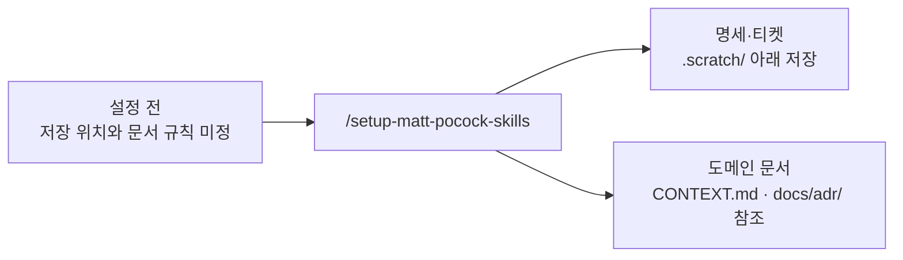

**완료 확인:** 설정 문서 세 개와 프로젝트 지침의 참조가 일치하는지 확인합니다. `CONTEXT.md` 자체는 의미 있는 용어가 정리되는 다음 강에서 생성합니다.

## 3강. /grill-with-docs — 원하는 기능을 질문과 답변으로 분명하게 정하기

이번에 추가한 핵심 단계입니다. ‘시큐리티를 쓴다’는 말만으로는 누가 무엇을 할 수 있는지, 로그인은 얼마나 유지되는지 결정되지 않습니다. 구현 전에 실제 사용 상황을 질문하고 답을 문서로 남깁니다.

> **학교 축제 비유:** ‘매점 만들어줘’라고만 하면 친구는 음료만 팔 생각을 하고, 나는 떡볶이도 팔 생각을 할 수 있습니다. 만들기 전에 ‘무엇을 팔까? 누가 돈을 받을까? 환불은 가능할까?’를 묻는 것이 그릴위드독스입니다. 귀찮게 시험하는 게 아니라, 서로 다른 완성품을 상상하고 있지 않은지 확인하는 과정입니다.

### 입력

```text
/grill-with-docs

간단한 공지사항 게시판을 만들고 싶어.
방문자는 목록과 상세를 보고, 관리자 한 명만 등록·수정·삭제해.
회원가입, 댓글, 첨부파일, 검색, 초안, 상단 고정은 이번 범위에서 빼자.

백엔드는 최신 안정 Spring Boot + Kotlin, JPA, Spring Security야.
로컬 DB는 H2 파일, 테스트 DB는 H2 인메모리, 운영 DB는 PostgreSQL.
백엔드는 Railway, 프론트는 Vite React TypeScript shadcn/ui야.
프론트는 Cloudflare Pages로 배포하고 GitHub Actions가 CI/CD를 담당해.
backend/와 frontend/를 같은 저장소에 둬.

아직 구현하지 말고 권한, 인증 유지, 입력 제한, 오류,
목록을 여러 페이지로 나누고 이동하는 방법, DB 전환, 자동배포 완료 기준을 질문해서 구체적으로 정해줘.
확정된 도메인 용어는 CONTEXT.md에 기록하고,
대안과 비용이 있는 중요한 결정만 ADR로 제안해줘.
버전·플랫폼 제약은 공식 자료를 직접 확인해줘.
```

### 예상 인터뷰: 한 번에 모든 답을 추측하지 않기

| 라운드 | 에이전트가 확인할 질문 예시 | 튜토리얼에서 선택할 답 |
| --- | --- | --- |
| 1 | 공지는 저장 즉시 공개되나요? 삭제는 복구되나요? | 즉시 공개, 확인 후 영구 삭제 |
| 1 | 제목·본문 제한과 정렬 기준은 무엇인가요? | 제목 1–100자, 본문 1–10,000자; 앞뒤 공백 제거; 최신순 |
| 1 | 한 페이지 크기와 빈 화면은 어떻게 하나요? | 10개 고정, 없으면 안내; 마지막 항목 삭제 시 이전 페이지로 |
| 2 | 관리자 로그인을 새로고침 후에도 유지해야 하나요? | 실습에서는 다시 로그인해도 됨 |
| 2 | 프론트·API 주소가 다를 때 인증은 어떻게 할까요? | 짧은 Bearer 토큰, 쿠키 인증 없이 메모리에 보관 |
| 3 | 토큰 만료·로그아웃은 어떤 의미인가요? | 30분 만료, refresh 없음; 로그아웃은 브라우저 토큰 제거 |
| 3 | CI와 실제 서비스 확인 중 어디까지가 완료인가요? | 검증 통과, 배포된 커밋 확인, 운영 화면·DB 저장 확인 |

실제 질문은 앞선 답에 따라 달라집니다. 예를 들어 토큰 방식을 선택하기 전에는 토큰 만료 시간을 확정하지 않습니다.

### 질문하고 답해서 정한 실습 조건

| 주제 | 결정 예시 |
| --- | --- |
| 공지 | 제목·일반 텍스트 본문·생성일·수정일; HTML을 실행하지 않음 |
| 목록 | 생성일 내림차순, 동률은 ID 내림차순, 10개씩 페이지 이동 |
| 작성 | 관리자만 가능; 저장 성공 후 상세 화면으로 이동 |
| 수정 | 생성일과 목록 순서는 유지; 수정일 갱신 |
| 삭제 | 확인창에서 승인 후 삭제, 목록 복귀; 없는 공지는 404 |
| 오류 | 입력 오류 400, 인증 오류 401, 권한 부족 403, 대상 없음 404 |
| 관리자 | 운영 환경변수의 사용자명·비밀번호 해시 사용; 회원가입 없음 |
| 인증 | 앱이 로그인 성공 시 서명한 access JWT 발급; Spring Security로 검증 |
| 토큰 | 30분, 프론트 메모리에만 저장; 새로고침·만료 시 재로그인 |
| 로그아웃 | 현재 화면에서 토큰 제거; 이미 발급된 토큰은 만료 전까지 유효 |
| 운영 연결 | 허용된 프론트 Origin만 CORS 허용; Authorization 헤더 허용 |

이 인증 구성은 단순 실습을 위한 **설계 선택**입니다. Spring Security의 JWT 검증 기능이 로그인·토큰 발급 API까지 자동으로 만들어주지는 않습니다. 토큰 발급과 검사, 토큰 정보에서 관리자 권한을 읽는 방법, 서명·유효기간·발급자(issuer)·사용 대상(audience) 확인을 명세에 포함합니다. [JWT 검증 공식 문서](https://docs.spring.io/spring-security/reference/servlet/oauth2/resource-server/jwt.html)

쿠키·세션·HTTP Basic 인증을 사용하지 않고, 서버에 로그인 세션을 저장하지 않는 API(stateless API)로 구성합니다. 이 전제에서 CSRF 비활성화를 검토하고 이유를 기록합니다. 향후 쿠키 인증을 도입하면 CSRF 정책도 다시 설계합니다. CORS는 인증이나 권한 검사를 대신하지 않습니다.

> **출입증 비유:** 인증은 ‘누구인지 확인’, 인가는 ‘그 사람이 이 일을 해도 되는지 확인’입니다. JWT는 유효기간과 권한 정보가 있는 서명된 출입증에 가깝습니다. 서버는 서명과 기간을 검사해야 하며, 출입증 내용이 자동으로 비밀 암호가 되는 것은 아닙니다. 메모리 보관은 출입증을 지금 열린 화면에서만 들고 있는 셈이라 새로고침하면 다시 받아야 합니다.
>
> **보안 설정을 더 쉽게:** 쿠키는 브라우저가 조건에 맞으면 요청에 자동으로 붙이는 정보입니다. 이 실습은 그런 자동 인증 대신 API 요청에 토큰을 분명하게 붙입니다. 따라서 CSRF 설정도 이 전제에 맞춰 결정합니다. CORS는 ‘어느 웹 화면에서 온 요청의 응답을 브라우저가 읽도록 허용할지’에 관한 규칙이며, 관리자 여부를 증명하는 출입증은 아닙니다.

### 예상 결과물: 용어집과 결정 기록

```text
새로 생기는 문서
├── CONTEXT.md
└── docs/adr/
    ├── 0001-admin-authentication.md
    └── 0002-ci-controlled-deployment.md
```

`CONTEXT.md` 내용 예시:

```markdown
# Domain glossary

- 공지(Notice): 관리자가 게시하며 방문자가 읽을 수 있는 안내문.
- 방문자(Visitor): 로그인 없이 공지를 읽는 사람.
- 관리자(Administrator): 공지를 등록·수정·삭제할 권한이 있는 사람.
```

용어집에는 Kotlin 버전·DB URL·API 구현 방법을 섞지 않습니다. ADR은 모든 기술 선택마다 만들지 않고, 대안·이유·후속 비용을 기록할 가치가 있는 결정만 남깁니다.

### CONTEXT.md — 우리 팀이 같은 뜻으로 말하기 위한 작은 사전

`CONTEXT.md`는 이 스킬 흐름에서 **프로젝트의 업무 용어를 정의하는 파일**입니다. 이름만 보면 모든 배경 지식을 넣어야 할 것 같지만, 여기서는 용어집으로 사용합니다. 해야 할 일 목록이나 모든 대화를 붙여 넣는 파일이 아닙니다.

예를 들어 친구는 ‘관리자’를 학교 선생님 전체라고 생각하고, 나는 게시판 담당자 한 명이라고 생각할 수 있습니다. 이 상태로 ‘관리자만 삭제 가능’이라고 쓰면 서로 다른 기능을 만들게 됩니다.

> **학교생활 비유:** 조별 발표에서 ‘자료 담당’이라는 말을 먼저 정의하는 것과 같습니다. 한 명은 사진만 모으는 역할이라고 생각하고 다른 한 명은 발표 자료까지 만드는 역할이라고 생각하면 일이 빠집니다. ‘자료 담당 = 출처를 확인해 글과 사진을 모으는 사람’이라고 합의해두면 같은 뜻으로 이야기할 수 있습니다.

게시판의 용어집은 다음처럼 짧고 구체적으로 씁니다.

```markdown
- 공지: 관리자가 등록하고 방문자가 읽는 안내문. 등록하면 바로 공개된다.
- 방문자: 로그인하지 않고 공개 공지를 읽는 사람.
- 관리자: 이 게시판의 공지를 등록·수정·삭제하는 담당자.
- 공지 삭제: 공지를 영구 제거하는 동작. 임시 숨김을 뜻하지 않는다.
```

| 넣을 내용 | 다른 문서에 넣을 내용 |
| --- | --- |
| ‘공지’의 뜻과 경계 | React 컴포넌트 경로 → 구현 코드·개발 문서 |
| ‘관리자’가 가리키는 역할 | JWT 라이브러리 설정 → 구현·설계 문서 |
| ‘삭제’와 ‘숨김’의 의미 차이 | 삭제 버튼의 완료됐다고 판단할 조건 → 명세·티켓 |

**언제 읽나요?** 새 기능을 논의하거나 코드를 살펴보기 전에 읽습니다. **언제 고치나요?** 인터뷰에서 단어의 뜻을 합의했을 때 고칩니다. 아직 정하지 않은 뜻을 확정된 것처럼 쓰지 않습니다.

### ADR — 중요한 선택의 ‘왜’를 남기는 결정 노트

ADR은 **Architecture Decision Record**, 즉 중요한 설계 결정을 기록하는 문서입니다. `docs/adr/`는 그런 기록을 모아두는 폴더입니다. 보통 결정 하나를 파일 하나에 씁니다.

`CONTEXT.md`가 ‘이 말은 무슨 뜻인가?’에 답한다면, ADR은 **‘여러 방법 중 왜 이 방법을 골랐는가?’**에 답합니다.

> **학교 축제 비유:** 매점을 운동장이 아니라 체육관에 열기로 했다고 합시다. ‘체육관 사용’만 쓰면 나중에 친구가 ‘운동장이 더 넓은데 왜?’라고 묻습니다. ‘비 예보가 있고, 체육관에는 전기가 있으며, 대신 자리가 좁아진다’까지 적어두면 선택의 이유와 불편함을 함께 이해할 수 있습니다. 이것이 ADR의 역할입니다.

이 게시판에서는 로그인 방법이 좋은 예입니다. 아래의 두 방법은 각각 얻는 것과 감수할 것이 다릅니다.

| 선택지 | 얻는 것 | 고려할 점 |
| --- | --- | --- |
| 메모리에 짧은 토큰 보관 | 서로 다른 서비스 주소에서도 쿠키 인증 없이 요청 가능 | 새로고침 후 재로그인, 즉시 토큰 폐기는 별도 설계 필요 |
| 쿠키 세션 | 브라우저의 세션 쿠키로 로그인 유지 가능 | 서비스 도메인·쿠키 정책·CSRF·세션 저장을 함께 설계해야 함 |

‘메모리 토큰이 항상 최고’여서 고르는 것이 아닙니다. **관리자 한 명이 사용하는 작은 실습이며 재로그인을 허용한다**는 조건에서 선택하는 것입니다. 그 조건이 달라지면 결정도 다시 검토할 수 있습니다.

ADR을 만들기 좋은 때는 선택을 바꾸는 비용이 크고, 나중에 이유를 궁금해할 만하며, 실제로 비교한 대안이 있을 때입니다. 버튼 글자를 ‘저장’에서 ‘등록’으로 바꾸는 정도마다 ADR을 만들 필요는 없습니다.

인증 ADR 일부 내용 예시:

```markdown
# 관리자 인증 방식

상태: 수락
맥락: 서로 다른 서비스 도메인에서 운영하며 관리자 한 명만 사용한다.
결정: 짧은 Bearer 토큰을 프론트 메모리에 보관한다.
대안: 쿠키 세션, 외부 인증 제공자.
결과: 새로고침 시 재로그인한다. 즉시 토큰 폐기는 이번 범위에 없다.
```

결정을 바꿀 때는 예전 이유를 지워버리기보다 새 결정을 기록하고 이전 기록과 연결합니다. ‘예전에는 틀렸다’보다 ‘사용 조건이 바뀌어 이제 다른 방법을 선택했다’는 과정을 남기는 것입니다.

### CONTEXT.md·ADR·명세·티켓은 무엇이 다른가요?

**Matt 스킬 흐름의 큰 장점은 개발하면서 프로젝트를 이해하는 데 필요한 기록도 함께 쌓인다는 것입니다.** `/grill-with-docs`에서 뜻을 합의하고 선택의 이유를 남기면, 다음 작업에서 LLM이 그 기록을 읽고 우리 프로젝트에 맞춰 판단할 수 있습니다. 기록이 정확하게 유지될수록 같은 설명을 반복할 필요가 줄고, 세밀한 규칙을 놓칠 가능성도 줄어듭니다.

> **조별 과제 비유:** 새 친구가 조에 들어올 때마다 “우리는 왜 이 주제를 골랐고, 이 단어를 무슨 뜻으로 쓰는지” 처음부터 설명하면 빠지는 이야기가 생깁니다. 그런데 용어 사전과 결정 노트가 있다면 새 친구도 읽고 이어서 작업할 수 있습니다. 과제를 진행하며 기록을 보강할수록 다음에 참여한 친구도 우리 조의 사정을 더 깊이 이해하게 됩니다.

예를 들어 몇 주 뒤 “로그인을 편하게 바꿔줘”라고 요청했다고 해봅시다.

| 기록이 없다면 놓치기 쉬운 점 | 기록을 읽으면 확인할 수 있는 점 |
| --- | --- |
| 관리자가 여러 명이라고 추측 | CONTEXT.md에서 이 게시판의 관리자 역할 확인 |
| 새로고침 후 로그인 해제를 단순 버그로 판단 | ADR에서 재로그인을 허용한 이유와 조건 확인 |
| ‘삭제’를 임시 숨김으로 구현 | CONTEXT.md와 명세에서 영구 삭제라는 합의 확인 |
| 편의 기능을 고치면서 기존 권한 규칙을 변경 | 명세·티켓·테스트에서 지켜야 할 동작 확인 |

**중요한 것은 LLM 자체가 프로젝트를 영구 학습하는 것이 아니라, 다음 작업에서도 읽을 수 있는 ‘프로젝트의 기억’을 파일로 남긴다는 점입니다.** 새 대화나 다른 에이전트에서도 같은 문서를 읽으면 맥락을 복원하기 쉬워집니다. 문서를 읽지 않거나 기록이 오래되어 실제 코드와 다르면 여전히 놓치거나 잘못 판단할 수 있으므로, 합의가 바뀌면 문서도 갱신하고 결과는 테스트로 확인합니다.

> **시험공부 비유:** 머릿속 기억만 믿는 대신 오답 노트에 “어디서 헷갈렸고 왜 이 풀이를 골랐는지” 적어두는 것입니다. 노트가 있다고 절대 틀리지 않는 것은 아니지만, 다음 문제를 풀기 전에 읽으면 같은 실수를 줄일 수 있습니다.

작업을 이어갈 때는 다음처럼 요청하면 됩니다.

```text
CONTEXT.md와 이번 변경에 관련된 ADR, 명세·티켓을 먼저 읽어줘.
기존에 합의한 용어와 세부 규칙을 유지하면서 작업해줘.
현재 코드와 문서가 다르거나 이전 결정을 바꿔야 한다면 알려줘.
새로 합의한 내용은 알맞은 문서에 반영하고 테스트로 확인해줘.
```

모든 세부 사항을 CONTEXT.md와 ADR에 몰아넣지는 않습니다. 용어는 CONTEXT.md, 중요한 선택의 이유는 ADR, 구체적인 동작은 명세·티켓, 실제 보장은 코드·테스트에 나누어 남깁니다. 이렇게 연결된 기록이 프로젝트 이해를 점점 풍부하게 만듭니다.

| 문서 | 답하는 질문 | 학교 축제에 비유하면 | 게시판 예시 |
| --- | --- | --- | --- |
| CONTEXT.md | 이 단어는 무슨 뜻인가? | 조별 활동 용어 사전 | 관리자는 공지를 관리하는 담당자 |
| ADR | 왜 이 방법을 선택했나? | 체육관을 고른 이유 기록 | 재로그인을 허용하고 메모리 토큰 선택 |
| spec.md | 무엇이 되면 완성인가? | 부스의 완성 조건 | 관리자가 공지를 등록하면 방문자가 읽을 수 있음 |
| 티켓 | 이번에 끝낼 작은 일은 무엇인가? | 오늘 할 일 카드 | 로그인부터 공지 등록까지 구현·검증 |

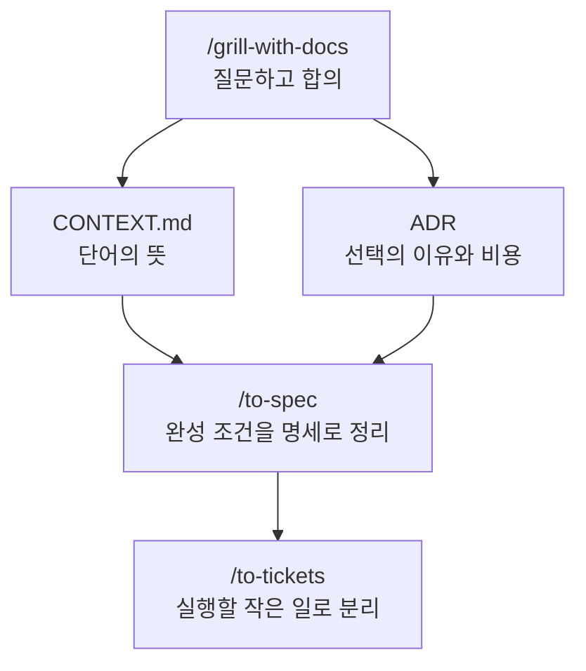

### 사용 전 → 후

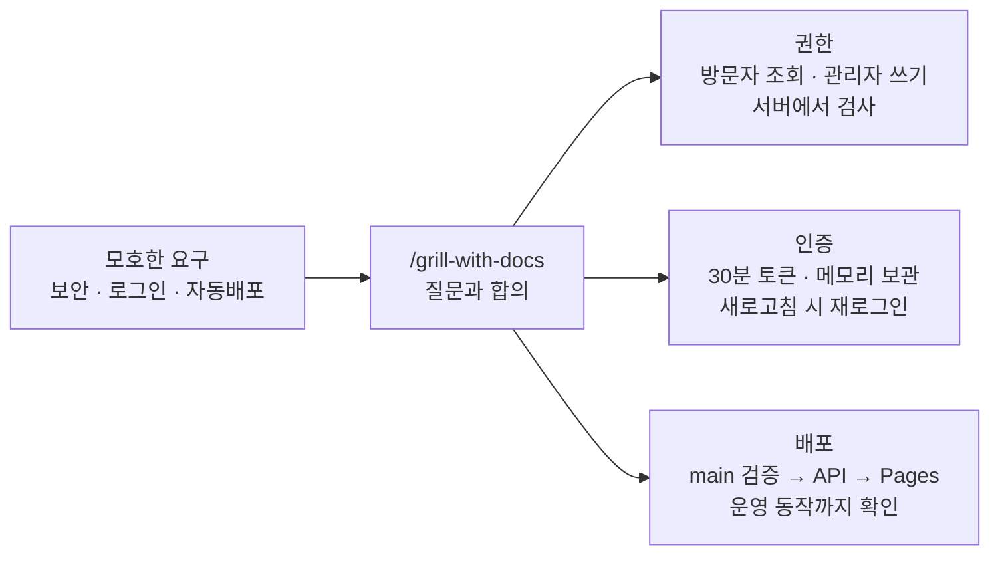

**완료 확인:** 에이전트의 최종 합의 요약을 읽고 “이 조건으로 합의했어. 문서에 반영해줘”라고 답합니다. 아직 앱 구현은 시작하지 않습니다.

## 4강. /to-spec — 함께 정한 기능과 완성 조건을 문서로 남기기

이렇게 무엇을 만들고 어떤 조건을 만족해야 하는지 적은 문서를 **명세**라고 부릅니다.

`/grill-with-docs`에서 결정한 내용을 `/to-spec`으로 모아 정리합니다. 이 단계는 새 요구사항 인터뷰보다 합의된 내용을 빠짐없이 옮기는 데 집중합니다. 설치된 스킬은 테스트에서 입력과 결과를 확인할 위치를 사용자에게 확인하는 단계도 포함합니다.

> **학교 축제 비유:** 인터뷰가 ‘어떤 매점을 만들지 회의하는 시간’이라면 명세는 ‘음료 3종을 팔고, 가격표가 있으며, 현금 결제가 되면 완성’이라고 쓴 합의서입니다. 완성 조건을 먼저 써야 나중에 ‘이 정도면 끝난 거 아니야?’라는 다툼을 줄일 수 있습니다.
>
> **테스트에서 입력과 결과를 확인할 위치란?** 어디에서 입력하고 어디에서 결과를 확인할지 정하는 것입니다. 자판기를 검사할 때 나사 모양부터 보는 대신 ‘돈을 넣고 버튼을 누르면 맞는 음료가 나오는가’를 확인하는 것과 같습니다. 이 실습에서는 API 요청·응답과 화면 조작을 주요 확인 지점으로 삼습니다.

### 테스트 설명에서 나오는 말

통합 테스트는 여러 부분을 연결해 함께 확인하는 테스트입니다. 브라우저 E2E 테스트는 사람이 화면에서 클릭하듯 실제 화면부터 서버 저장까지 끝에서 끝으로 확인합니다. CRUD는 만들기·읽기·수정·삭제를 묶어 부르는 말입니다.

> **쉬운 비유:** 버튼만 눌리는지 보는 것과, 주문 버튼을 누른 뒤 주방에 주문이 들어가고 결과가 화면에 보이는지 확인하는 것은 다릅니다. E2E는 이 연결된 과정을 따라가 보는 것입니다.

### 입력

```text
/to-spec

앞서 합의한 공지사항 게시판을 명세로 작성해줘.
CONTEXT.md와 관련 ADR을 읽고 .scratch/notice-board/spec.md에 저장해.
기능, API 요청과 응답의 약속, 관리자 인증, 환경별 DB, CI/CD 완료 기준을 포함해.
구현 파일 목록이나 코드를 명세 대신 나열하지 마.

테스트에서 어디에 입력하고 어떤 결과를 확인할지 먼저 제안해줘.
백엔드는 Security 필터를 포함한 HTTP 통합 테스트와 H2 인메모리,
프론트는 사용자 화면 테스트,
최종 연결은 실제 백엔드+H2로 브라우저 E2E를 원해.
운영 PostgreSQL의 마이그레이션·저장 확인은 별도 배포 검증으로 구분해.
```

예상 확인에 답합니다.

```text
그 테스트에서 입력과 결과를 확인할 위치로 진행해. 운영 DB 확인을 H2 테스트 통과로 대체하지 말고
별도 완료 항목으로 남겨줘.
```

### 결과물 A: 무엇을 만들지 적은 문서의 내용

```markdown
# 공지사항 게시판
Status: ready-for-agent

## Problem Statement
방문자는 최신 안내를 읽고 관리자는 개발자 도움 없이 안내를 관리해야 한다.

## Solution
공개 읽기 화면과 관리자 쓰기 기능을 가진 게시판을 제공한다.

## User Stories
1. 방문자는 최신순 목록에서 공지를 선택할 수 있다.
2. 방문자는 제목과 본문, 작성·수정 시점을 확인할 수 있다.
3. 관리자는 로그인해 공지를 등록할 수 있다.
4. 관리자는 내용을 수정하고 삭제할 수 있다.
5. 관리자는 입력 오류와 인증 만료의 원인을 확인할 수 있다.
6. 운영자는 검증된 main 변경을 자동 배포할 수 있다.

## Implementation Decisions
합의한 권한·API·저장·환경·배포할 때 지킬 약속을 기록한다.

## Testing Decisions
HTTP/H2, 화면, H2 E2E, 운영 PG 검증의 범위를 구분한다.

## Out of Scope
회원가입, 댓글, 첨부, 검색, 초안, 상단 고정, refresh token.

## Further Notes
버전과 외부 서비스의 실제 설정값은 구현·배포 문서에 기록한다.
```

일부 내용 예시입니다. 실제 명세는 페이지 끝 삭제, 만료, 중복 제출, 없는 공지, 실패 중 입력 보존 등 합의한 사례까지 사용자 스토리와 검증 조건으로 포함합니다.

### 결과물 B: API 요청과 응답의 약속 예시

프론트가 백엔드에 무엇을 보내고, 백엔드가 무엇을 돌려줄지 미리 정합니다. 예를 들어 공지 제목과 본문을 보냈을 때 저장에 성공하면 어떤 데이터가 돌아오는지 약속하는 것입니다.

> **급식실 비유:** ‘우유 하나 주세요’라고 요청했는데 우유 대신 숫자만 받으면 곤란하겠죠. 요청하는 방법과 돌아오는 결과를 맞추는 것이 API 요청과 응답의 약속입니다. 400은 잘못된 요청, 401은 인증 필요·실패, 403은 권한 부족, 404는 요청한 대상 없음처럼 상황을 구분하는 번호입니다.

| 메서드 | 경로 | 권한 | 성공 결과 |
| --- | --- | --- | --- |
| POST | `/api/auth/login` | 공개 | 200, accessToken·expiresIn |
| GET | `/api/notices?page=0` | 공개 | 200, items·page·size·totalElements·totalPages |
| GET | `/api/notices/{id}` | 공개 | 200, 공지 상세 |
| POST | `/api/notices` | ADMIN | 201, 생성된 공지와 Location |
| PUT | `/api/notices/{id}` | ADMIN | 200, 수정된 공지 |
| DELETE | `/api/notices/{id}` | ADMIN | 204, 본문 없음 |

목록의 API 페이지 번호는 0부터, 화면 표시는 1부터 시작합니다. `page < 0`은 400, 범위를 초과한 페이지는 빈 items와 전체 개수를 반환합니다. 날짜는 UTC ISO 8601로 전달하고 화면에서 사용자 시간대로 표시합니다.

### 결과물 C: 환경별 DB 계약

| 환경 | 프로필 | DB 예시 | DB의 표와 항목을 만들고 바꾸는 방법 |
| --- | --- | --- | --- |
| 로컬 | local | `jdbc:h2:file:./data/notice-board` | Flyway 적용 + JPA validate |
| 테스트 | test | `jdbc:h2:mem:<test-id>` | 테스트 시작 시 Flyway 적용 + JPA validate, 데이터 격리 |
| 운영 | prod | `jdbc:postgresql://<host>:<port>/<db>` | Flyway 적용 + JPA validate |

H2와 PG에서 동작하는 DB의 표와 항목 변경을 우선 사용합니다. 차이가 필요한 SQL은 DB별 마이그레이션을 분명하게 구분합니다. 운영에서는 `create`·`create-drop`·자동 `update`로 DB의 표와 항목을 바꾸지 않습니다. H2의 PG 호환 모드를 사용하더라도 PG와 동일하다는 보장은 없습니다.

> **연습장 비유:** H2 메모리는 연습이 끝나면 지우는 칠판, H2 파일은 다음 날 다시 펼칠 개인 공책, 운영 PG는 실제 공지를 보관하는 장부에 가깝습니다. 연습 칠판에서 잘됐다고 실제 장부의 모든 규칙까지 확인한 것은 아닙니다.
>
> **Flyway와 validate는?** DB에 ‘수정일’ 칸을 추가하는 변경을 번호 순서대로 남기는 것이 마이그레이션입니다. Flyway는 그 변경을 순서대로 적용하고, JPA `validate`는 프로그램이 기대하는 칸과 실제 장부가 맞는지 검사합니다. 운영 장부를 매번 새 공책으로 바꾸면 기존 공지가 사라질 수 있으므로 변경 기록을 따라 고칩니다.

### 사용 전 → 후

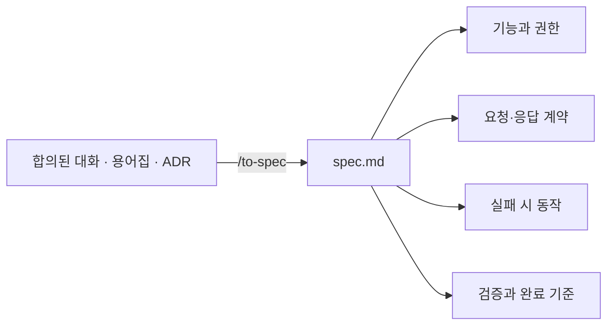

**완료 확인:** 대화의 결정과 명세를 대조합니다. H2 파일/메모리/PG의 구분, 쓰기 권한, 배포 완료 조건이 빠지지 않아야 합니다.

## 5강. /to-tickets — 하나씩 만들고 직접 실행해볼 수 있는 작은 작업으로 나누기

티켓은 이번에 끝낼 작은 작업과 확인 방법을 적은 카드입니다. 먼저 끝내야 할 티켓은 해당 작업을 시작하기 전에 끝나야 하는 일입니다.

> **학교 축제 비유:** ‘매점 완성’은 너무 큽니다. ‘손님이 음료를 고르고 돈을 내면 음료를 받는다’처럼 실제로 해보고 결과를 확인할 수 있는 작은 일로 나눕니다. ‘예쁜 간판만 만들기’처럼 한 부분만 끝내는 것보다 실제 사용 경로를 하나씩 완성하는 방식입니다. 포스터를 붙이려면 먼저 문구가 정해져야 하는 것처럼 작업에도 선후 관계가 있습니다.

### 입력

```text
/to-tickets

.scratch/notice-board/spec.md를 티켓으로 분해해줘.
UI → API → DB → 테스트가 연결되는 작은 기능 단위로 나눠줘.
각 티켓에 먼저 끝내야 할 티켓, 완료됐다고 판단할 조건, 완료 후 직접 실행해 확인하는 방법을 넣어.
CI와 운영 배포도 명세 범위에 포함해.
파일을 만들기 전에 제안한 분할과 작업의 앞뒤 순서를 보여줘.
```

### 예상 분할

| 번호 | 티켓 | 먼저 끝낼 작업 | 완료 후 눈으로 볼 결과 |
| --- | --- | --- | --- |
| 01 | 공개 목록·상세 읽기 | 없음 | local 전용 예제 공지를 UI에서 조회, H2 API 테스트 통과 |
| 02 | 관리자 로그인·공지 등록 | 01 | 로그인 후 작성, 새 공지가 공개 목록에 표시 |
| 03 | 공지 수정·삭제 | 02 | 본문 변경 반영, 삭제 후 목록에서 사라짐 |
| 04 | PR 품질 검증 자동화 | 03 | GitHub PR에서 백엔드·프론트·E2E 검사 결과 표시 |
| 05 | 운영 DB·자동배포 | 04 | Railway API + PG, Pages UI, main 자동배포 결과 |

01에 프로젝트 초기 구성과 shadcn/ui 설정도 포함합니다. 읽기 기능부터 연결하며, 예제 데이터는 local 프로필 전용으로 운영에 들어가지 않습니다. 04·05는 서버와 자동 검사·배포를 준비하는 티켓이지만 완료 조건이 ‘파일 생성’이 아니라 실제로 확인할 수 있는 검사·배포 결과입니다. 작은 실습이라 앞 작업을 끝내고 다음 작업을 하는 순서를 택한 것이며 항상 순차로 분해해야 하는 것은 아닙니다.

```text
이 분할과 작업의 앞뒤 순서로 진행해.
.scratch/notice-board/issues/ 아래 티켓당 한 파일로 작성해줘.
```

### 예상 파일 트리

```text
.scratch/notice-board/
├── spec.md
└── issues/
    ├── 01-read-notices.md
    ├── 02-login-and-create.md
    ├── 03-update-and-delete.md
    ├── 04-ci.md
    └── 05-production-deploy.md
```

### 티켓 일부 내용: 등록 기능

```markdown
# 02: 관리자 로그인과 공지 등록

**What to build:** 관리자가 로그인해 공지를 작성하면 방문자가 읽을 수 있다.
**Blocked by:** 01: 공개 목록·상세 읽기
**Status:** ready-for-agent

- [ ] 잘못된 로그인은 401이며 입력 화면에 오류가 표시된다.
- [ ] 관리자는 제목과 본문을 입력하고 저장할 수 있다.
- [ ] 제목·본문 제한을 API와 화면에서 검증한다.
- [ ] 저장 성공 시 상세로 이동하고 공개 목록에 표시된다.
- [ ] 미인증 쓰기는 401, 인증된 비관리자의 쓰기는 403이다.
- [ ] 만료된 토큰은 재로그인 안내로 이어진다.
- [ ] 저장 실패 시 입력을 보존하고 재시도할 수 있다.
- [ ] H2 통합 테스트와 화면 테스트로 위 동작을 확인한다.
```

공개 계정 생성 기능은 없지만, 권한 검사 테스트에서는 관리자 권한이 없는 인증 사용자를 구성해 403을 확인할 수 있습니다.

### 사용 전 → 후

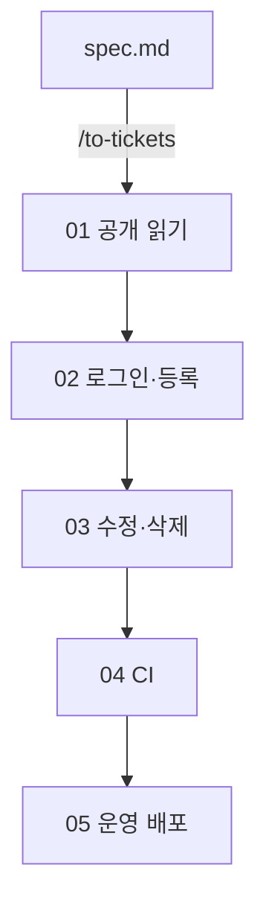

각 티켓에는 파일·완료됐다고 판단할 조건·직접 실행해 확인하는 방법이 있으며, 화살표는 먼저 끝내야 할 티켓의 완료가 필요함을 나타냅니다.

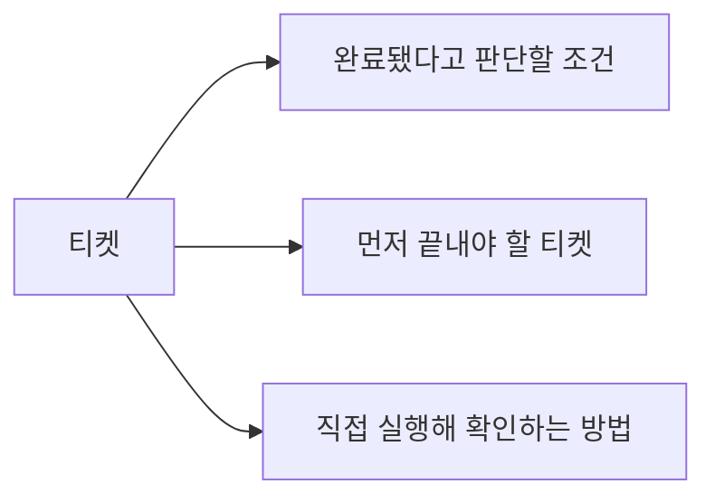

**완료 확인:** 모든 명세 조건이 티켓에 연결되어 있는지 확인합니다. 서로 상대 작업이 끝나기만 기다리는 순서가 되어서는 안 되고, 배포 티켓에는 필요한 계정·변수·검증 방법까지 있어야 합니다.

## 6강. /implement — 모든 티켓 구현하고 배포 결과 확인하기

`/implement-all`이라는 별도 스킬 대신 `/implement`에 **모든 티켓**을 지정합니다. `/implement-spec`은 여러 에이전트가 각자의 작업 폴더(worktree)에서 나눠 만든 뒤, 변경을 한 브랜치로 모아 검토 요청(PR)을 만드는 방식입니다. 이 실습은 `/implement`로 진행합니다.

> **조립 실습 비유:** `/implement`는 작업 카드를 보고 직접 만들고 시험하는 단계입니다. TDD는 먼저 ‘이 행동이 되어야 한다’는 시험을 만들고, 아직 실패하는지 확인한 뒤, 통과하도록 구현하는 방식입니다. 리뷰는 결과를 다시 살펴 규칙과 약속을 지켰는지 확인하는 과정입니다. 같은 티켓에서 구현 스킬이 이미 테스트와 리뷰를 수행했다면 별도 호출로 반복할 필요는 없습니다.

### 입력

```text
/implement

.scratch/notice-board/spec.md와 issues/의 모든 티켓을 구현해줘.
01 → 02 → 03 → 04 → 05 순서로 진행하고,
각 티켓의 완료됐다고 판단할 조건을 검증한 뒤 다음으로 넘어가.

backend/는 Spring Initializr의 최신 안정 Boot + Kotlin 조합을 확인해
JDK 25, Gradle Kotlin DSL, MVC, JPA, Security로 생성해.
Spring Boot, Kotlin, Gradle 버전을 고정하고 docs/versions.md에 기록해.
Spring용 Kotlin 플러그인, JPA 엔티티용 no-arg/open 설정도 검증해.
local=H2 파일, test=H2 메모리, prod=PG를 분명하게 분리해.
Flyway 적용과 JPA validate를 사용해.

frontend/는 Vite React TypeScript + shadcn/ui로 구성해.
등록/로그인/수정/삭제/페이지 이동을 실제 API에 연결해.
API 주소는 VITE_API_BASE_URL로 빌드할 때 주입해.

앞서 정한 입력과 결과 확인 위치에서 /tdd를 적용해.
백엔드 Security 포함 HTTP 통합 테스트는 H2 메모리를 사용하고,
프론트 화면 테스트와 실제 백엔드+H2의 브라우저 E2E도 작성해.
frontend에 lint, typecheck, test, test:e2e, build, dev 스크립트를 제공해.
test는 한 번 실행 후 종료하고 E2E용 서버 시작·종료를 자동화해.

GitHub Actions에서 PR과 main을 검증해.
main 검증이 통과한 동일 커밋만 Railway와 Cloudflare Pages에 배포해.
Railway 준비 완료와 배포 커밋을 확인한 다음 Pages 배포를 진행해.
외부 서비스 초기 설정은 docs/deployment.md에 단계별로 작성해.
설정값이 없으면 가능한 코드와 워크플로우부터 완성하고,
실제 배포에 필요한 아직 입력하지 않은 설정값을 정확히 보고해.

/code-review로 변경을 검토하고 문제를 수정해.
실제 검증을 통과한 티켓만 체크하고 Comments에 근거를 기록해.
이번 실습의 완료 티켓 Status는 done으로 사용해.
커밋은 현재 브랜치에 남기고, 푸시·최초 운영 배포는 설정 확인 후 진행해.
실행하지 않은 테스트나 배포를 완료로 보고하지 마.
```

생성 순서의 기준은 [Spring Initializr](https://start.spring.io/)와 [shadcn/ui Vite 안내](https://ui.shadcn.com/docs/installation/vite)입니다. 프론트는 비어 있는 `frontend/`에서 `npx shadcn@latest init -t vite`를 사용하는 방식을 선택할 수 있습니다. Vite를 먼저 생성했다면 기존 프로젝트 설치 절차를 따릅니다.

### 결과물 A: 프로젝트 트리 예시

```text
notice-board/
├── AGENTS.md
├── CONTEXT.md
├── .scratch/notice-board/...
├── docs/
│   ├── agents/...
│   ├── adr/...
│   ├── versions.md
│   └── deployment.md
├── backend/
│   ├── build.gradle.kts
│   ├── gradlew / gradlew.bat
│   ├── gradle/wrapper/...
│   ├── Dockerfile
│   └── src/
│       ├── main/kotlin/...          # API, 도메인, 저장, 인증
│       ├── main/resources/         # local/prod 설정, 마이그레이션
│       └── test/                   # H2 test 설정과 통합 테스트
├── frontend/
│   ├── package.json
│   ├── package-lock.json
│   ├── vite.config.ts
│   ├── playwright.config.ts
│   └── src/                       # 화면, API 연결, shadcn 컴포넌트
└── .github/workflows/
    └── ci-cd.yml
```

### 결과물 B: 화면 변화

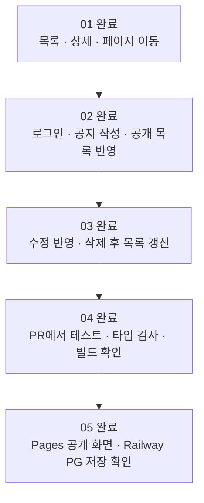

### 로컬에서 직접 확인

백엔드 폴더의 PowerShell 터미널:

```powershell
.\gradlew.bat bootRun --args='--spring.profiles.active=local'
```

프론트 폴더의 다른 터미널:

```powershell
npm ci
npm run dev
```

개발용 관리자 아이디·비밀번호와 API 주소는 구현 시 생성한 `.env.example`·배포 문서에 따라 설정합니다. 실제 비밀번호를 저장소에 커밋하지 않습니다.

| 직접 조작 | 확인할 결과 |
| --- | --- |
| 로그아웃 상태에서 목록·상세 열기 | 공개 조회 가능, 작성 버튼 없음 |
| 인증 없이 쓰기 API 호출 | 401; 버튼을 숨기는 것과 별개로 서버에서 차단 |
| 관리자 로그인 후 작성 | 상세로 이동, 목록에도 새 공지 표시 |
| 잘못된 제목 제출 | 필드 오류 표시, DB에 등록되지 않음 |
| 수정 후 새로고침 | 수정 결과 유지, 로그인은 해제 |
| 다시 로그인하여 삭제 | 확인 후 삭제, 상세 재조회 404 |
| 로컬 백엔드 재시작 | H2 파일의 공지 유지 |

## 6강의 배포 실습 — GitHub Actions가 전체 흐름을 제어하기

CI는 변경할 때마다 테스트와 빌드를 자동 확인하는 과정입니다. 이 실습의 CD는 통과한 변경을 실제 서비스에 배포하는 과정입니다. PR은 변경을 합치기 전에 검토하는 요청이고, main은 여기서 운영 배포의 기준으로 삼은 브랜치입니다.

> **학교 방송 비유:** 방송 원고를 고친 뒤 맞춤법·분량·소리를 점검하는 것이 CI, 확인된 원고를 실제 교내 방송에 내보내는 것이 CD입니다. 점검 중인 원고와 실제 방송 원고가 같아야 합니다. 커밋 SHA는 ‘몇 번째 수정본인가’를 정확히 구분하는 꼬리표입니다.

### 최초 한 번 준비할 것

배포 전에 **Cloudflare CLI인 Wrangler와 Railway CLI**를 준비합니다. 아래 명령은 실습자가 실행할 안내이며, 이 문서를 읽는 것만으로 설치·로그인이 이루어지지는 않습니다.

> **학교생활 비유:** CLI는 서비스에 명령을 전달하는 리모컨입니다. 설치는 리모컨을 준비하는 일, 로그인은 내 계정의 사용 권한을 확인하는 일, 프로젝트 연결은 어느 교실의 장비를 조작할지 고르는 일입니다. 로그인했다고 게시판이 자동으로 배포되는 것은 아닙니다.

#### 1. Cloudflare Wrangler 설치

프론트 프로젝트를 생성해 `frontend/package.json`이 생긴 뒤, **frontend 폴더의 터미널**에서 실행합니다. 프로젝트별 설치를 사용하고 버전·lockfile을 커밋해 팀과 CI가 같은 도구를 쓰게 합니다. [Wrangler 설치 안내](https://developers.cloudflare.com/workers/wrangler/install-and-update/)

```powershell
npm install --save-dev --save-exact wrangler@latest
npx wrangler --version
```

이미 Wrangler가 설치되어 있다면 버전부터 확인합니다. 위 설치 명령은 최초 준비용이며 매번 배포할 때 최신 버전으로 다시 설치하지 않습니다. CI에서는 `npm ci`로 기록된 버전을 설치합니다.

#### 2. Cloudflare 로그인과 계정 확인

같은 frontend 터미널에서 실행합니다.

```powershell
npx wrangler login
```

브라우저가 열리면 게시판을 배포할 Cloudflare 계정으로 로그인하고 CLI 접근을 허용합니다. 터미널로 돌아와 확인합니다. [Wrangler 인증 명령](https://developers.cloudflare.com/workers/wrangler/commands/general/)

```powershell
npx wrangler whoami
npx wrangler pages project list
```

**성공 기준:** 올바른 계정과 계정 ID가 표시되고, 프로젝트 목록을 권한 오류 없이 조회할 수 있습니다. 새 계정이라 목록이 비어 있는 것은 정상입니다.

Pages 프로젝트가 없다면 다음 명령으로 만들고 production branch를 `main`으로 지정합니다. 이미 만들었다면 다시 생성하지 않습니다.

```powershell
npx wrangler pages project create
```

질문에 프로젝트 이름을 입력합니다. 생성 후 이름과 계정 ID를 아래 Actions 변수에 기록합니다. 이 단계는 배포 대상 생성이며 앱 업로드는 아닙니다. [Pages Direct Upload 시작](https://developers.cloudflare.com/pages/get-started/direct-upload/)

#### 3. Railway CLI 설치

Node.js와 npm이 준비된 터미널에서 설치합니다. 이 실습은 사람이 직접 실행하고 CI에도 연결하기 쉬운 **CLI 경로**를 사용합니다.

```powershell
npm install -g @railway/cli
railway --version
```

명령을 찾지 못하면 터미널을 새로 열고 다시 확인합니다. 그래도 안 되면 npm 전역 실행 파일 경로가 PATH에 포함되어 있는지 확인합니다. 실제 설치 버전을 `docs/versions.md`에 적고 CI 설치 시 그 버전을 지정합니다. [Railway CLI 설치 안내](https://docs.railway.com/cli)

#### 4. Railway 로그인

```powershell
railway login
```

브라우저에서 계정 인증을 마친 뒤 확인합니다.

```powershell
railway whoami
```

브라우저를 자동으로 열 수 없는 환경에서는 다음 명령을 사용하고, 터미널이 안내한 주소와 코드를 따라 인증합니다. [Railway 로그인 안내](https://docs.railway.com/cli/login)

```powershell
railway login --browserless
```

**성공 기준:** `railway whoami`가 사용할 계정을 표시합니다. 아직 어느 프로젝트에 배포할지는 정하지 않은 상태입니다.

#### 5. Railway 프로젝트와 API 서비스 연결

Railway 대시보드에서 프로젝트, API용 서비스와 PostgreSQL 서비스를 먼저 준비합니다. 그 뒤 **게시판 저장소 루트**에서 실행합니다.

```powershell
railway link
railway status
```

선택 화면에서 정확한 프로젝트·환경·API 서비스를 고릅니다. CLI 버전에 따라 서비스 선택이 별도라면 `railway service`로 API 서비스를 선택합니다. `railway status`로 연결 대상을 다시 확인합니다. **PostgreSQL 서비스가 아니라 API 서비스에 백엔드 코드를 배포합니다.** [프로젝트 연결 안내](https://docs.railway.com/cli/link)

이 문서에서는 저장소 루트를 연결하고 API 서비스의 소스 루트를 `backend/`로 구성합니다. 실제 업로드 위치와 Railway의 Root Directory·Dockerfile 경로가 같은 기준을 사용하는지 확인합니다. 같은 `backend/` 경로를 이중으로 적용하지 않습니다.

> **학교생활 비유:** 같은 학교에도 방송실과 도서관이 있습니다. 내 계정으로 들어갔더라도 ‘방송실 장비에 보낼 파일’을 도서관 장비에 보내면 안 됩니다. `whoami`는 사람 확인, `status`는 작업 대상 확인입니다.

#### 6. 내 PC 로그인과 GitHub Actions 인증은 별개

| 실행 장소 | Cloudflare | Railway |
| --- | --- | --- |
| 내 PC | `wrangler login`으로 로그인 | `railway login`으로 로그인 |
| GitHub Actions | `CLOUDFLARE_API_TOKEN`과 계정 ID | 프로젝트 범위 `RAILWAY_TOKEN` |

내 PC에서 로그인했어도 GitHub Actions의 실행 컴퓨터에는 그 로그인이 전달되지 않습니다. Actions에서 브라우저 로그인 명령을 실행하지 말고 토큰을 사용합니다.

Cloudflare에서는 해당 계정의 **Cloudflare Pages 편집 권한**을 가진 API 토큰을 만들고, Railway에서는 배포 대상 프로젝트·환경의 토큰을 만듭니다. GitHub 저장소의 **Settings → Secrets and variables → Actions**에서 등록합니다. production 환경 Secret을 사용한다면 **Settings → Environments → production**에 등록하고 배포 job이 그 환경을 참조하게 합니다.

GitHub CLI로 production 환경 Secret을 입력할 수도 있습니다. 값을 명령어에 직접 넣지 않고 입력 요청에 붙여 넣습니다.

```powershell
gh secret set CLOUDFLARE_API_TOKEN --env production
gh secret set RAILWAY_TOKEN --env production
```

토큰 이름이 등록됐다는 사실만으로 권한이 올바르다고 확정하지 않습니다. 실제 배포 결과까지 확인합니다. 계정 ID·프로젝트명·서비스 ID 등은 아래 변수 표에 따라 설정합니다.

> **출입증 비유:** 내 학생증을 집에 두고 왔다고 학교의 자동 배송 로봇이 그 학생증을 쓸 수는 없습니다. 자동화에는 별도 출입증을 주되, 필요한 곳만 출입할 수 있게 하는 것입니다.

#### Railway MCP도 설치해야 하나요?

이 튜토리얼은 **Railway CLI로 진행하므로 MCP 설치는 필수가 아닙니다.** MCP는 에이전트가 외부 서비스 도구를 호출할 수 있게 연결하는 방식이고, CLI는 터미널 명령으로 조작하는 방식입니다. 이번 실습에서는 CLI 설치·인증·연결을 먼저 완료하면 됩니다.

**MCP(Model Context Protocol)**는 AI 애플리케이션과 도구·자료 제공자가 서로 연결되는 표준 규약입니다. MCP 서버는 도구나 자료 등을 제공하고, 에이전트 쪽 클라이언트는 연결된 기능을 사용합니다. 이름에 ‘서버’가 들어가도 반드시 멀리 있는 대형 컴퓨터라는 뜻은 아니며, 로컬 프로그램일 수도 있습니다. [MCP의 서버 기능](https://modelcontextprotocol.io/specification/2025-06-18/server/index)

> **학교 도서관 비유:** 학생이 사서에게 정해진 방식으로 ‘이 책이 대출 가능한지 알려주세요’라고 요청하고 결과를 받는 창구와 같습니다. 스킬은 ‘자료 조사할 때 어떤 순서로 책을 찾을지’ 적은 안내서이고, MCP는 실제 조회 기능을 연결하는 창구입니다. 창구가 생겨도 내가 모든 책을 가져갈 권한이 생기는 것은 아닙니다.

| 비교 | 스킬 | MCP | CLI |
| --- | --- | --- | --- |
| 주요 역할 | 일을 진행하는 방법 안내 | 도구·자료를 표준 방식으로 연결 | 터미널 명령으로 도구 실행 |
| 게시판 예시 | 배포 확인 절차를 안내 | 연결된 서비스의 배포 상태 도구 사용 | `railway status` 실행 |
| 별도 준비 | 설치·참고 자료 | 서버 연결·필요한 인증과 권한 | 프로그램 설치·필요한 로그인 |

예를 들어 ‘배포가 끝났는지 확인해줘’라는 요청에서 스킬은 **확인 순서**를 안내할 수 있습니다. 실제 상태는 연결된 MCP 도구나 Railway CLI로 조회합니다. 어떤 정보가 조회되는지는 각 도구가 제공하는 기능에 따라 다릅니다. 스킬 문서에 ‘Railway를 확인한다’고 적는 것만으로 계정 연결이 만들어지지는 않습니다.

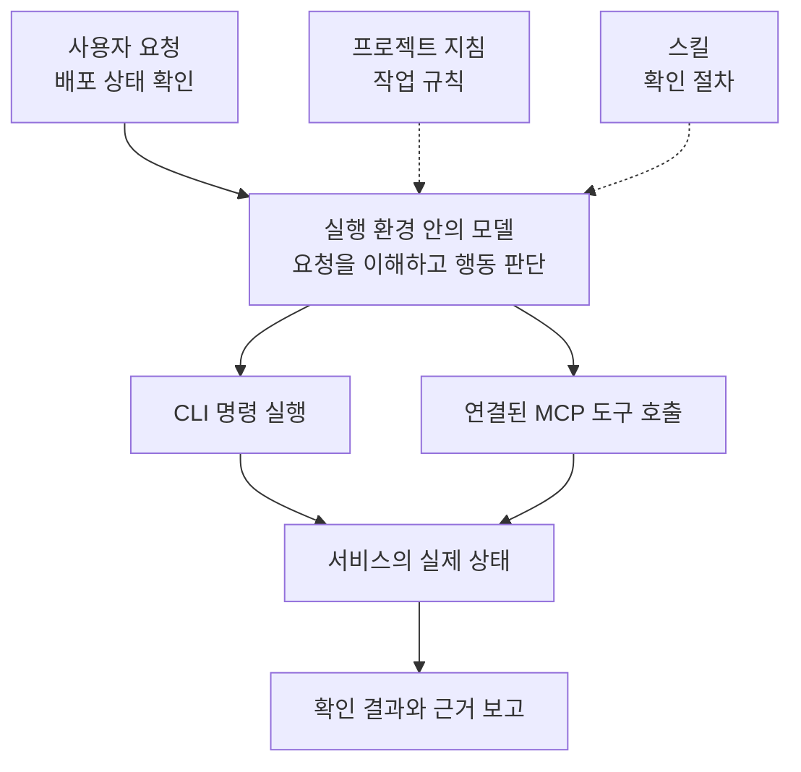

그림의 CLI와 MCP는 가능한 두 경로를 나타냅니다. 매번 둘 다 사용해야 하는 것은 아닙니다. 어느 경로든 인증과 권한이 필요하며, 연결이 없거나 조회가 실패하면 상태를 추측하지 않고 미확인으로 남깁니다.

#### 설치·연결 완료 체크

- [ ] `npx wrangler --version`과 `railway --version`이 실행된다.
- [ ] `npx wrangler whoami`와 `railway whoami`에서 올바른 계정이 보인다.
- [ ] Pages 프로젝트 이름과 production branch가 확인된다.
- [ ] `railway status`의 프로젝트·환경·서비스가 API 배포 대상과 일치한다.
- [ ] GitHub Actions용 토큰과 대상 변수를 별도로 등록했다.

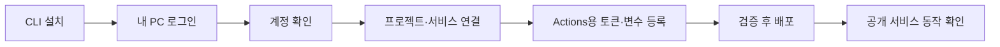

#### 외부 서비스 준비 목록

| 위치 | 설정 |
| --- | --- |
| GitHub | 저장소, main 브랜치, Actions 사용, production 환경 |
| Railway | 프로젝트, API 서비스, PostgreSQL 서비스, API 공개 HTTPS 주소 |
| Railway API | backend 루트/Dockerfile 경로, prod 환경변수, 헬스체크 경로 |
| Cloudflare | Pages Direct Upload 프로젝트, production branch=main |
| Actions | 아래 Secrets·Variables, 고정된 CLI/Action 버전 |

Railway API는 플랫폼의 `PORT`를 사용하도록 `server.port=${PORT:8080}`을 설정합니다. Railway의 PostgreSQL 연결 변수를 **JDBC URL·사용자·비밀번호**에 맞게 연결해 설정합니다. 일반 `postgresql://...` URL을 JDBC URL 자리에 그대로 넣지 않습니다.

### 환경변수의 역할 구분

| 보관 위치 | 이름 예시 | 용도 |
| --- | --- | --- |
| GitHub Secret | RAILWAY_TOKEN | 프로젝트·환경 범위의 배포 토큰 |
| GitHub Secret | CLOUDFLARE_API_TOKEN | 해당 계정 Pages 편집 권한 |
| GitHub Variable | RAILWAY_SERVICE_ID | 배포할 API 서비스 |
| GitHub Variable | CLOUDFLARE_ACCOUNT_ID, CLOUDFLARE_PAGES_PROJECT | Pages 배포 대상 |
| GitHub Variable | VITE_API_BASE_URL | Railway의 공개 API URL, 프론트 빌드에 주입 |
| Railway Variable | SPRING_PROFILES_ACTIVE=prod | 운영 프로필 |
| Railway Variable | SPRING_DATASOURCE_URL / USERNAME / PASSWORD | PG 연결, Railway 변수 참조 사용 |
| Railway Variable | ADMIN_USERNAME, ADMIN_PASSWORD_HASH | 관리자 검증 정보 |
| Railway Variable | JWT_SECRET | 운영 서명 키, 코드 기본값 없이 설정 |
| Railway Variable | CORS_ALLOWED_ORIGINS | 실제 Pages production Origin |

`VITE_` 값은 브라우저 번들에 포함되므로 공개 API 주소만 넣습니다. DB 비밀번호와 JWT 키를 넣으면 안 됩니다. Pages에 런타임 변수만 바꿔서는 이미 만들어진 JS의 API 주소가 바뀌지 않으므로 **Actions 빌드 단계**에 주입합니다. [Vite 환경변수](https://vite.dev/guide/env-and-mode)

> **안내문 비유:** 환경변수는 학교별로 바뀌는 교무실 전화번호처럼 프로그램 바깥에서 넣는 설정입니다. 프론트 빌드에 넣은 `VITE_` 값은 학생에게 나눠준 안내문에 인쇄된 내용처럼 공개됩니다. 교무실 위치는 써도 되지만 열쇠 보관함 비밀번호를 인쇄하면 안 됩니다. 인쇄한 뒤 번호를 바꾸려면 안내문도 다시 만들어야 합니다.

### 자동 검사와 배포가 따라야 할 순서

아래는 구현 시 생성할 `ci-cd.yml`의 **실행 순서를 설명한 문서**입니다. 완성된 실행용 YAML로 오해하지 않도록 자동 실행 작업의 앞뒤 순서로 표시합니다.

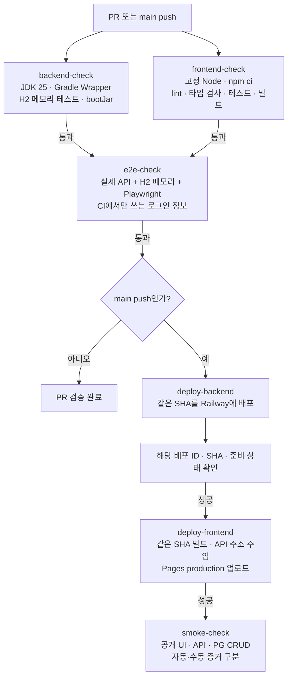

검사나 배포가 실패하면 다음 배포 단계를 진행하지 않습니다. PG CRUD에 관리자 인증이 필요하면 아래 운영 검증 절차에 따라 자동·수동 실행을 구분합니다.

backend와 frontend 검사가 끝나기 전에는 배포하지 않습니다. PR 검사에는 운영 비밀번호·토큰(Secret)을 제공하지 않습니다. 운영 배포가 동시에 두 개 진행되지 않도록 GitHub Actions의 `concurrency` 설정으로 같은 그룹에 묶습니다. 진행 중인 배포는 중간에 취소하지 않게 설정합니다. 대기 중인 작업은 새 작업으로 교체될 수 있으므로 모든 중간 버전이 배포되는 것은 아닙니다. 실제 배포한 코드 버전을 구분하는 SHA를 기록합니다.

Railway 배포 명령과 인증은 [Railway CLI](https://docs.railway.com/cli), [railway up](https://docs.railway.com/cli/up)을 기준으로 구현합니다. `RAILWAY_TOKEN`으로 인증하고 서비스 대상을 적습니다. CLI 종료만으로 앱 정상 실행을 판단하지 않습니다.

Railway는 DB 연결까지 확인하는 health endpoint를 배포 준비 조건에 연결하고 세부 정보는 노출하지 않습니다. 기존 버전의 health 200을 새 버전 성공으로 착각하지 않도록 **이번 배포 ID·커밋**과 함께 확인합니다. [Railway healthchecks](https://docs.railway.com/deployments/healthchecks)

Pages 업로드의 핵심 명령은 다음 형태입니다. `frontend/`에서 실행하며, 프로젝트 값과 인증 환경변수는 Actions가 제공합니다. CLI 버전은 구현 시 고정합니다. [Pages CI 안내](https://developers.cloudflare.com/pages/how-to/use-direct-upload-with-continuous-integration/)

```bash
npx wrangler pages deploy dist --project-name="$CLOUDFLARE_PAGES_PROJECT" --branch=main
```

외부 서비스 자체의 Git 자동배포는 끄고 위 Actions 순서로 통일합니다. 백엔드와 프론트가 반드시 함께 새 버전으로 바뀌는 것은 아닙니다. 백엔드만 성공하고 프론트 배포가 실패할 수도 있습니다. 따라서 새 백엔드도 기존 프론트의 요청을 처리할 수 있게 만들어두고, 실패한 프론트 배포를 다시 진행합니다. DB를 바꿀 때도 기존 앱이 계속 읽고 쓸 수 있는 변경부터 적용합니다. 이미 지운 데이터나 DB 항목이 배포 취소만으로 자동 복구된다고 생각하면 안 됩니다.

> **학교 방송 비유:** 방송실 장비와 교실 스피커를 따로 교체하면 둘 중 하나만 새것이 될 수 있습니다. 그래서 새 장비가 기존 스피커와도 연결되게 준비합니다. 이것이 여기서 말하는 호환성입니다. ‘두 곳 모두 동시에 바뀌거나 아무것도 안 바뀜’이 보장되지 않으므로 어느 곳이 성공했는지 따로 확인합니다. health 확인도 전원이 켜졌다는 것뿐 아니라 실제 필요한 연결이 준비됐는지 보는 점검입니다.

### H2 테스트와 PG 운영 확인은 서로 다른 결과물

| 확인 | DB | 의미 |
| --- | --- | --- |
| HTTP 통합 테스트 | H2 메모리 | 기능·검증·권한 규칙이 기대대로 동작 |
| 브라우저 E2E | H2 메모리 | 프론트와 백엔드 연결 동작 |
| 로컬 재시작 확인 | H2 파일 | 개발 데이터가 재시작 후 유지 |
| 운영 마이그레이션·CRUD 확인 | PG | 실제 운영 DB의 표·항목·연결·저장 동작 |

운영 검증에서는 `[배포확인 <커밋>]`처럼 식별 가능한 임시 공지를 생성·수정·삭제합니다. 관리자 인증이 필요한 검증은 배포 담당자가 직접 하거나 별도로 승인한 자동화용 계정·토큰으로 수행합니다. 수동으로 했다면 워크플로우가 자동 통과한 것으로 쓰지 않고 실행자·시간·결과를 별도로 기록합니다.

### 사용 전 → 후: GitHub 화면과 운영 화면

```text
전
  소스만 있음 / 배포 상태 알 수 없음

후 — 실제 실행 후 채워야 하는 기록
  Commit: <실제 SHA>
  backend-check: <결과 + 실행 링크>
  frontend-check: <결과 + 실행 링크>
  e2e-check: <결과 + 실행 링크>
  Railway deployment: <배포 ID + 준비 상태>
  Pages deployment: <배포 URL + SHA>
  PG CRUD: <자동/수동 구분 + 확인 결과>
```

### 티켓 완료 표기 예시

```diff
- **Status:** ready-for-agent
+ **Status:** done
- - [ ] 공지 등록 후 공개 목록에서 확인된다.
+ - [x] 공지 등록 후 공개 목록에서 확인된다.
+
+ ## Comments
+ 실제 테스트 명령·결과와 해당 변경 커밋을 기록한다.
```

`done`은 이 튜토리얼에서 추가한 완료 표기입니다. 기본 triage 라벨에 자동으로 포함되는 값이 아닙니다. 외부 설정이 없어 배포하지 못했다면 05를 완료로 바꾸지 않습니다.

## 한눈에 보는 스킬 사용 결과의 차이

| 단계 | 입력 | 결과물 | 아직 없는 것 |
| --- | --- | --- | --- |
| 설치 | 설치 명령 | 사용할 수 있는 스킬 | 프로젝트 규칙 |
| `/setup-matt-pocock-skills` | 저장소와 선호 | 작업 저장 규칙 | 제품 요구사항 합의 |
| `/grill-with-docs` | 게시판 아이디어·사용할 기술과 지켜야 할 조건 | 용어·구체적으로 정한 요구사항·결정 기록 | 통합된 명세 |
| `/to-spec` | 합의된 대화와 문서 | 검증 가능한 spec.md | 구현 단위 |
| `/to-tickets` | 명세 | 작업의 앞뒤 순서·완료됐다고 판단할 조건이 있는 티켓 | 실행되는 기능 |
| `/implement` | 전체 티켓 | 코드·테스트·CI/CD·실행 근거 | 미실행 배포는 별도 미완료 |

## 최종 완료 체크

- [ ] 모든 스킬 호출 예시는 `/스킬이름` 형식으로 실행했다.
- [ ] 인터뷰에서 인증·권한·입력·삭제·페이지·배포 기준을 합의했다.
- [ ] 명세와 티켓에 같은 조건이 일관되게 반영됐다.
- [ ] Boot/Kotlin/Gradle/Node/프론트 패키지 버전을 실제 생성 결과로 기록했다.
- [ ] local H2 파일, test H2 메모리, prod PG가 분리됐다.
- [ ] UI와 API에서 읽기·쓰기 권한 및 실패 상황을 확인했다.
- [ ] PR에서 검사하고 main의 검증된 커밋만 배포한다.
- [ ] Railway와 Pages가 같은 커밋 기준이며 공개 주소에서 동작한다.
- [ ] H2 통과와 별개로 PG 마이그레이션·CRUD 결과를 확인했다.
- [ ] 테스트·배포·화면 확인을 실제 수행한 경우에만 완료로 기록했다.

## 추가 사항: /ask-matt로 다음 단계 추천받기

어떤 스킬을 써야 할지 기억나지 않으면 현재 작업 중인 대화에서 물어보세요. `/ask-matt`는 상황에 맞는 스킬과 진행 경로를 추천하는 안내 역할입니다. 추천을 확인한 뒤 해당 스킬을 호출해 진행합니다.

```text
/ask-matt 나 이제 뭐해야 해?
```

### 예시 1: setup을 마쳤지만 요구사항이 아직 모호할 때

```text
사용자: /ask-matt 나 이제 뭐해야 해?

예상 추천: 프로젝트 설정은 끝났습니다. 관리자 권한과 로그인 유지,
삭제 정책을 먼저 정리하도록 /grill-with-docs를 추천합니다.
```

추천받은 스킬을 바로 실행합니다.

```text
/grill-with-docs

추천한 대로 공지사항 게시판의 관리자 권한, 로그인 유지,
삭제 정책부터 질문해서 정리해줘. 합의한 내용을 문서에 남겨줘.
```

### 예시 2: 인터뷰가 끝났을 때

```text
/ask-matt 나 이제 뭐해야 해?
공지사항 게시판 요구사항을 합의했고 CONTEXT.md와 ADR도 작성했어.
```

예상 추천은 `/to-spec`입니다. 이어서 입력합니다.

```text
/to-spec

방금 합의한 요구사항과 도메인 문서를 기준으로
.scratch/notice-board/spec.md를 작성해줘.
테스트에서 어디에 입력하고 어떤 결과를 확인할지 먼저 확인해줘.
```

### 예시 3: 티켓까지 만들었을 때

```text
/ask-matt 나 이제 뭐해야 해?
.scratch/notice-board/spec.md와 issues/의 티켓을 작성했어.
아직 구현한 티켓은 없어.
```

먼저 해야 하는 작업이 없는 첫 티켓의 `/implement`를 추천받았다면 다음처럼 진행합니다.

```text
/implement

.scratch/notice-board/spec.md를 읽고
.scratch/notice-board/issues/01-read-notices.md를 구현해줘.
완료됐다고 판단할 조건을 검증하고 실제 결과를 티켓에 기록해줘.
```

첫 티켓 완료 후 다시 `/ask-matt 나 이제 뭐해야 해?`라고 물으면 남은 티켓과 작업의 앞뒤 순서를 바탕으로 다음 단계를 추천받을 수 있습니다. 이 튜토리얼 6강처럼 모든 티켓을 한 번에 지정할 수도 있고, 추천에 따라 하나씩 진행할 수도 있습니다.

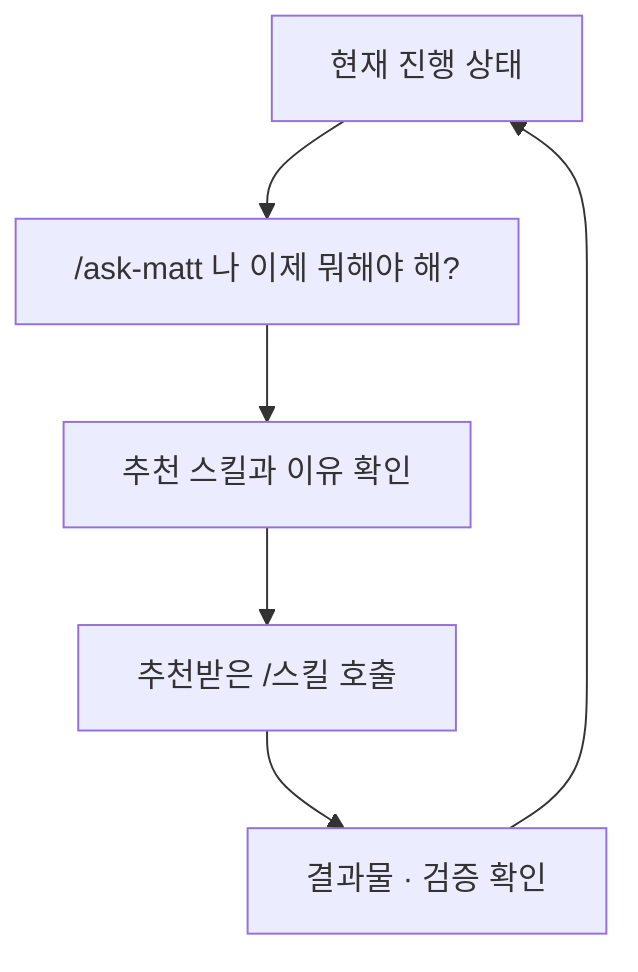

추천은 정해진 답이 아닙니다. 요구가 모호하면 인터뷰, 명세가 준비되면 티켓 분해, 구현 중 오류가 생기면 진단을 추천할 수 있습니다. 새 대화에서는 명세·티켓 경로와 완료한 작업을 함께 알려주면 다음 단계를 판단하기 쉽습니다.

## 그외 워크플로우 10개

**워크플로우는 상황에 맞춰 스킬을 이어 쓰는 순서**입니다. 열 가지를 모두 해야 하는 숙제가 아닙니다. 지금 겪는 상황과 가장 비슷한 하나를 골라 시작하세요.

> **학교생활 비유:** 체육복을 잃어버렸을 때는 ‘마지막으로 본 곳 확인 → 분실물함 확인’을 하고, 축제를 준비할 때는 ‘회의 → 준비물 정리 → 역할 분담’을 합니다. 둘 다 순서가 있지만 목적이 다르듯, 개발도 항상 같은 긴 절차가 필요한 것은 아닙니다.

### 읽는 방법과 공통 준비

### 잠깐: 컨텍스트와 용량은 무엇인가요?

**컨텍스트(context)**는 LLM이 지금 답하거나 작업할 때 참고하는 정보입니다. 현재 대화, 작업 지침, 읽어온 코드와 문서, 도구 실행 결과 등이 포함됩니다. 저장소의 모든 파일이 자동으로 전부 들어오는 것은 아닙니다. 필요한 파일을 읽어야 그 내용이 현재 작업에 전달됩니다.

> **책상 비유:** 프로젝트 폴더는 책장이고, 컨텍스트는 지금 책상 위에 펼쳐놓은 자료입니다. 책장에 책이 있다고 모든 페이지를 동시에 보고 있는 것은 아닙니다. `CONTEXT.md`는 책장에 있는 ‘우리 팀 용어 사전’이라는 파일 하나이며, 컨텍스트 전체와 같은 뜻이 아닙니다.

**컨텍스트 창(context window)**은 한 번의 처리에서 다룰 수 있는 정보량의 범위입니다. 보통 **토큰(token)**이라는 단위로 표시합니다. 토큰은 글을 모델이 처리하도록 나눈 조각으로, 한 글자나 한 단어와 항상 같지 않습니다. 한국어·영어·코드에 따라 나뉘는 방식도 달라집니다.

정확한 최대 용량과 실제 사용 가능한 공간은 모델·실행 환경·설정에 따라 달라집니다. ‘항상 몇 글자까지’ 또는 ‘모든 모델은 같은 용량’이라고 외우지 마세요. 사용하는 도구가 제공하는 컨텍스트 사용량·한도·자동 요약 안내를 확인합니다. 구독의 사용량 제한과 한 대화의 컨텍스트 용량도 서로 다른 개념입니다.

> **책상 크기 비유:** 큰 책상에도 책과 공책을 계속 펼치면 새 자료를 놓기 어려워집니다. 긴 로그와 관련 없는 코드까지 쌓으면 중요한 합의를 찾기도 어려워집니다. 그렇다고 책상을 매번 싹 비우면 방금 정한 내용까지 잃습니다. 필요한 자료를 남기고, 작업이 한 단계 끝났을 때 정리하는 것이 좋습니다.

### /handoff, /clear, /compact는 언제 쓰나요?

**`/handoff`는 다음 작업자가 이어받을 수 있도록 인계 문서를 작성하는 스킬**입니다. 현재 목표, 남은 일, 중요한 결정과 기존 자료의 경로를 남깁니다. 설치된 스킬은 운영체제의 임시 폴더에 문서를 저장하며, 다음 대화에서 사용할 추천 스킬도 적습니다. 비밀값은 제외합니다.

> **조별 과제 비유:** 내가 만들던 발표 자료를 친구에게 넘길 때 “3쪽까지 끝냈고, 통계 출처는 이 파일, 4쪽부터 이어서 하면 돼”라는 쪽지를 같이 주는 것입니다. 친구가 자동으로 내 머릿속까지 알게 되는 것은 아니므로 실제 인계 파일을 전달해야 합니다.

`/handoff` 자체는 대화를 지우거나 새 대화를 여는 명령이 아닙니다. **파일 생성 → 경로 확인 → 다른 대화에서 파일 읽기**까지 해야 인계가 됩니다. 임시 파일은 정리될 수 있으므로 장기 보관할 결정은 ADR·명세·티켓에 남깁니다. 다른 PC로 넘기면 내 PC의 경로만 알려주지 말고 파일과 참조 자료에 접근할 수 있게 전달해야 합니다.

| 선택 | 하는 일 | 쓰기 좋은 시점 |
| --- | --- | --- |
| 계속 진행 | 지금 대화의 맥락을 유지 | 다음 단계에 방금 논의가 필요하고 공간도 충분할 때 |
| `/handoff` | 이동 가능한 인계 문서 작성 | 다른 폴더·도구·사람에게 작업을 넘길 때 |
| `/clear` 또는 새 대화 | 현재 작업에서 쓸 대화 맥락을 새로 시작 | 필요한 정보가 문서에 남았고 이전 대화가 더는 필요 없을 때 |
| `/compact` 또는 도구의 요약 기능 | 필요한 맥락을 요약해 이어가기 | 같은 작업을 계속하지만 공간을 정리해야 할 때 |

**`/clear`와 `/compact`는 여기서 Matt 스킬 이름이 아니라 사용하는 도구의 대화 관리 기능을 가리킵니다.** 지원 여부와 동작은 도구마다 다릅니다. 해당 명령이 없다면 새 대화·요약 기능을 사용하고, 존재하지 않는 명령을 억지로 실행하지 않습니다. `/clear`가 프로젝트 파일을 지운다는 뜻은 아닙니다.

> **정리 비유:** `/handoff`는 친구에게 줄 인계 쪽지, `/compact`는 내가 계속 쓸 핵심 요약, `/clear`는 지금 펼친 대화 자료를 치우고 새 작업을 시작하는 것에 가깝습니다. 요약에는 빠지는 내용이 있을 수 있으므로 정확한 결정은 원본 문서로 확인합니다.

### 이 튜토리얼에서는 언제 대화를 바꾸나요?

1. **인터뷰 → 명세 → 티켓:** 가능한 한 같은 대화에서 이어갑니다. 아직 문서에 반영하지 않은 합의가 있으므로 중간에 `/clear`를 하지 않습니다.
2. **시제품 실험:** 아래 3번처럼 다른 폴더로 이동할 때 `/handoff`를 만듭니다. 원래 대화는 유지하고 실험용 새 대화를 열면 됩니다. 이때 `/clear`는 필요하지 않습니다.
3. **티켓 하나의 구현·검증 완료 후:** 다음 티켓이 필요한 정보를 명세·티켓·커밋으로 모두 갖췄다면 새 대화나 지원되는 `/clear`로 시작할 수 있습니다. 검증 중인 작업을 끊어서 비우지는 않습니다.
4. **티켓 작성 전부터 대화가 너무 길어진 경우:** 합의된 내용을 먼저 문서에 반영하고 단계가 끝나는 지점에서 요약합니다. 다음 단계에 필요한 결정·미결정 질문·문서 경로를 보존합니다.

새 대화 또는 `/clear` 이후에는 다음처럼 실제 경로를 알려줍니다.

```text
.scratch/notice-board/spec.md와
.scratch/notice-board/issues/02-login-and-create.md를 읽어줘.
01 티켓은 구현·검증을 마쳤어. 해당 완료 기록도 확인해줘.
CONTEXT.md와 관련 ADR을 읽고 02 티켓을 시작하기 전에 갖춰야 할 조건을 확인한 뒤 진행해줘.
```

아래 표의 열 가지 흐름마다 `/clear`를 넣지 않은 이유는 **대화 초기화가 의무 단계가 아니기 때문**입니다. 필요한 맥락이 기록되어 있는지, 다음 단계가 그 맥락을 필요로 하는지 보고 결정합니다.

### 워크플로우를 실행하는 방법

아래의 `A → B`는 **A의 결과를 확인한 다음 B를 호출한다**는 뜻입니다. 화살표 전체를 터미널에 붙여 넣지 않습니다. 각 `/스킬`은 에이전트 대화창에서 따로 실행합니다.

- 프로젝트의 첫 엔지니어링 작업 전에는 `/setup-matt-pocock-skills`를 실행합니다. 이미 설정한 저장소에서는 아래 경로의 setup을 반복하지 않습니다.
- 1강 명령으로 Matt Pocock 저장소의 전체 스킬을 Codex·Claude Code에 전역 설치합니다. 아래에는 1강의 소개 표에 없는 스킬도 등장하지만 별도로 골라 설치할 필요는 없습니다. 나중에 추가된 스킬이 필요하면 같은 전체 설치 명령을 다시 실행합니다.
- 인터뷰 → 명세 → 티켓은 가능한 한 같은 대화에서 이어가 합의 내용을 유지합니다. 구현을 새 대화에서 할 때는 명세·티켓 경로를 전달합니다.
- `/implement`는 테스트와 리뷰를 포함하는 흐름입니다. 표에서 리뷰를 따로 쓰지 않았다고 검증을 생략하는 뜻은 아닙니다.
- 아래 대화는 추천 예시입니다. 실제 `/ask-matt`는 대화와 파일의 현재 상태를 보고 다른 경로를 제안할 수 있습니다.

| 번호 | 이런 상황이면 선택 | 핵심 결과 |
| --- | --- | --- |
| 1 | 새 앱을 처음부터 만들고 싶다 | 명세·티켓·동작하는 앱 |
| 2 | 기존 앱의 작은 동작 하나를 바꾸고 싶다 | 필요한 만큼만 수정한 기능 |
| 3 | 화면이 어떤 게 좋은지 말로 결정하기 어렵다 | 실제로 눌러본 시제품과 결정 |
| 4 | 어떤 기술·서비스가 가능한지 모르겠다 | 근거 있는 조사와 구현 계획 |
| 5 | 다른 사람이 요청한 일이 쌓였다 | 정리된 요청과 처리할 작업 |
| 6 | 잘되던 기능이 고장 났다 | 재현·원인·수정·재발 방지 테스트 |
| 7 | 코드를 바꿀 때마다 여러 곳이 깨진다 | 구조 개선 계획과 검증된 변경 |
| 8 | 실제 사용자의 답이 없어서 결정을 못 한다 | 질문지·답변·합의된 명세 |
| 9 | 너무 큰 프로젝트라 무엇부터 정할지 모르겠다 | 결정 지도와 구현 가능한 계획 |
| 10 | 완성 직전인데 사람만 할 수 있는 설정이 남았다 | 설정 안내와 실제 배포 확인 |

### 1. 학교 축제 공지 게시판을 처음부터 만들기

**상황:** “반 친구들이 축제 공지를 볼 사이트가 필요해. 선생님만 공지를 올리면 좋겠어.” 아직 화면도 코드도 없습니다.

**순서:** `/setup-matt-pocock-skills` → `/grill-with-docs` → `/to-spec` → `/to-tickets` → `/implement`

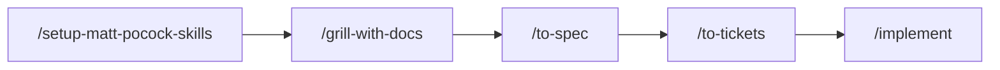

**왜 쓰나요?** ‘선생님만 작성’이라는 말에도 계정 수, 로그인 유지, 수정·삭제, 공개 시점 같은 질문이 숨어 있습니다. 먼저 합의하고, 완성 조건을 쓴 뒤, 작은 기능으로 나눠야 엉뚱한 게시판을 만드는 일을 줄일 수 있습니다.

> **축제 준비 비유:** 장소와 기록 규칙을 정하고 → 어떤 부스를 할지 회의하고 → 완성 조건을 쓰고 → 역할 카드를 나누고 → 실제로 준비하는 순서입니다.

**바로 물어보기:**

```text
/ask-matt 나 이제 뭐해야 해?
학교 축제 공지 게시판을 처음 만들 거야.
방문자는 읽고 관리자 한 명만 쓰게 하고 싶어. 아직 코드는 없어.
```

setup 추천을 받았다면 `/setup-matt-pocock-skills`부터 실행합니다. 설정이 끝나면 3강의 `/grill-with-docs` 요청을 이어갑니다.

**끝나면:** 명세에 적힌 등록·조회·수정·삭제가 실행되고, 티켓별 검증 결과가 남습니다. 계정 설정 때문에 배포가 안 됐다면 앱 구현과 배포 완료를 구분합니다.

### 2. 공지 제목이 너무 길 때 오류를 보여주기

**상황:** 게시판은 이미 있습니다. 제목을 100자보다 길게 쓰면 친절한 안내를 보여주고 싶습니다. 한 번의 대화에서 끝낼 수 있을 만큼 범위가 작습니다.

**순서:** `/grill-with-docs` → `/implement`

```text
/grill-with-docs
공지 제목을 앞뒤 공백 제거 후 1–100자로 제한하고 싶어.
길이 계산, 화면 안내 위치, API 오류 응답을 짧게 확인해줘.
기존 규칙과 충돌하는지도 확인해줘.
```

합의 후:

```text
/implement
방금 합의한 제목 길이 제한을 구현해줘.
100자는 저장되고 101자는 거부되는지, 빈 제목도 거부되는지 검증해줘.
실패해도 작성 중인 본문은 유지해줘.
```

**왜 쓰나요?** 작은 변경까지 무조건 큰 명세와 여러 티켓으로 나누면 준비가 작업보다 커질 수 있습니다. 범위가 확실하고 한 대화에서 구현·검증할 수 있으면 짧은 경로가 적합합니다. 예상보다 복잡해지면 명세·티켓 경로로 옮깁니다.

> **학교생활 비유:** 안내문의 날짜 한 줄을 고치는 일에 축제 전체 회의를 다시 열 필요는 없습니다. 다만 날짜가 맞는지와 다른 안내문도 함께 바뀌어야 하는지는 확인해야 합니다.

**끝나면:** 제한을 넘긴 입력은 저장되지 않고 화면에 이유가 보입니다. 테스트가 100자와 101자처럼 허용되는 길이의 바로 안쪽과 바깥쪽을 확인합니다.

### 3. 목록을 표로 할지 카드로 할지 직접 보고 고르기

**상황:** “표가 깔끔할까? 카드가 예쁠까?” 말로는 결정을 못 하겠습니다. 특히 휴대폰에서 읽기 편한지 보고 싶습니다.

**순서:** `/grill-with-docs` → `/handoff` → `/prototype` → `/handoff` → `/to-spec` → `/to-tickets` → `/implement`

**왜 쓰나요?** 질문의 답이 실제 화면에 있을 때는 작게 만들어 눌러보는 편이 빠릅니다. `/prototype`은 설계 질문에 답하는 실험입니다. 처음부터 운영용 로그인·DB·배포까지 갖출 필요가 없습니다.

> **미술 시간 비유:** 벽화를 바로 칠하기 전에 작은 종이에 두 가지 밑그림을 그려봅니다. 밑그림에서 배운 배치와 색을 본 작업에 가져가지만 종이 자체가 완성된 벽화는 아닙니다.

**복사할 요청:**

```text
/grill-with-docs
공지 목록을 표와 카드 중 어떤 방식으로 만들지 결정하고 싶어.
휴대폰에서 제목과 날짜를 읽기 쉬운지가 가장 중요해.
시제품으로 확인할 질문과 비교 기준을 정해줘.
```

**① 원래 프로젝트 대화에서 시제품 작업을 인계합니다.** 질문과 비교 기준을 합의한 뒤 다음을 입력합니다.

```text
/handoff
다른 폴더의 새 대화에서 공지 목록의 표·카드 시제품을 비교할 거야.
실험 목적, 휴대폰에서 읽기 편한지 판단할 기준, 합의한 요구, 제외 범위를 기록해줘.
기존 CONTEXT.md·ADR은 중복 복사하지 말고 실제 경로로 참조해줘.
다음 대화에서 /prototype을 사용하도록 추천 스킬에 적어줘.
인계 문서를 저장한 실제 전체 경로를 알려줘.
```

**② 실험용 폴더를 열어 새 대화를 시작합니다.** 원래 대화는 그대로 둡니다. `/clear`는 하지 않아도 됩니다. 아래 `[인계 파일의 실제 전체 경로]`는 출력받은 경로로 바꿉니다.

```text
/prototype
[인계 파일의 실제 전체 경로]를 먼저 읽고
공지 목록의 표·카드 시제품을 만들어줘.
가상 공지 12개를 쓰고 모바일 폭에서 비교할 수 있게 해줘.
서버·운영 인증은 만들지 말고 읽기 쉬운지 비교하는 데 집중해줘.
```

**③ 직접 눌러보고 선택한 결과를 원래 프로젝트로 인계합니다.** 예를 들어 카드가 더 읽기 편했다고 판단했다면 실험 대화에서 입력합니다.

```text
/handoff
원래 공지사항 게시판 프로젝트로 돌아가 명세를 작성할 거야.
표·카드 시제품에서 실제 확인한 결과와 확인하지 못한 점을 구분해줘.
내 선택은 모바일에서 카드형을 사용하는 것이야.
긴 제목과 날짜가 어떻게 보였는지 근거를 기록하고,
시제품 파일 경로·남은 질문·원래 프로젝트 문서 경로를 포함해줘.
다음 단계로 /to-spec을 추천하고 인계 파일의 전체 경로를 알려줘.
```

**④ 원래 프로젝트 대화로 돌아와 결과를 반영합니다.** 이 대화도 새로 시작했다면 인계 문서뿐 아니라 관련 원본 문서도 다시 읽게 합니다.

```text
/to-spec
[실험 결과 인계 파일의 실제 전체 경로]를 읽어줘.
CONTEXT.md와 관련 ADR, 앞서 합의한 요구사항도 확인해줘.
카드형을 선택한 실험 결과를 반영해 .scratch/notice-board/spec.md를 작성해줘.
미확인 사항을 확정 사실로 바꾸지 말고 테스트에서 어디에 입력하고 어떤 결과를 확인할지 먼저 확인해줘.
```

명세를 확인한 뒤 `/to-tickets`, `/implement`로 이어갑니다. 두 번의 `/handoff`는 각각 **실험하러 갈 때**와 **실험 결과를 가져올 때** 쓰는 것입니다.

**끝나면:** 선택한 화면과 이유가 명세에 반영됩니다. 시제품이 곧 운영용 코드라고 가정하지 않습니다.

### 4. 배포 서비스에서 무엇이 가능한지 조사한 뒤 결정하기

**상황:** “Railway와 Pages를 같이 써도 로그인과 자동배포가 될까?” 아직 서비스 제약을 잘 모릅니다.

**순서:** `/research` → `/grill-with-docs` → `/to-spec` → `/to-tickets` → `/implement`

```text
/research
공지사항 게시판을 Railway API와 Cloudflare Pages로 나눠 배포하려고 해.
GitHub Actions 배포 방법, 환경변수 주입 시점, 서로 다른 도메인의
인증 연결 제약을 공식 문서로 조사해줘.
확인 날짜와 출처 링크를 포함한 Markdown 파일로 남겨줘.
```

조사 결과를 확인한 다음:

```text
/grill-with-docs
방금 작성한 조사 문서를 기준으로 배포와 인증 방식을 결정하자.
확인된 서비스 제약과 내가 선택해야 하는 조건을 구분해줘.
```

**왜 쓰나요?** 모르고 있는 사실은 조사하고, 선택해야 할 것은 함께 결정해야 합니다. ‘공식적으로 가능한가?’와 ‘우리 프로젝트에서 이 방식을 쓸까?’는 서로 다른 질문입니다.

> **수학여행 비유:** 버스 출발 시간과 입장 가능 인원은 찾아볼 사실입니다. 박물관과 과학관 중 어디에 갈지는 조사 후 반에서 정할 선택입니다.

**끝나면:** 출처가 있는 조사 문서와 그 결과를 반영한 결정·명세가 남습니다. 조사가 끝났다고 앱까지 만들어진 것은 아닙니다.

### 5. 친구들이 남긴 요청을 정리하고 처리하기

**상황:** “휴대폰에서 글자가 잘려요”, “검색이 있으면 좋겠어요”, “로그인이 안 돼요” 같은 요청이 한꺼번에 들어왔습니다.

**순서:** `/triage` → 필요한 정보 보완 → 준비된 티켓 `/implement`

```text
/triage
다른 사용자가 등록한 게시판 요청들을 분류해줘.
정보가 부족한 요청과 바로 구현 가능한 요청을 구분하고,
현재 프로젝트의 라벨 규칙을 사용해줘.
```

**왜 쓰나요?** ‘로그인이 안 돼요’만으로는 비밀번호 오류인지 서버 장애인지 알 수 없습니다. 먼저 정보를 보완해야 하는 요청과 바로 실행할 수 있는 요청을 나눕니다.

> **보건실 비유:** 들어온 학생을 모두 같은 순서로 치료하기 전에 무슨 일이 있었는지 듣고 필요한 처치를 구분합니다. 요청을 분류하는 단계이지 모든 문제를 그 자리에서 구현하는 단계는 아닙니다.

구현 준비가 끝난 실제 티켓 경로를 지정해 실행합니다.

```text
/implement
구현 준비가 끝난 티켓을 읽고 해당 범위만 구현해줘.
먼저 티켓 경로와 먼저 해야 하는 작업 완료 여부를 확인해줘.
```

**끝나면:** 요청마다 현재 상태와 필요한 후속 행동이 보이고, 준비된 요청부터 구현합니다. `/to-tickets`가 만든 티켓은 이미 실행 가능한 형태이므로 다시 triage할 필요가 없습니다.

### 6. 공지 수정 버튼을 눌렀는데 500 오류가 날 때

**상황:** 어제는 됐는데 오늘은 수정 저장이 실패합니다. 화면만 보고는 왜 그런지 모릅니다.

**순서:** `/diagnosing-bugs` → 오류 재현 → 원인 확인 → 수정·같은 오류가 다시 생기지 않는지 확인하는 테스트

여기서 ‘재현 → 원인 확인 → 수정’은 `/diagnosing-bugs` 안에서 진행하는 단계입니다. 각각이 별도의 스킬 이름은 아닙니다.

```text
/diagnosing-bugs
관리자로 로그인해서 기존 공지 제목을 수정하고 저장하면 500이 나.
같은 문제를 다시 확인할 수 있는 테스트나 명령부터 확보해줘.
실제 요청과 오류 로그를 근거로 원인을 좁히고 수정해줘.
확인된 사실과 아직 추측인 원인을 구분해줘.
```

**왜 쓰나요?** 원인을 모른 채 여러 곳을 고치면 우연히 잠깐 해결되거나 다른 기능이 깨질 수 있습니다. 같은 실패를 반복 확인할 방법이 있어야 수정 전과 후를 비교할 수 있습니다.

> **자전거 비유:** 자전거가 덜컹거린다고 바퀴·브레이크·안장을 모두 바꾸지 않습니다. 어느 상황에서 소리가 나는지 재현하고 느슨한 부분을 찾은 뒤 고칩니다. 같은 오류가 다시 생기지 않는지 확인하는 테스트는 나중에 같은 나사가 다시 풀리지 않았는지 확인하는 점검표입니다.

**끝나면:** 같은 재현 절차가 수정 전에는 실패하고 수정 후에는 통과합니다. 단순한 새 기능 요청처럼 인터뷰부터 전부 다시 시작할 필요는 없습니다.

### 7. 작은 수정인데 다섯 군데를 고쳐야 할 때

**상황:** 제목 제한을 바꿀 때마다 화면·API·여러 서비스에서 같은 숫자를 고칩니다. 한 군데를 빠뜨리면 오류가 생깁니다.

**순서:** `/improve-codebase-architecture` → `/grill-with-docs` → `/to-spec` → `/to-tickets` → `/implement`

```text
/improve-codebase-architecture
공지 제목 검증을 바꿀 때 여러 곳을 수정해야 해.
현재 코드에서 책임이 흩어졌거나 중복된 부분을 찾아
구조 개선 후보와 이유를 보여줘.
```

후보를 확인하고 고른 다음:

```text
/grill-with-docs
방금 제안한 공지 검증 구조 개선을 구체화하자.
사용자가 보는 동작은 유지하고 내부 구조를 정리하고 싶어.
어떤 책임을 모으고 무엇을 테스트로 보장할지 합의해줘.
```

**왜 쓰나요?** 고장이 날 때마다 복사된 코드를 하나씩 고치는 대신, 변경이 어려운 구조 자체를 살펴볼 수 있습니다. 개선 후보를 찾는 단계와 실제 구조를 바꾸는 단계를 구분합니다.

> **교실 정리 비유:** 가위를 찾을 때마다 다섯 서랍을 뒤지는 상황이라면 매번 빨리 찾는 연습만 할 것이 아니라 공용 가위를 둘 장소와 관리 규칙을 정하는 편이 낫습니다.

**끝나면:** 같은 사용자 동작이 유지된다는 검증과 함께 변경 지점이 명확해집니다. 단순히 파일 수가 줄었다고 무조건 좋은 구조는 아닙니다.

### 8. 선생님이 답해줘야 요구사항을 정할 수 있을 때

**상황:** 공지를 누가 올리고, 누가 삭제할지 개발자인 내가 결정할 수 없습니다. 실제 사용하는 선생님의 답이 필요합니다.

**순서:** `/to-questionnaire` → 사용자 답변 수집 → `/grill-with-docs` → `/to-spec` → `/to-tickets` → `/implement`

```text
/to-questionnaire
게시판을 사용할 선생님께 질문지를 드리려고 해.
누가 공지를 작성·삭제하는지, 삭제 복구가 필요한지,
공지 수정 내역을 남겨야 하는지 결정에 필요한 질문을 정리해줘.
먼저 질문 대상과 질문지의 목적을 나와 확인해줘.
질문지는 작성만 하고 전송하지 마.
```

답을 받은 후:

```text
/grill-with-docs
선생님이 보내준 답변을 기준으로 게시판 요구사항을 정리하자.
답변끼리 충돌하거나 아직 모호한 부분을 확인해줘.
```

**왜 쓰나요?** 실제 운영자가 결정할 일을 AI나 개발자가 추측해서 정하면 나중에 다시 만들게 됩니다. 질문지를 작성하는 것과 답을 얻는 것은 별도 단계입니다.

> **학교생활 비유:** 반 티셔츠를 주문할 때 내 생각으로 친구들의 사이즈를 정하지 않습니다. 필요한 항목을 설문으로 받고 빠진 응답을 확인한 뒤 주문합니다.

**끝나면:** 실제 사용자의 답을 근거로 명세를 작성할 수 있습니다. 답변이 도착하지 않았다면 그 결정은 아직 미완료입니다.

### 9. 학교 전체 서비스를 만들려는데 너무 막막할 때

**상황:** 게시판뿐 아니라 급식, 동아리, 상담, 출결까지 한꺼번에 만들고 싶습니다. 어느 문제부터 결정해야 할지도 모르겠습니다.

**순서:** `/setup-matt-pocock-skills` → `/wayfinder` → `/to-spec` → `/to-tickets` → `/implement`

```text
/wayfinder
학교 공지, 동아리 신청, 상담 예약을 연결하는 서비스를 생각 중이야.
한 번에 전부 구현하지 말고 먼저 결정해야 할 문제의 지도를 만들어줘.
사용자·권한·데이터 공유·첫 출시 범위를 순서대로 정하고 싶어.
```

**왜 쓰나요?** 한 대화에 담기 어려울 정도로 큰 문제는, 바로 구현 티켓으로 나누기 전에 무엇을 결정해야 하는지부터 정리해야 합니다. `/wayfinder`가 만드는 것은 우선 **결정의 지도**이며 완성된 앱이 아닙니다.

> **여행 비유:** 목적지도 경유지도 모르는 상태에서 ‘매일 몇 시에 어디를 걸을지’ 정할 수 없습니다. 먼저 지역과 이동 순서를 고른 뒤 하루 계획을 짭니다.

길이 정리되면 `/to-spec`으로 연결된 결정을 구현 가능한 명세로 모으고, `/to-tickets`로 나눕니다. 결정 카드들을 곧바로 구현 카드처럼 사용하지 않습니다.

**끝나면:** ‘학교 서비스 전부’라는 막연한 목표가 ‘첫 출시는 공지와 동아리 신청’처럼 범위와 이유가 있는 계획이 됩니다. 작은 공지 게시판만 만들 때는 1번이 더 적합합니다.

### 10. 코드가 끝났는데 계정·배포 설정에서 막혔을 때

**상황:** 로컬 앱과 테스트는 되지만 Railway 계정 연결이나 Cloudflare 토큰 발급처럼 사람이 직접 처리해야 하는 단계가 남았습니다.

**순서:** `/implement` 중 누락 설정 확인 → `/wizard` → 설정 완료 → `/implement` 재개·배포 검증

```text
/ask-matt 나 이제 뭐해야 해?
앱 구현과 로컬 테스트는 끝났고 배포 티켓만 남았어.
외부 서비스 계정 승인과 배포 토큰 설정이 필요하대.
에이전트가 할 수 있는 작업과 내가 직접 해야 하는 작업을 구분해줘.
```

`/wizard`를 추천받았고 실제로 사람이 해야 하는 일이 남았다면:

```text
/wizard
배포 티켓에서 내가 직접 해야 하는 계정 승인과 토큰 설정만
한 단계씩 따라갈 수 있는 안내로 만들어줘.
각 단계의 목적과 성공 확인 방법을 설명하고,
비밀값은 채팅에 붙여 넣지 않고 필요한 저장 위치에 설정하게 해줘.
Windows를 사용하니 Bash 실행 환경이 필요한지도 먼저 확인해줘.
```

**왜 쓰나요?** 계정 승인이나 실제 계정·토큰 입력은 코드 작성과 다른 종류의 작업입니다. 설정을 ‘알아서 됐겠지’라고 넘기지 않고 필요한 값과 위치를 정확히 확인합니다. 에이전트가 직접 할 수 있는 일에는 이 우회 단계를 추가하지 않습니다.

> **학교 방송 비유:** 방송 원고와 장비 점검이 끝나도 방송실 열쇠를 가진 선생님의 승인이 필요할 수 있습니다. 열쇠를 받는 절차와 방송을 실제로 내보내는 절차를 구분하는 것입니다.

`/wizard`는 설치된 스킬 기준으로 Bash 안내 스크립트를 생성하는 도구입니다. Windows PowerShell에서 그대로 실행된다고 가정하지 않습니다. 설정을 끝내면 남은 티켓을 지정해 `/implement`를 재개하고 실제 배포·공개 화면·DB 저장 결과를 확인합니다.

**끝나면:** 설정값이 필요한 곳에 들어가고 배포가 확인됩니다. 안내 파일만 생성됐다면 아직 배포 완료가 아닙니다.

### 열 가지 중에서도 못 고르겠다면

아래 네 줄이면 시작할 수 있습니다. 대괄호 부분을 지금 상황으로 바꾸세요.

```text
/ask-matt 나 이제 뭐해야 해?
만들고 싶은 것: [예: 학교 축제 공지 게시판]
끝낸 것: [예: setup과 요구사항 인터뷰]
막힌 것: [예: 명세를 만들지, 화면부터 실험할지 모르겠어]
쉬운 비유로 추천 이유를 설명하고 다음에 복사할 명령을 알려줘.
```

추천을 받으면 **왜 이 단계인지 읽고 → 추천 스킬을 실행하고 → 결과물을 확인**합니다. 어려운 말 때문에 멈췄다면 `/wait-what`으로 방금 설명을 쉽게 다시 풀어달라고 요청할 수도 있습니다.

```text
/wait-what
방금 말한 '테스트에서 입력과 결과를 확인할 위치'와 '먼저 끝내야 할 티켓'을
공지사항 게시판의 실제 예와 학교생활 비유로 다시 설명해줘.
```
