# Matt Pocock 스킬 튜토리얼 — 공지사항 게시판을 배포까지

## 초간단 요약

**1. 전체 스킬 설치** — 터미널에 붙여 넣습니다.

```powershell
npx --yes skills@latest add mattpocock/skills --global --skill "*" --agent codex claude-code --copy --yes
```

설치 후 Claude Code·Codex를 완전히 종료하고 다시 실행합니다. 그래도 스킬이 보이지 않으면 설치 상태를 확인하고 PC를 재부팅합니다.

**2. 프로젝트 폴더를 열고 아래 순서로 진행** — 대화창에서 하나씩 호출합니다.

| 순서 | 스킬 | 하는 일 |
| --- | --- | --- |
| **프로젝트 최초 1회만** | **`/setup-matt-pocock-skills`** | 이 프로젝트의 작업 규칙 설정. 명세·티켓은 파일 관리 추천 |
| 무엇을 만들지 정하기 | `/grill-with-docs` | 질문에 답하며 기능을 정하고, 용어와 결정 이유를 기록 |
| 만들 내용 정리 | `/to-spec` | 함께 정한 기능과 완성 조건을 문서로 작성 |
| 작은 일로 나누기 | `/to-tickets` | 하나씩 만들고 확인할 작업으로 나누기 |
| 실제로 만들기 | `/implement` | 명세·티켓을 읽고 코드 작성과 테스트 진행 |

**`/setup-matt-pocock-skills`는 프로젝트를 처음 시작할 때 단 한 번만 호출합니다.** 같은 프로젝트에서 새 기능을 추가하거나, 새 대화를 열거나, 에이전트를 재시작해도 다시 호출하지 않습니다.

각 단계의 결과를 확인한 뒤 다음으로 넘어갑니다. 초기 설정이 끝난 프로젝트의 새 기능은 보통 `/grill-with-docs`부터 시작합니다.

**같은 대화에서 앞 단계가 끝났다면 다음 스킬 이름만 입력하면 됩니다.** `/grill-with-docs`에서 합의한 뒤에는 `/to-spec`, 명세를 확인한 뒤에는 `/to-tickets`, 작업 범위를 정한 뒤에는 `/implement`로 이어갑니다. 앞서 설명한 요구사항·문서 경로·테스트 조건을 매번 다시 붙여 넣지 않습니다. 에이전트가 기존 대화와 프로젝트 문서를 바탕으로 이어가고, 아직 정하지 않은 내용이 있으면 그 부분만 질문합니다.

처음 만들 제품이나 새로 바꾸려는 내용은 사용자에게서 나와야 합니다. 그 내용은 인터뷰에서 이야기하고, 이후에는 달라진 요구나 여러 후보 중 작업할 대상이 있을 때만 덧붙입니다. 아래의 상세 조건과 결과물 예시는 읽고 확인하는 기준입니다.

**3. 다음에 무엇을 할지 모르겠다면**

```text
/ask-matt 나 이제 뭐해야 해?
```

추천 이유를 읽고 추천받은 `/스킬이름`을 실행하면 됩니다.

함께 읽기: [목적별 /archify 프롬프트 매뉴얼](ARCHIFY-GUIDE.md) — 전체 구조, 권한, 업무 흐름, 데이터, 보안, 변경 영향과 테스트를 시각화하는 12가지 요청 예시.

처음부터 모든 용어를 외울 필요는 없습니다. 이 문서는 **학교 축제에서 사용할 공지 게시판을 친구와 함께 만든다**고 생각하며 읽으면 됩니다. 어려운 설명 아래에는 같은 뜻의 비유를 붙였습니다. 명령어는 비유로 바꾸지 않고 그대로 복사해 사용합니다.

## 처음 읽는 분: 이렇게 따라오세요

**기본은 하나의 프로젝트 폴더, 하나의 대화에서 1강부터 6강까지 순서대로 진행하는 것입니다.** 스킬 하나를 끝낼 때마다 새 폴더나 새 대화를 만들지 않습니다. 맨 아래 10개 워크플로우는 추가 예시이므로 지금 전부 실행하지 않아도 됩니다.

### 어디에 입력하나요?

| 문서에 보이는 내용 | 입력하거나 확인할 곳 | 예 |
| --- | --- | --- |
| `/grill-with-docs`처럼 스킬로 시작하는 요청 | 프로젝트를 연 코딩 에이전트의 **대화창** | 질문에 답하며 요구사항 정하기 |
| `git`, `npm`, `npx`, `java`로 시작하는 실행 명령 | **PowerShell 터미널** | 설치, 앱 실행, GitHub에 코드 올리기 |
| 파일 내용·폴더 그림·예상 대화 | 읽고 실제 결과와 **비교** | spec.md의 내용이 맞는지 확인 |
| `http://localhost:5173` 같은 주소 | **브라우저 주소창** | 실행 중인 앱 열기 |

코드 상자의 `powershell`, `text`, `json` 같은 글자는 내용의 종류를 표시합니다. 입력할 때는 상자 안의 내용만 복사하세요. **‘예상 결과물’ 아래의 코드는 실행 명령이 아닙니다.**

> **쉬운 비유:** 대화창은 작업을 부탁하는 곳, 터미널은 실제 장비를 조작하는 곳, 브라우저는 완성된 화면을 보는 곳입니다. 같은 문장을 아무 창에나 넣으면 되는 것이 아닙니다.

### 어떤 폴더를 열어야 하나요?

이 매뉴얼 저장소 `matt-user-guide`는 **설명서**이고, 여러분이 만들 `notice-board`는 **실습 프로젝트**입니다. 1강에서 `notice-board`를 한 번 만들고 에이전트의 작업 폴더로 엽니다. 이후 파일은 그 안에 계속 쌓입니다.

- **처음부터 만들기:** 1강에서 빈 `notice-board`를 만들고 시작합니다. 이 문서의 기본 경로입니다.
- **완성된 예제만 실행하기:** [실행 저장소 README](https://github.com/jhs512/2nd-matt-user-guide#readme)의 복제·실행 안내를 따릅니다. 이미 코드가 있으므로 생성 명령을 다시 실행하지 않습니다.
- **강별 변화 구경하기:** 각 강의 `002`~`006` 커밋 링크를 엽니다. 링크를 보는 것만으로 내 PC에 파일이 생기지는 않습니다.

> **쉬운 비유:** 설명서를 내려받은 것, 빈 작업대를 준비한 것, 완제품을 가져온 것은 서로 다릅니다. 처음부터 만드는 연습에서는 빈 작업대에 결과물을 하나씩 쌓습니다.

### 요청을 보낸 다음에는 무엇을 하나요?

1. **한 요청만 보내고 답을 기다립니다.** 순서표의 스킬을 한꺼번에 붙여 넣지 않습니다.
2. 질문을 받으면 답합니다. 모르는 선택은 “선택지를 쉬운 예로 설명하고 이번 실습에 맞는 것을 추천해줘”라고 합니다.
3. 에이전트가 만든 파일이나 실행 결과를 확인합니다. 설명만 했다면 “지금 합의한 내용을 실제 파일로 저장하고 경로를 알려줘”라고 합니다.
4. 각 강의 완료 조건을 확인한 뒤 다음 스킬을 호출합니다.

## 시작 전 준비

스킬을 설치할 코딩 에이전트와 Git, Node.js(npm·npx 포함)를 준비합니다. 앱 구현에 필요한 추가 도구는 선택한 기술에 맞춰 에이전트의 안내를 따릅니다.

각 강은 **입력 → 예상 결과물 → 사용 전후 차이 → 완료 확인** 순서입니다. 대화와 결과물은 예시이며, 실제 실행 기록은 문서 마지막에 연결했습니다.

## 만들 제품: 작은 공지사항 게시판

방문자는 로그인 없이 공지 목록과 상세를 읽습니다. 관리자 한 명은 로그인해 공지를 등록·수정·삭제합니다. 작성 즉시 공개되며, 초안·첨부파일·댓글·회원가입은 이번 범위에서 제외합니다.

이 기능 범위와 아래 세부 동작은 **튜토리얼의 제안값**입니다. 3강의 인터뷰에서 확인하고 확정하는 흐름으로 사용합니다.

아래는 화면의 배치가 아니라 **역할별 화면 이동과 가능한 동작**입니다. 쓰기 권한은 서버에서도 검사합니다.

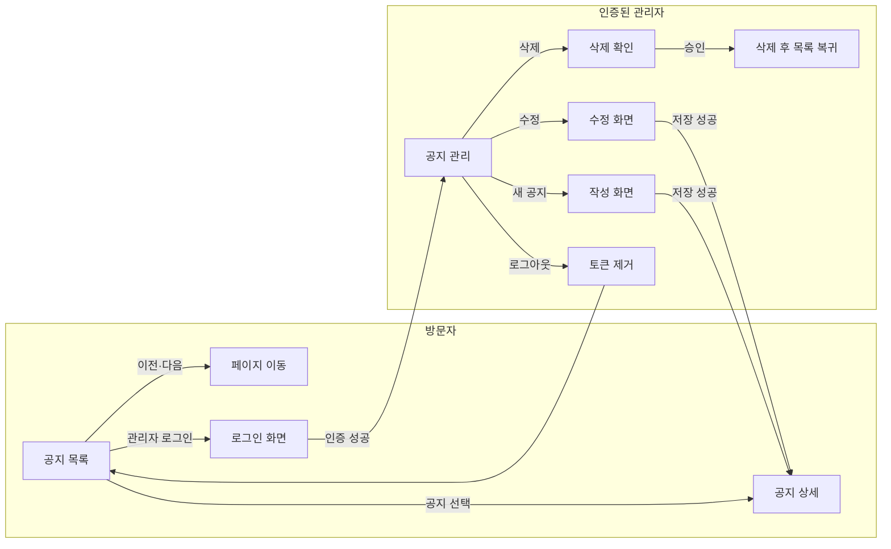

### 실습 배경

예제는 Kotlin/Spring 백엔드와 React 프론트를 가진 게시판입니다. 테스트와 운영 배포도 작업 범위에 포함합니다. 기술 선택은 인터뷰에서 정할 조건이며, Matt 스킬은 다른 기술을 사용하는 프로젝트에도 적용할 수 있습니다.

이 가이드는 스킬을 언제 호출하고 어떤 결과를 확인하는지 설명합니다. 앱 설치·실행·환경변수·서비스별 배포 방법은 [실행 프로젝트 안내](https://github.com/jhs512/2nd-matt-user-guide#readme)를 참고합니다.

## 수업 지도

| 강 | 호출 / 작업 | 강이 끝나면 보이는 결과 |
| --- | --- | --- |
| 1강 | 설치 | 필요한 스킬 목록 |
| 2강 | 하네스 세팅 — `/setup-matt-pocock-skills` | 프로젝트 지침·설정 문서 |
| 3강 | `/grill-with-docs` | 합의된 동작, 용어집, 필요한 ADR |
| 4강 | `/to-spec` | 기능·권한·DB·배포·검증 기준을 담은 명세 |
| 5강 | `/to-tickets` | 직접 실행해볼 작은 작업과 먼저 끝내야 할 작업 |
| 6강 | `/implement` | 앱 코드·테스트·워크플로우·배포 확인 기록 |

## 1강. 설치

### 설치 전에: 모델·하네스·스킬은 각각 무엇인가요?

**모델**은 글과 코드를 이해하고 다음 행동을 판단하는 AI입니다. **하네스(harness)**는 모델이 파일을 읽고, 명령을 실행하고, 결과를 받아 다음 행동을 이어가도록 지원하는 실행 환경입니다. 대화 기록·도구 연결·권한 확인 같은 장치도 여기에 포함됩니다. 이 문서에서는 Claude Code나 Codex 같은 코딩 에이전트의 실행 환경을 설명할 때 이 말을 사용합니다.

> **기술실 비유:** 모델은 문제를 생각하는 학생, 하네스는 작업대·공구·실습 규칙이 갖춰진 기술실입니다. 학생이 똑똑해도 사용할 공구가 없으면 나무를 자를 수 없습니다. 반대로 공구만 놓여 있다고 책상이 저절로 만들어지지도 않습니다.

**스킬(skill)**은 특정 작업을 수행하는 절차와 참고 자료를 묶어 재사용하는 작업 안내서입니다. 보통 `SKILL.md`가 처음 읽는 문서이고, 필요하면 예제·템플릿·보조 스크립트를 함께 포함합니다. `/to-spec`은 명세 작성법, `/archify`는 구조도를 만드는 방법을 안내합니다. 스킬을 설치한다고 모델 자체를 다시 학습시키는 것은 아닙니다. [스킬 설명](https://support.claude.com/en/articles/12512176-what-are-skills)

> **실습 비유:** 기술실에서 ‘나무 의자 만들기 안내서’를 꺼내 읽는 것이 스킬 사용입니다. 책에는 준비물·작업 순서·확인 방법이 적혀 있습니다. 학생은 안내서를 읽고 실제 공구로 작업해야 합니다. 안내서만 설치했다고 의자가 완성되지는 않습니다.

| 용어 | 담당하는 일 | 게시판에서의 예 |
| --- | --- | --- |
| 모델 | 이해하고 판단하기 | 로그인 오류의 설명과 코드를 해석 |
| 하네스 | 작업을 실행할 환경 제공 | 파일 읽기·터미널 실행·결과 전달 |
| 스킬 | 특정 작업의 진행 방법 안내 | `/to-tickets`로 명세를 작은 작업으로 분리 |
| 도구 | 구체적인 행동 실행 | 파일 저장, 테스트 실행, 배포 상태 조회 |

같은 스킬을 사용해도 연결된 도구·접근 권한·모델·프로젝트 상태에 따라 가능한 행동과 결과가 달라질 수 있습니다. `/스킬이름`이라는 호출 표기도 사용하는 도구에서 지원하는 방식으로 선택해야 합니다.

### 준비

만들 앱의 프로젝트 폴더를 코딩 에이전트에서 엽니다. 이 매뉴얼 저장소가 아니라 실습할 프로젝트가 작업 대상으로 선택되어 있는지 확인합니다. 같은 프로젝트에서 다음 강을 계속 진행합니다.

### 설치: 터미널 입력

```powershell
npx --yes skills@latest add mattpocock/skills --global --skill "*" --agent codex claude-code --copy --yes
```

위 명령은 저장소의 **전체 스킬을 사용자 전역에 설치**하고, **Codex와 Claude Code 모두를 대상**으로 지정합니다. 확인 질문 없이 파일을 복사하므로 Claude Code의 기본 전역 경로인 `~/.claude/skills/`에도 설치합니다. 공용 경로만 설치하고 끝내는 방식이 아닙니다. 아래 목록은 전체 설치 중 이 튜토리얼에서 주로 사용하는 스킬입니다. [스킬 설치 옵션](https://github.com/vercel-labs/skills)

| 옵션 | 뜻 |
| --- | --- |
| `npx --yes` | npx의 패키지 실행 확인 생략 |
| `--global` | 현재 프로젝트가 아닌 사용자 전역 설치 |
| `--skill "*"` | 저장소에서 발견한 모든 스킬 설치 |
| `--agent codex claude-code` | Codex와 Claude Code 모두 설치 대상으로 지정 |
| `--copy` | 에이전트 설치 위치에 다른 위치를 가리키는 링크 대신 실제 파일 복사 |
| 마지막 `--yes` | 스킬 설치기의 확인 질문 생략 |

`~`는 사용자 홈 폴더입니다. 기본 설정의 Windows에서는 `C:\Users\사용자명`에 해당합니다. `.agents/skills` 같은 공용 위치와 에이전트별 경로는 설치기 출력으로 확인하고, Claude Code의 `~/.claude/skills/`도 확인합니다. 에이전트 경로를 별도로 설정한 환경에서는 실제 출력 경로를 따릅니다.

> **학교생활 비유:** 필요한 준비물을 하나씩 고르는 대신 세트 전체를 준비하고, 내 개인 보관함에 넣어 어느 프로젝트에서도 꺼내 쓰게 합니다. Codex용과 Claude용 위치에 각각 복사하므로 두 도구에서 사용할 수 있습니다. 스킬은 전역 설치해도 `/setup-matt-pocock-skills`로 정하는 프로젝트 규칙은 저장소마다 다릅니다.

| 스킬 | 역할 |
| --- | --- |
| `setup-matt-pocock-skills` | 저장소별 작업 규칙 |
| `grill-with-docs` | 질문과 문서화를 연결 |
| `grilling`, `domain-modeling` | 인터뷰, 용어집과 설계 결정 기록 |
| `to-spec`, `to-tickets` | 명세 작성, 구현 단위 분해 |
| `implement`, `tdd`, `code-review` | 구현, 검증, 리뷰 |
| `triage` | 들어온 요청을 분류하고 부족한 정보를 확인 |
| `ask-matt` | 현재 상황에 맞는 다음 스킬·진행 순서 추천 |

`grill-with-docs`는 설치된 원문에서 `grilling`과 `domain-modeling`을 함께 호출합니다. 세 스킬이 모두 설치되어 있는지 확인합니다.

### 사용 전 → 후

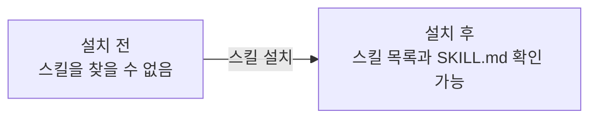

**설치 후에는 Claude Code와 Codex를 완전히 종료한 뒤 다시 실행하세요.** 실행 중인 작업을 먼저 저장하고, 앱이나 터미널 세션을 종료한 뒤 다시 열어 스킬 목록을 확인합니다. 그래도 스킬이 보이지 않으면 설치 경로와 설치 성공 여부를 확인한 다음 **PC를 재부팅하고 다시 확인하세요.** 재부팅 후에도 보이지 않으면 설치 오류나 대상 경로 문제를 확인해야 합니다.

**완료 확인:** 설치기가 출력한 경로와 재시작한 에이전트의 스킬 목록에 필요한 스킬이 있는지 확인합니다. 아직 앱 파일은 생기지 않습니다.

## 2강. 하네스 세팅 — /setup-matt-pocock-skills

**시작 상태:** 스킬 설치와 재시작을 마쳤고, 빈 실습 폴더를 에이전트에서 열었습니다. **입력 위치:** 같은 프로젝트의 대화창. **끝나면:** AGENTS.md와 작업 안내 파일이 생깁니다. 아직 게시판 화면이 없는 것이 정상입니다.

**실제 결과 보기 · [002](https://github.com/jhs512/2nd-matt-user-guide/commit/002):** 작업 규칙이 없는 상태에서 [AGENTS.md](https://github.com/jhs512/2nd-matt-user-guide/blob/002/AGENTS.md)와 [에이전트용 안내 문서](https://github.com/jhs512/2nd-matt-user-guide/tree/002/docs/agents)가 생겼습니다. 무엇을 먼저 읽고 어디에 작업을 기록할지 확인해 보세요.

각 태그는 수업별 결과입니다. `002`에서는 하네스 설정 파일만 확인할 수 있습니다.

> **최초 1회만 호출하세요.** `/setup-matt-pocock-skills`는 프로젝트의 첫 작업 규칙을 만드는 스킬입니다. **이 프로젝트에서는 처음 단 한 번만 호출하고, 이후 작업에서는 반복하지 않습니다.**

새 기능 추가, 새 대화 시작, Claude Code·Codex 재시작은 다시 호출할 이유가 아닙니다. 이미 만든 작업 규칙을 읽고 다음 작업을 이어가면 됩니다. **완전히 다른 프로젝트를 새로 시작할 때만 그 프로젝트에서 최초 1회 설정합니다.**

여기서 ‘하네스 세팅’은 **코딩 에이전트가 이 프로젝트에서 일할 규칙을 설정한다**는 뜻입니다. 프로그램 설치나 계정 로그인이 아니라, 프로젝트 지침과 이슈·문서 관리 규칙을 파일로 남기는 작업입니다.

> **쉬운 비유:** 새 동아리방을 사용할 때 ‘회의록은 이 서랍, 할 일 카드는 저 게시판’이라고 처음에 정하는 것입니다. 모일 때마다 서랍 위치를 다시 정할 필요는 없습니다. 다른 동아리방으로 옮기거나 관리 방식을 바꿀 때만 다시 정하면 됩니다.

튜토리얼의 명세와 티켓은 로컬 Markdown으로 기록합니다. **코드는 GitHub에서 관리하고 CI/CD를 실행하면서, 작업 티켓은 저장소 안의 파일로 관리할 수 있습니다.** GitHub Issues가 필수인 것은 아닙니다.

### 이슈를 GitHub에서 관리할까요, 파일로 관리할까요?

이슈는 해결할 문제나 구현할 작업을 기록한 것입니다. 이 흐름에서는 명세와 구현 티켓을 어디에 저장하고 찾아볼지 선택합니다.

| 비교 | GitHub Issues | 저장소 안의 Markdown 파일 |
| --- | --- | --- |
| 저장 위치 | GitHub의 이슈 페이지 | `.scratch/<기능>/` 아래 파일 |
| 장점 | 여러 사람이 댓글·담당자·라벨로 협업하기 편함 | 에이전트가 코드와 함께 바로 읽고 수정하기 편함 |
| 변경 기록 | 이슈의 활동 기록으로 확인 | Git에 포함하면 코드와 함께 diff·커밋으로 확인 |
| 외부 사용자 요청 | 이슈 링크를 공유해 접수하기 편함 | 파일 전달이나 저장소 변경 절차가 필요함 |
| 준비 | GitHub 계정·저장소·접근 권한, 도구 인증 필요 | 파일을 읽고 쓸 수 있으면 바로 시작 가능 |
| 주의점 | 온라인 접근과 권한에 의존하고 코드와 이슈를 오가야 함 | 담당자·알림·상태 관리를 위한 별도 규칙이 필요함 |
| 협업 시 부담 | 이슈와 코드 변경의 연결을 유지해야 함 | 같은 파일을 수정하면 Git 충돌을 해결해야 할 수 있음 |

**이 튜토리얼에서는 파일 관리를 더 추천합니다.** 개인이나 작은 팀이 에이전트와 개발할 때는 명세·티켓·코드가 같은 작업 폴더에 있어 다음 작업에 전달하기 쉽고, 이슈를 다루기 위한 계정 연결 없이 시작할 수 있습니다. 특히 새 대화에서도 “이 명세와 티켓을 읽어줘”라고 파일 경로를 지정해 이어가기 편합니다.

파일을 쓴다고 GitHub를 사용하지 않는 것은 아닙니다. 명세와 티켓도 Git에 포함해 푸시하면 코드와 함께 공유할 수 있습니다. `.scratch/`가 `.gitignore`에 포함되어 있으면 업로드되지 않으므로 공유할 때 확인하세요. 파일 이름이나 폴더 이름만으로 자동 백업되는 것은 아닙니다.

> **쉬운 비유:** GitHub Issues는 팀원들이 댓글과 담당자를 붙일 수 있는 온라인 업무 게시판입니다. 파일 관리는 작업물과 체크리스트를 같은 과제 폴더에 넣는 방식입니다. 혼자 또는 몇 명이 과제를 할 때는 같은 폴더에서 바로 확인하는 편이 간단합니다. 여러 반에서 요청을 받고 담당자를 배정해야 한다면 온라인 게시판이 더 편할 수 있습니다.

외부 사용자 요청이 많거나 담당자 배정·알림·여러 사람의 논의가 중요해지면 GitHub Issues를 고려하세요. 처음에는 파일로 시작하고 필요해졌을 때 전환해도 됩니다. 전환할 때는 기존 티켓과 새 이슈의 연결을 남겨 미완료 작업이 빠지지 않게 합니다.

> **학교 축제 비유:** 일을 시작하기 전에 ‘회의록은 이 폴더, 할 일 카드는 저 폴더’라고 정하는 단계입니다. `/setup-matt-pocock-skills`가 게시판을 만들어주는 것은 아닙니다. 앞으로 사용할 공책의 위치와 작성 규칙을 정해줍니다. `.scratch/`라는 이름이어도 여기 담은 명세와 티켓은 다음 작업에 필요한 자료입니다.

### 입력

```text
/setup-matt-pocock-skills

공지사항 게시판 실습 저장소를 설정해줘.
이슈와 명세는 로컬 Markdown, triage는 기본 라벨을 사용해.
backend/와 frontend/를 둘 예정이지만 도메인은 공지사항 하나이므로
단일 CONTEXT.md와 docs/adr/를 사용하는 구성을 원해.
AGENTS.md와 CLAUDE.md가 모두 없다면 AGENTS.md를 생성해줘.
```

### 예상 결과물

```text
notice-board/
├── AGENTS.md
└── docs/agents/
    ├── issue-tracker.md
    ├── triage-labels.md
    └── domain.md
```

기존 `CLAUDE.md`가 있으면 그것을, 없으면 기존 `AGENTS.md`를 편집하는 것이 스킬의 선택 규칙입니다. 위 트리는 두 파일이 없었던 실습 폴더 기준입니다.

### CLAUDE.md — 프로젝트에서 일하는 방법을 적는 안내판

정확한 파일 이름은 **`CLAUDE.md`**입니다. `CLUADE.md`처럼 철자가 바뀌면 같은 이름으로 인식되지 않습니다. `.md`는 Markdown 형식의 글 문서라는 뜻입니다.

`CLAUDE.md`는 Claude Code에 전달할 프로젝트 지침을 적는 파일입니다. 예를 들어 어떤 문서를 먼저 읽을지, 어떤 검증을 해야 할지, 팀에서 지키는 작업 규칙을 적습니다. 파일 자체가 실행되는 프로그램은 아닙니다. [Claude Code의 프로젝트 지침](https://code.claude.com/docs/en/memory)

> **학교생활 비유:** 과학실 문에 붙은 ‘실험 전에 준비물을 확인하고, 끝나면 결과를 기록하세요’라는 안내판입니다. 실험마다 길게 다시 설명하지 않도록 공통 규칙을 적어둡니다. 하지만 안내판에 ‘불을 끄세요’라고 써놓는 것만으로 전등이 꺼지지는 않듯, 실제 실행과 검증은 별도입니다.

| 파일 | 쉽게 말하면 | 적합한 내용 |
| --- | --- | --- |
| CLAUDE.md | 여기서 일하는 규칙 | 어떤 문서를 읽고 어떻게 검증할지 |
| SKILL.md | 특정 작업의 안내서 | 명세 작성·진단·구조도 생성 절차 |
| CONTEXT.md | 우리 팀의 용어 사전 | 공지·관리자·삭제의 정확한 뜻 |
| ADR | 중요한 결정의 이유 노트 | 왜 이 인증·배포 방식을 골랐는지 |

> **축제 준비 비유:** ‘끝나면 정리한다’는 전체 규칙, ‘음료를 만드는 순서’는 작업 안내서, ‘운영요원이 누구인지’는 용어 사전, ‘왜 실내 부스를 골랐는지’는 결정 기록입니다. 네 문서는 서로 돕지만 담는 내용은 다릅니다.

| 파일 | 확정되는 내용 |
| --- | --- |
| 프로젝트 지침 | 어떤 상황에 설정 문서를 읽어야 하는지 |
| issue-tracker.md | `.scratch/<기능>/spec.md`, `issues/<번호>-<이름>.md` |
| triage-labels.md | `needs-triage`, `needs-info`, `ready-for-agent`, `ready-for-human`, `wontfix` |
| domain.md | 용어집·ADR의 위치와 읽는 규칙 |

### 사용 전 → 후

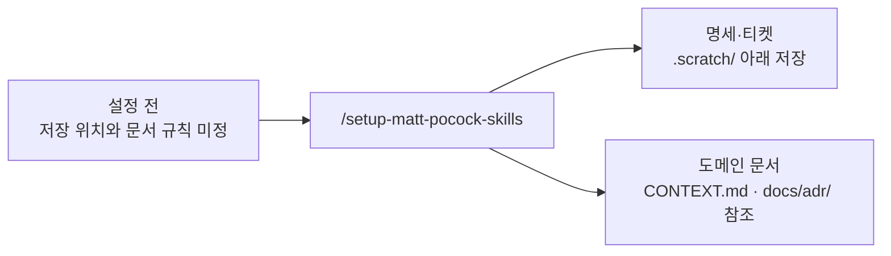

**완료 확인:** 설정 문서 세 개와 프로젝트 지침의 참조가 일치하는지 확인합니다. `CONTEXT.md` 자체는 의미 있는 용어가 정리되는 다음 강에서 생성합니다.

## 3강. /grill-with-docs — 원하는 기능을 질문과 답변으로 분명하게 정하기

**시작 상태:** 2강의 작업 규칙 파일이 있습니다. **입력 위치:** 그대로 같은 대화창. **할 일:** 에이전트의 질문에 답하고 합의 내용을 확인합니다. **끝나면:** 용어와 결정 이유가 문서에 남습니다. 아직 앱을 실행하는 단계는 아닙니다.

**실제 결과 보기 · [003](https://github.com/jhs512/2nd-matt-user-guide/commit/003):** 질문과 답변으로 정한 내용을 [CONTEXT.md](https://github.com/jhs512/2nd-matt-user-guide/blob/003/CONTEXT.md)와 [ADR 결정 기록](https://github.com/jhs512/2nd-matt-user-guide/tree/003/docs/adr)에 남겼습니다. 막연한 “공지 게시판”이 어떤 용어와 규칙을 가진 제품으로 구체화됐는지 확인해 보세요. [이전 단계와 비교](https://github.com/jhs512/2nd-matt-user-guide/commit/003)

이번에 추가한 핵심 단계입니다. ‘시큐리티를 쓴다’는 말만으로는 누가 무엇을 할 수 있는지, 로그인은 얼마나 유지되는지 결정되지 않습니다. 구현 전에 실제 사용 상황을 질문하고 답을 문서로 남깁니다.

> **학교 축제 비유:** ‘매점 만들어줘’라고만 하면 친구는 음료만 팔 생각을 하고, 나는 떡볶이도 팔 생각을 할 수 있습니다. 만들기 전에 ‘무엇을 팔까? 누가 돈을 받을까? 환불은 가능할까?’를 묻는 것이 그릴위드독스입니다. 귀찮게 시험하는 게 아니라, 서로 다른 완성품을 상상하고 있지 않은지 확인하는 과정입니다.

### 입력

```text
/grill-with-docs

간단한 공지사항 게시판을 만들고 싶어.
방문자는 목록과 상세를 보고, 관리자 한 명만 등록·수정·삭제해.
회원가입, 댓글, 첨부파일, 검색, 초안, 상단 고정은 이번 범위에서 빼자.

백엔드는 최신 안정 Spring Boot + Kotlin, JPA, Spring Security야.
로컬 DB는 H2 파일, 테스트 DB는 H2 인메모리, 운영 DB는 PostgreSQL.
백엔드는 Railway, 프론트는 Vite React TypeScript shadcn/ui야.
프론트는 Cloudflare Pages로 배포하고 GitHub Actions가 CI/CD를 담당해.
backend/와 frontend/를 같은 저장소에 둬.

권한, 인증 유지, 입력 제한, 오류,
목록을 여러 페이지로 나누고 이동하는 방법, DB 전환, 자동배포 완료 기준을 질문해서 구체적으로 정해줘.
확정된 도메인 용어는 CONTEXT.md에 기록하고,
대안과 비용이 있는 중요한 결정만 ADR로 제안해줘.
버전·플랫폼 제약은 공식 자료를 직접 확인해줘.
```

### 예상 인터뷰: 한 번에 모든 답을 추측하지 않기

| 라운드 | 에이전트가 확인할 질문 예시 | 튜토리얼에서 선택할 답 |
| --- | --- | --- |
| 1 | 공지는 저장 즉시 공개되나요? 삭제는 복구되나요? | 즉시 공개, 확인 후 영구 삭제 |
| 1 | 제목·본문 제한과 정렬 기준은 무엇인가요? | 제목 1–100자, 본문 1–10,000자; 앞뒤 공백 제거; 최신순 |
| 1 | 한 페이지 크기와 빈 화면은 어떻게 하나요? | 10개 고정, 없으면 안내; 마지막 항목 삭제 시 이전 페이지로 |
| 2 | 관리자 로그인을 새로고침 후에도 유지해야 하나요? | 실습에서는 다시 로그인해도 됨 |
| 2 | 프론트·API 주소가 다를 때 인증은 어떻게 할까요? | 짧은 Bearer 토큰, 쿠키 인증 없이 메모리에 보관 |
| 3 | 토큰 만료·로그아웃은 어떤 의미인가요? | 30분 만료, refresh 없음; 로그아웃은 브라우저 토큰 제거 |
| 3 | 테스트는 어디에 입력하고 무엇을 확인할까요? | Security 포함 HTTP 통합 테스트 + H2 메모리, 사용자 화면 테스트, 실제 백엔드+H2 브라우저 E2E; 운영 PG 검증은 별도 |
| 3 | CI와 실제 서비스 확인 중 어디까지가 완료인가요? | 검증 통과, 배포된 커밋 확인, 운영 화면·DB 저장 확인 |

실제 질문은 앞선 답에 따라 달라집니다. 예를 들어 토큰 방식을 선택하기 전에는 토큰 만료 시간을 확정하지 않습니다.

### 질문하고 답해서 정한 실습 조건

| 주제 | 결정 예시 |
| --- | --- |
| 공지 | 제목·일반 텍스트 본문·생성일·수정일; HTML을 실행하지 않음 |
| 목록 | 생성일 내림차순, 동률은 ID 내림차순, 10개씩 페이지 이동 |
| 작성 | 관리자만 가능; 저장 성공 후 상세 화면으로 이동 |
| 수정 | 생성일과 목록 순서는 유지; 수정일 갱신 |
| 삭제 | 확인창에서 승인 후 삭제, 목록 복귀; 없는 공지는 404 |
| 오류 | 입력 오류 400, 인증 오류 401, 권한 부족 403, 대상 없음 404 |
| 관리자 | 담당자 한 명만 로그인; 회원가입 없음 |
| 인증 | 앱이 로그인 성공 시 서명한 access JWT 발급; Spring Security로 검증 |
| 토큰 | 30분, 프론트 메모리에만 저장; 새로고침·만료 시 재로그인 |
| 로그아웃 | 현재 화면에서 토큰 제거; 이미 발급된 토큰은 만료 전까지 유효 |
| 운영 연결 | 허용된 프론트 Origin만 CORS 허용; Authorization 헤더 허용 |

### 예상 결과물: 용어집과 결정 기록

```text
새로 생기는 문서
├── CONTEXT.md
└── docs/adr/
    ├── 0001-admin-authentication.md
    └── 0002-ci-controlled-deployment.md
```

`CONTEXT.md` 내용 예시:

```markdown
# Domain glossary

- 공지(Notice): 관리자가 게시하며 방문자가 읽을 수 있는 안내문.
- 방문자(Visitor): 로그인 없이 공지를 읽는 사람.
- 관리자(Administrator): 공지를 등록·수정·삭제할 권한이 있는 사람.
```

용어집에는 Kotlin 버전·DB URL·API 구현 방법을 섞지 않습니다. ADR은 모든 기술 선택마다 만들지 않고, 대안·이유·후속 비용을 기록할 가치가 있는 결정만 남깁니다.

### CONTEXT.md — 우리 팀이 같은 뜻으로 말하기 위한 작은 사전

`CONTEXT.md`는 이 스킬 흐름에서 **프로젝트의 업무 용어를 정의하는 파일**입니다. 이름만 보면 모든 배경 지식을 넣어야 할 것 같지만, 여기서는 용어집으로 사용합니다. 해야 할 일 목록이나 모든 대화를 붙여 넣는 파일이 아닙니다.

예를 들어 친구는 ‘관리자’를 학교 선생님 전체라고 생각하고, 나는 게시판 담당자 한 명이라고 생각할 수 있습니다. 이 상태로 ‘관리자만 삭제 가능’이라고 쓰면 서로 다른 기능을 만들게 됩니다.

> **학교생활 비유:** 조별 발표에서 ‘자료 담당’이라는 말을 먼저 정의하는 것과 같습니다. 한 명은 사진만 모으는 역할이라고 생각하고 다른 한 명은 발표 자료까지 만드는 역할이라고 생각하면 일이 빠집니다. ‘자료 담당 = 출처를 확인해 글과 사진을 모으는 사람’이라고 합의해두면 같은 뜻으로 이야기할 수 있습니다.

게시판의 용어집은 다음처럼 짧고 구체적으로 씁니다.

```markdown
- 공지: 관리자가 등록하고 방문자가 읽는 안내문. 등록하면 바로 공개된다.
- 방문자: 로그인하지 않고 공개 공지를 읽는 사람.
- 관리자: 이 게시판의 공지를 등록·수정·삭제하는 담당자.
- 공지 삭제: 공지를 영구 제거하는 동작. 임시 숨김을 뜻하지 않는다.
```

| 넣을 내용 | 다른 문서에 넣을 내용 |
| --- | --- |
| ‘공지’의 뜻과 경계 | React 컴포넌트 경로 → 구현 코드·개발 문서 |
| ‘관리자’가 가리키는 역할 | JWT 라이브러리 설정 → 구현·설계 문서 |
| ‘삭제’와 ‘숨김’의 의미 차이 | 삭제 버튼의 완료됐다고 판단할 조건 → 명세·티켓 |

**언제 읽나요?** 새 기능을 논의하거나 코드를 살펴보기 전에 읽습니다. **언제 고치나요?** 인터뷰에서 단어의 뜻을 합의했을 때 고칩니다. 아직 정하지 않은 뜻을 확정된 것처럼 쓰지 않습니다.

### ADR — 중요한 선택의 ‘왜’를 남기는 결정 노트

ADR은 **Architecture Decision Record**, 즉 중요한 설계 결정을 기록하는 문서입니다. `docs/adr/`는 그런 기록을 모아두는 폴더입니다. 보통 결정 하나를 파일 하나에 씁니다.

`CONTEXT.md`가 ‘이 말은 무슨 뜻인가?’에 답한다면, ADR은 **‘여러 방법 중 왜 이 방법을 골랐는가?’**에 답합니다.

> **학교 축제 비유:** 매점을 운동장이 아니라 체육관에 열기로 했다고 합시다. ‘체육관 사용’만 쓰면 나중에 친구가 ‘운동장이 더 넓은데 왜?’라고 묻습니다. ‘비 예보가 있고, 체육관에는 전기가 있으며, 대신 자리가 좁아진다’까지 적어두면 선택의 이유와 불편함을 함께 이해할 수 있습니다. 이것이 ADR의 역할입니다.

이 게시판에서는 로그인 방법이 좋은 예입니다. 아래의 두 방법은 각각 얻는 것과 감수할 것이 다릅니다.

| 선택지 | 얻는 것 | 고려할 점 |
| --- | --- | --- |
| 메모리에 짧은 토큰 보관 | 서로 다른 서비스 주소에서도 쿠키 인증 없이 요청 가능 | 새로고침 후 재로그인, 즉시 토큰 폐기는 별도 설계 필요 |
| 쿠키 세션 | 브라우저의 세션 쿠키로 로그인 유지 가능 | 서비스 도메인·쿠키 정책·CSRF·세션 저장을 함께 설계해야 함 |

‘메모리 토큰이 항상 최고’여서 고르는 것이 아닙니다. **관리자 한 명이 사용하는 작은 실습이며 재로그인을 허용한다**는 조건에서 선택하는 것입니다. 그 조건이 달라지면 결정도 다시 검토할 수 있습니다.

ADR을 만들기 좋은 때는 선택을 바꾸는 비용이 크고, 나중에 이유를 궁금해할 만하며, 실제로 비교한 대안이 있을 때입니다. 버튼 글자를 ‘저장’에서 ‘등록’으로 바꾸는 정도마다 ADR을 만들 필요는 없습니다.

인증 ADR 일부 내용 예시:

```markdown
# 관리자 인증 방식

상태: 수락
맥락: 서로 다른 서비스 도메인에서 운영하며 관리자 한 명만 사용한다.
결정: 짧은 Bearer 토큰을 프론트 메모리에 보관한다.
대안: 쿠키 세션, 외부 인증 제공자.
결과: 새로고침 시 재로그인한다. 즉시 토큰 폐기는 이번 범위에 없다.
```

결정을 바꿀 때는 예전 이유를 지워버리기보다 새 결정을 기록하고 이전 기록과 연결합니다. ‘예전에는 틀렸다’보다 ‘사용 조건이 바뀌어 이제 다른 방법을 선택했다’는 과정을 남기는 것입니다.

### CONTEXT.md·ADR·명세·티켓은 무엇이 다른가요?

**Matt 스킬 흐름의 큰 장점은 개발하면서 프로젝트를 이해하는 데 필요한 기록도 함께 쌓인다는 것입니다.** `/grill-with-docs`에서 뜻을 합의하고 선택의 이유를 남기면, 다음 작업에서 LLM이 그 기록을 읽고 우리 프로젝트에 맞춰 판단할 수 있습니다. 기록이 정확하게 유지될수록 같은 설명을 반복할 필요가 줄고, 세밀한 규칙을 놓칠 가능성도 줄어듭니다.

> **조별 과제 비유:** 새 친구가 조에 들어올 때마다 “우리는 왜 이 주제를 골랐고, 이 단어를 무슨 뜻으로 쓰는지” 처음부터 설명하면 빠지는 이야기가 생깁니다. 그런데 용어 사전과 결정 노트가 있다면 새 친구도 읽고 이어서 작업할 수 있습니다. 과제를 진행하며 기록을 보강할수록 다음에 참여한 친구도 우리 조의 사정을 더 깊이 이해하게 됩니다.

예를 들어 몇 주 뒤 “로그인을 편하게 바꿔줘”라고 요청했다고 해봅시다.

| 기록이 없다면 놓치기 쉬운 점 | 기록을 읽으면 확인할 수 있는 점 |
| --- | --- |
| 관리자가 여러 명이라고 추측 | CONTEXT.md에서 이 게시판의 관리자 역할 확인 |
| 새로고침 후 로그인 해제를 단순 버그로 판단 | ADR에서 재로그인을 허용한 이유와 조건 확인 |
| ‘삭제’를 임시 숨김으로 구현 | CONTEXT.md와 명세에서 영구 삭제라는 합의 확인 |
| 편의 기능을 고치면서 기존 권한 규칙을 변경 | 명세·티켓·테스트에서 지켜야 할 동작 확인 |

**중요한 것은 LLM 자체가 프로젝트를 영구 학습하는 것이 아니라, 다음 작업에서도 읽을 수 있는 ‘프로젝트의 기억’을 파일로 남긴다는 점입니다.** 새 대화나 다른 에이전트에서도 같은 문서를 읽으면 맥락을 복원하기 쉬워집니다. 문서를 읽지 않거나 기록이 오래되어 실제 코드와 다르면 여전히 놓치거나 잘못 판단할 수 있으므로, 합의가 바뀌면 문서도 갱신하고 결과는 테스트로 확인합니다.

> **시험공부 비유:** 머릿속 기억만 믿는 대신 오답 노트에 “어디서 헷갈렸고 왜 이 풀이를 골랐는지” 적어두는 것입니다. 노트가 있다고 절대 틀리지 않는 것은 아니지만, 다음 문제를 풀기 전에 읽으면 같은 실수를 줄일 수 있습니다.

같은 대화에서 작업을 이어갈 때는 다음 스킬만 호출합니다. 관련 문서를 읽고 기존 합의를 이어받는 것은 에이전트가 할 일입니다. 새 대화에서 대상이 불분명할 때만 작업할 기능이나 명세 경로를 짧게 알려줍니다.

모든 세부 사항을 CONTEXT.md와 ADR에 몰아넣지는 않습니다. 용어는 CONTEXT.md, 중요한 선택의 이유는 ADR, 구체적인 동작은 명세·티켓, 실제 보장은 코드·테스트에 나누어 남깁니다. 이렇게 연결된 기록이 프로젝트 이해를 점점 풍부하게 만듭니다.

| 문서 | 답하는 질문 | 학교 축제에 비유하면 | 게시판 예시 |
| --- | --- | --- | --- |
| CONTEXT.md | 이 단어는 무슨 뜻인가? | 조별 활동 용어 사전 | 관리자는 공지를 관리하는 담당자 |
| ADR | 왜 이 방법을 선택했나? | 체육관을 고른 이유 기록 | 재로그인을 허용하고 메모리 토큰 선택 |
| spec.md | 무엇이 되면 완성인가? | 부스의 완성 조건 | 관리자가 공지를 등록하면 방문자가 읽을 수 있음 |
| 티켓 | 이번에 끝낼 작은 일은 무엇인가? | 오늘 할 일 카드 | 로그인부터 공지 등록까지 구현·검증 |

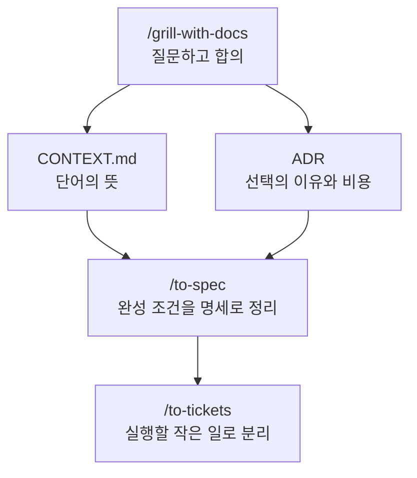

### 사용 전 → 후

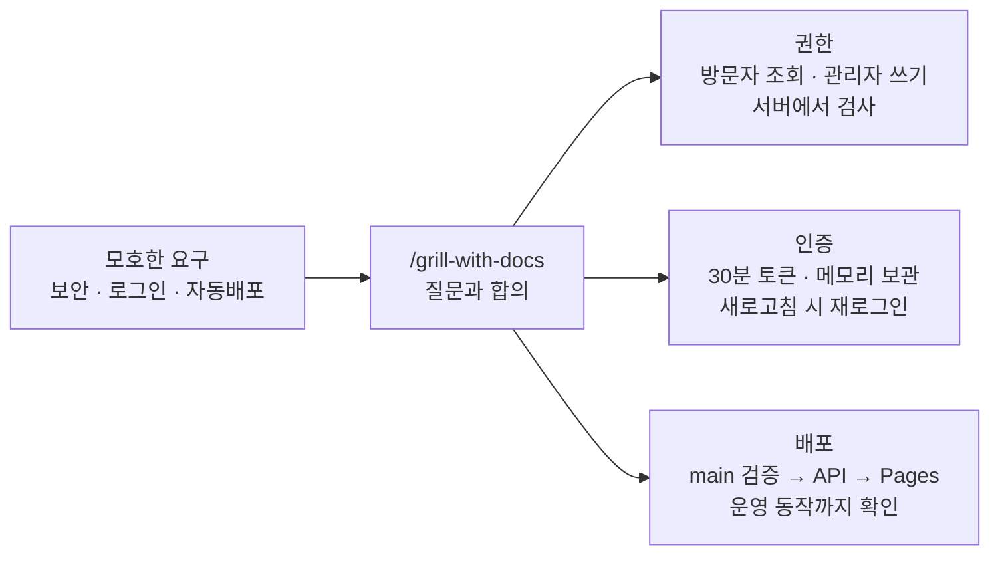

**완료 확인:** 에이전트의 최종 합의 요약을 읽고 “이 조건으로 합의했어. 문서에 반영해줘”라고 답합니다. 아직 앱 구현은 시작하지 않습니다.

## 4강. /to-spec — 함께 정한 기능과 완성 조건을 문서로 남기기

**시작 상태:** 3강에서 기능과 규칙을 합의했습니다. **할 일:** 같은 대화에서 명세 작성을 요청하고 빠진 기능이 없는지 읽습니다. **끝나면:** `.scratch/notice-board/spec.md`가 생깁니다. `.scratch`를 포함한 경로는 에이전트가 만들게 하면 됩니다.

**실제 결과 보기 · [004 커밋](https://github.com/jhs512/2nd-matt-user-guide/commit/004):** 앞에서 정한 규칙이 구현할 기능과 확인 조건으로 정리된 파일입니다. 아래 입력 예시와 실제 명세를 나란히 읽어 보세요. [이전 단계와 비교](https://github.com/jhs512/2nd-matt-user-guide/commit/004)

이렇게 무엇을 만들고 어떤 조건을 만족해야 하는지 적은 문서를 **명세**라고 부릅니다.

`/grill-with-docs`에서 결정한 내용을 `/to-spec`으로 모아 정리합니다. 이 단계는 새 요구사항 인터뷰보다 합의된 내용을 빠짐없이 옮기는 데 집중합니다. 설치된 스킬은 테스트에서 입력과 결과를 확인할 위치를 사용자에게 확인하는 단계도 포함합니다.

> **학교 축제 비유:** 인터뷰가 ‘어떤 매점을 만들지 회의하는 시간’이라면 명세는 ‘음료 3종을 팔고, 가격표가 있으며, 현금 결제가 되면 완성’이라고 쓴 합의서입니다. 완성 조건을 먼저 써야 나중에 ‘이 정도면 끝난 거 아니야?’라는 다툼을 줄일 수 있습니다.
>
> **테스트에서 입력과 결과를 확인할 위치란?** 어디에서 입력하고 어디에서 결과를 확인할지 정하는 것입니다. 자판기를 검사할 때 나사 모양부터 보는 대신 ‘돈을 넣고 버튼을 누르면 맞는 음료가 나오는가’를 확인하는 것과 같습니다. 이 실습에서는 API 요청·응답과 화면 조작을 주요 확인 지점으로 삼습니다.

### 테스트 설명에서 나오는 말

통합 테스트는 여러 부분을 연결해 함께 확인하는 테스트입니다. 브라우저 E2E 테스트는 사람이 화면에서 클릭하듯 실제 화면부터 서버 저장까지 끝에서 끝으로 확인합니다. CRUD는 만들기·읽기·수정·삭제를 묶어 부르는 말입니다.

> **쉬운 비유:** 버튼만 눌리는지 보는 것과, 주문 버튼을 누른 뒤 주방에 주문이 들어가고 결과가 화면에 보이는지 확인하는 것은 다릅니다. E2E는 이 연결된 과정을 따라가 보는 것입니다.

### 입력

```text
/to-spec
```

이 한 줄로 앞서 합의한 기능, API 요청·응답, 관리자 인증, 환경별 DB, CI/CD 완료 기준을 명세로 정리하는 단계에 들어갑니다. 문서 위치는 2강의 설정을 따릅니다. 명세가 구현 파일 목록이나 코드로 대체되지 않았는지 결과를 확인합니다.

테스트 확인 지점을 질문받으면 제안을 읽고 답합니다. 이미 합의한 조건을 다시 작성할 필요는 없습니다. 이 실습에서 확인할 기준은 다음과 같습니다.

| 검증 | 입력하는 곳 | 확인할 결과 |
| --- | --- | --- |
| 백엔드 HTTP 통합 테스트 | Security 필터를 통과하는 HTTP 요청, H2 인메모리 DB | 상태 코드·응답·저장 결과·인증 및 권한 거부 |
| 프론트 사용자 화면 테스트 | 로그인·공지 작성 등의 화면 조작 | 표시 내용·오류 안내·화면 이동 |
| 브라우저 E2E | 실제 백엔드와 H2에 연결한 브라우저 | 화면 조작부터 서버 저장·재조회까지 연결된 동작 |
| 별도 운영 배포 검증 | 배포된 서비스와 PostgreSQL | 마이그레이션 적용·실제 저장·배포 커밋과 서비스 준비 상태 |

H2 테스트 통과가 운영 PostgreSQL 검증을 대신하지 않습니다.

### 결과물 A: 무엇을 만들지 적은 문서의 내용

```markdown
# 공지사항 게시판
Status: ready-for-agent

## Problem Statement
방문자는 최신 안내를 읽고 관리자는 개발자 도움 없이 안내를 관리해야 한다.

## Solution
공개 읽기 화면과 관리자 쓰기 기능을 가진 게시판을 제공한다.

## User Stories
1. 방문자는 최신순 목록에서 공지를 선택할 수 있다.
2. 방문자는 제목과 본문, 작성·수정 시점을 확인할 수 있다.
3. 관리자는 로그인해 공지를 등록할 수 있다.
4. 관리자는 내용을 수정하고 삭제할 수 있다.
5. 관리자는 입력 오류와 인증 만료의 원인을 확인할 수 있다.
6. 운영자는 검증된 main 변경을 자동 배포할 수 있다.

## Implementation Decisions
합의한 권한·API·저장·환경·배포할 때 지킬 약속을 기록한다.

## Testing Decisions
HTTP/H2, 화면, H2 E2E, 운영 PG 검증의 범위를 구분한다.

## Out of Scope
회원가입, 댓글, 첨부, 검색, 초안, 상단 고정, refresh token.

## Further Notes
버전과 외부 서비스의 실제 설정값은 구현·배포 문서에 기록한다.
```

일부 내용 예시입니다. 실제 명세는 페이지 끝 삭제, 만료, 중복 제출, 없는 공지, 실패 중 입력 보존 등 합의한 사례까지 사용자 스토리와 검증 조건으로 포함합니다.

### 명세에서 확인할 것

- 합의한 기능과 제외 범위가 담겼는가?
- 요청·응답, 권한, 실패 상황의 동작이 분명한가?
- 테스트에서 무엇을 입력하고 어떤 결과를 확인할지 정했는가?
- 테스트 통과와 운영 배포 확인을 구분했는가?

구체적인 API와 DB 설계는 프로젝트 명세에서 확인합니다.

### 사용 전 → 후

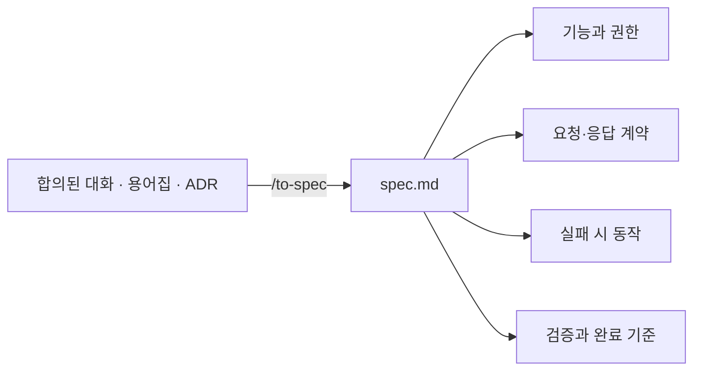

**완료 확인:** 대화의 결정과 명세를 대조합니다. H2 파일/메모리/PG의 구분, 쓰기 권한, 배포 완료 조건이 빠지지 않아야 합니다.

## 5강. /to-tickets — 하나씩 만들고 직접 실행해볼 수 있는 작은 작업으로 나누기

**시작 상태:** 4강의 spec.md를 확인했습니다. **할 일:** 제안한 작업 순서를 읽고 승인합니다. **끝나면:** `.scratch/notice-board/issues/`에 작업별 Markdown 파일이 생깁니다. 여기서 티켓은 유료 이용권이 아니라 ‘할 일 한 장’입니다.

**실제 결과 보기 · [005 커밋](https://github.com/jhs512/2nd-matt-user-guide/commit/005):** 하나의 명세가 조회, 로그인·작성, 수정·삭제, CI, 운영 배포 작업으로 나뉩니다. [첫 번째 티켓](https://github.com/jhs512/2nd-matt-user-guide/blob/005/.scratch/notice-board/issues/01-read-notices.md)을 열면 실제 작업 크기를 볼 수 있습니다. [이전 단계와 비교](https://github.com/jhs512/2nd-matt-user-guide/commit/005)

티켓은 이번에 끝낼 작은 작업과 확인 방법을 적은 카드입니다. 먼저 끝내야 할 티켓은 해당 작업을 시작하기 전에 끝나야 하는 일입니다.

> **학교 축제 비유:** ‘매점 완성’은 너무 큽니다. ‘손님이 음료를 고르고 돈을 내면 음료를 받는다’처럼 실제로 해보고 결과를 확인할 수 있는 작은 일로 나눕니다. ‘예쁜 간판만 만들기’처럼 한 부분만 끝내는 것보다 실제 사용 경로를 하나씩 완성하는 방식입니다. 포스터를 붙이려면 먼저 문구가 정해져야 하는 것처럼 작업에도 선후 관계가 있습니다.

### 입력

```text
/to-tickets
```

명세와 프로젝트 설정을 이어받아 작은 기능 단위, 선후 관계, 완료 조건, 직접 확인할 방법을 제안합니다. 사용자가 이 작성 절차를 호출 뒤에 다시 적을 필요는 없습니다. CI와 운영 배포도 합의한 명세 범위에 따라 포함합니다.

### 예상 분할

| 번호 | 티켓 | 먼저 끝낼 작업 | 완료 후 눈으로 볼 결과 |
| --- | --- | --- | --- |
| 01 | 공개 목록·상세 읽기 | 없음 | local 전용 예제 공지를 UI에서 조회, H2 API 테스트 통과 |
| 02 | 관리자 로그인·공지 등록 | 01 | 로그인 후 작성, 새 공지가 공개 목록에 표시 |
| 03 | 공지 수정·삭제 | 02 | 본문 변경 반영, 삭제 후 목록에서 사라짐 |
| 04 | 코드를 합치기 전 자동 검사 | 03 | GitHub PR에서 백엔드·프론트·E2E 검사 결과 표시 |
| 05 | 운영 DB·자동배포 | 04 | Railway API + PG, Pages UI, main 자동배포 결과 |

01에 프로젝트 초기 구성과 shadcn/ui 설정도 포함합니다. 읽기 기능부터 연결하며, 예제 데이터는 local 프로필 전용으로 운영에 들어가지 않습니다. 04·05는 서버와 자동 검사·배포를 준비하는 티켓이지만 완료 조건이 ‘파일 생성’이 아니라 실제로 확인할 수 있는 검사·배포 결과입니다. 작은 실습이라 앞 작업을 끝내고 다음 작업을 하는 순서를 택한 것이며 항상 순차로 분해해야 하는 것은 아닙니다.

제안된 분할과 순서를 확인하고, 맞으면 짧게 동의합니다. 저장 위치와 티켓 작성 규칙은 프로젝트 설정을 따릅니다.

### 예상 파일 트리

```text
.scratch/notice-board/
├── spec.md
└── issues/
    ├── 01-read-notices.md
    ├── 02-login-and-create.md
    ├── 03-update-and-delete.md
    ├── 04-ci.md
    └── 05-production-deploy.md
```

### 티켓 일부 내용: 등록 기능

```markdown
# 02: 관리자 로그인과 공지 등록

**What to build:** 관리자가 로그인해 공지를 작성하면 방문자가 읽을 수 있다.
**Blocked by:** 01: 공개 목록·상세 읽기
**Status:** ready-for-agent

- [ ] 잘못된 로그인은 401이며 입력 화면에 오류가 표시된다.
- [ ] 관리자는 제목과 본문을 입력하고 저장할 수 있다.
- [ ] 제목·본문 제한을 API와 화면에서 검증한다.
- [ ] 저장 성공 시 상세로 이동하고 공개 목록에 표시된다.
- [ ] 미인증 쓰기는 401, 인증된 비관리자의 쓰기는 403이다.
- [ ] 만료된 토큰은 재로그인 안내로 이어진다.
- [ ] 저장 실패 시 입력을 보존하고 재시도할 수 있다.
- [ ] H2 통합 테스트와 화면 테스트로 위 동작을 확인한다.
```

공개 계정 생성 기능은 없지만, 권한 검사 테스트에서는 관리자 권한이 없는 인증 사용자를 구성해 403을 확인할 수 있습니다.

### 사용 전 → 후

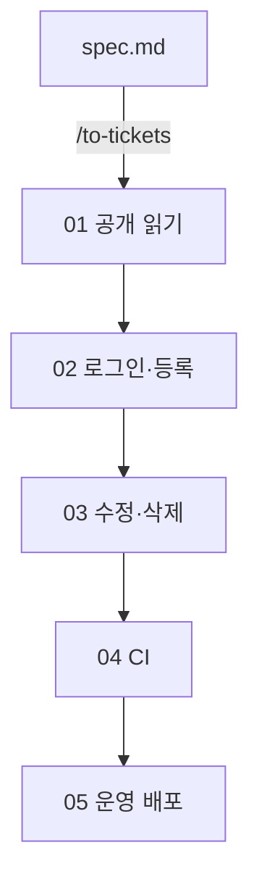

각 티켓에는 파일·완료됐다고 판단할 조건·직접 실행해 확인하는 방법이 있으며, 화살표는 먼저 끝내야 할 티켓의 완료가 필요함을 나타냅니다.

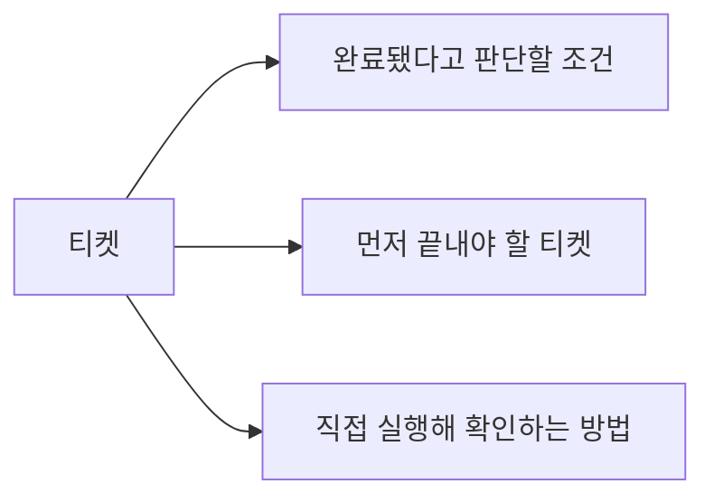

**완료 확인:** 모든 명세 조건이 티켓에 연결되어 있는지 확인합니다. 서로 상대 작업이 끝나기만 기다리는 순서가 되어서는 안 되고, 배포 티켓에는 필요한 계정·변수·검증 방법까지 있어야 합니다.

## 6강. /implement — 모든 티켓 구현하고 배포 결과 확인하기

**시작 상태:** 명세와 티켓 파일이 있습니다. **할 일:** 아래 요청을 같은 대화에 보내 구현과 검사를 맡깁니다. **끝나면:** 실행할 코드와 테스트가 생깁니다. 그 뒤 로컬 화면을 확인하고 배포 준비로 넘어갑니다. 6강은 오래 걸릴 수 있으며 계정 설정이 필요하면 그 지점에서 안내를 따릅니다.

**실제 변화 보기 · [6강 변경 내용 · 006](https://github.com/jhs512/2nd-matt-user-guide/commit/006):** 명세와 티켓이 있던 저장소에 백엔드·프론트·테스트·실행 스크립트·CI가 추가됩니다. [006의 변경 코드](https://github.com/jhs512/2nd-matt-user-guide/commit/006)와 [게시판 화면](https://github.com/jhs512/2nd-matt-user-guide/blob/006/docs/evidence/admin-detail.png)을 확인해 보세요.

`006`는 구현과 검사를 마친 결과입니다. 구현 중 수행하는 테스트·리뷰·수정은 이 단계에 포함됩니다.

이 실습에서는 티켓 분할을 확인할 때 **모든 티켓을 순서대로 구현한다**는 범위까지 정한 뒤 `/implement`를 호출합니다. 특정 티켓만 진행하기로 했다면 그 대상을 이어받습니다. 대상이 여러 개여서 불분명할 때만 티켓을 지정합니다. `/implement-spec`은 여러 에이전트가 각자의 작업 폴더(worktree)에서 나눠 만든 뒤, 변경을 한 브랜치로 모아 검토 요청(PR)을 만드는 방식입니다. 이 실습은 `/implement`로 진행합니다.

> **조립 실습 비유:** `/implement`는 작업 카드를 보고 직접 만들고 시험하는 단계입니다. TDD는 먼저 ‘이 행동이 되어야 한다’는 시험을 만들고, 아직 실패하는지 확인한 뒤, 통과하도록 구현하는 방식입니다. 리뷰는 결과를 다시 살펴 규칙과 약속을 지켰는지 확인하는 과정입니다. 같은 티켓에서 구현 스킬이 이미 테스트와 리뷰를 수행했다면 별도 호출로 반복할 필요는 없습니다.

### 입력

```text
/implement
```

이 호출은 앞서 정한 구현 범위와 명세·티켓의 완료 조건을 이어받습니다. 기술 구성과 테스트 방식을 다시 입력하지 않습니다. 아래 항목은 구현 결과를 확인하는 기준입니다.

- 합의한 백엔드·프론트 구성과 환경별 DB가 적용되고, 사용 버전과 실행 방법이 기록됩니다.
- HTTP 통합 테스트·화면 테스트·실제 백엔드+H2 E2E의 결과가 남습니다.
- 배포가 포함된 티켓은 실제 배포 결과까지 확인합니다.
- 외부 계정이나 설정값이 부족하면 필요한 항목과 남은 배포 검증을 알려줍니다.
- 실제 검증한 티켓만 완료로 기록합니다. 푸시와 최초 운영 배포는 앞서 정한 진행 범위와 설정 상태를 확인합니다.

### 구현 결과 확인

에이전트가 안내한 실행 방법으로 앱을 열고, 티켓에 적힌 행동과 기대 결과를 비교합니다. 코드 파일이 생긴 것만으로 티켓이 완료된 것은 아닙니다.

### 결과물: 화면 변화

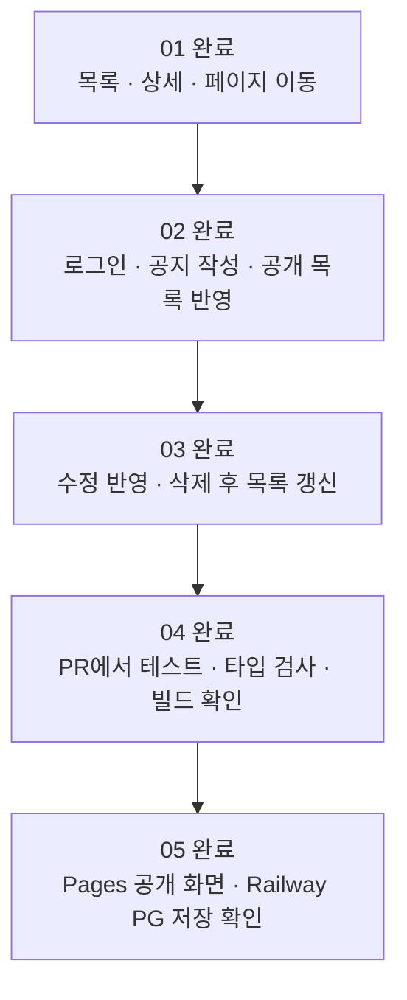

### 직접 확인하고 다음 작업으로 이어가기

공지 작성 티켓이라면 로그인 후 공지를 작성하고, 공개 목록과 상세에 나타나는지 확인합니다. 실패 사례도 티켓의 완료 조건과 대조합니다.

배포가 범위에 포함되어 있다면 실제 배포 결과까지 확인합니다. 계정이나 외부 설정 때문에 막혔을 때는 `/ask-matt`로 다음 단계를 찾고, 사람이 직접 해야 하는 준비가 있으면 `/wizard`의 안내를 받습니다. 구체적인 활용은 아래 추가 워크플로우에서 설명합니다.

실행하지 못한 테스트나 배포는 미완료로 남깁니다. 스킬 호출이 끝났다는 사실과 작업의 완료 조건을 만족했다는 사실을 구분합니다.

### 티켓 완료 표기 예시

```diff
- **Status:** ready-for-agent
+ **Status:** done
- - [ ] 공지 등록 후 공개 목록에서 확인된다.
+ - [x] 공지 등록 후 공개 목록에서 확인된다.
+
+ ## Comments
+ 실제 테스트 명령·결과와 해당 변경 커밋을 기록한다.
```

`done`은 이 튜토리얼에서 추가한 완료 표기입니다. 기본 triage 라벨에 자동으로 포함되는 값이 아닙니다. 외부 설정이 없어 배포하지 못했다면 05를 완료로 바꾸지 않습니다.

## 한눈에 보는 스킬 사용 결과의 차이

| 단계 | 입력 | 결과물 | 아직 없는 것 |
| --- | --- | --- | --- |
| 설치 | 설치 명령 | 사용할 수 있는 스킬 | 프로젝트 규칙 |
| `/setup-matt-pocock-skills` | 저장소와 선호 | 작업 저장 규칙 | 제품 요구사항 합의 |
| `/grill-with-docs` | 게시판 아이디어·사용할 기술과 지켜야 할 조건 | 용어·구체적으로 정한 요구사항·결정 기록 | 통합된 명세 |
| `/to-spec` | 합의된 대화와 문서 | 검증 가능한 spec.md | 구현 단위 |
| `/to-tickets` | 명세 | 작업의 앞뒤 순서·완료됐다고 판단할 조건이 있는 티켓 | 실행되는 기능 |
| `/implement` | 전체 티켓 | 코드·테스트·CI/CD·실행 근거 | 미실행 배포는 별도 미완료 |

## 최종 완료 체크

- [ ] 인터뷰에서 만들 기능과 제외 범위, 완료 기준을 합의했다.
- [ ] 용어와 중요한 결정 이유가 알맞은 문서에 남았다.
- [ ] 명세가 앞선 합의와 일치한다.
- [ ] 티켓에 선후 관계와 확인 가능한 완료 조건이 있다.
- [ ] 구현 결과를 티켓의 조건에 따라 확인했다.
- [ ] 실제 검증 결과와 남은 작업을 기록했다.

## 추가 사항: /ask-matt로 다음 단계 추천받기

어떤 스킬을 써야 할지 기억나지 않으면 현재 작업 중인 대화에서 물어보세요. `/ask-matt`는 상황에 맞는 스킬과 진행 경로를 추천하는 안내 역할입니다. 추천을 확인한 뒤 해당 스킬을 호출해 진행합니다.

```text
/ask-matt 나 이제 뭐해야 해?
```

### 예시 1: setup을 마쳤지만 요구사항이 아직 모호할 때

```text
사용자: /ask-matt 나 이제 뭐해야 해?

예상 추천: 프로젝트 설정은 끝났습니다. 관리자 권한과 로그인 유지,
삭제 정책을 먼저 정리하도록 /grill-with-docs를 추천합니다.
```

추천받은 스킬을 바로 실행합니다.

```text
/grill-with-docs
```

### 예시 2: 인터뷰가 끝났을 때

```text
/ask-matt 나 이제 뭐해야 해?
```

예상 추천은 `/to-spec`입니다. 이어서 입력합니다.

```text
/to-spec
```

### 예시 3: 티켓까지 만들었을 때

```text
/ask-matt 나 이제 뭐해야 해?
```

먼저 해야 하는 작업이 없는 첫 티켓의 `/implement`를 추천받았다면 다음처럼 진행합니다.

```text
/implement
```

첫 티켓 완료 후 다시 `/ask-matt 나 이제 뭐해야 해?`라고 물으면 남은 티켓과 작업의 앞뒤 순서를 바탕으로 다음 단계를 추천받을 수 있습니다. 이 튜토리얼 6강처럼 모든 티켓을 한 번에 지정할 수도 있고, 추천에 따라 하나씩 진행할 수도 있습니다.

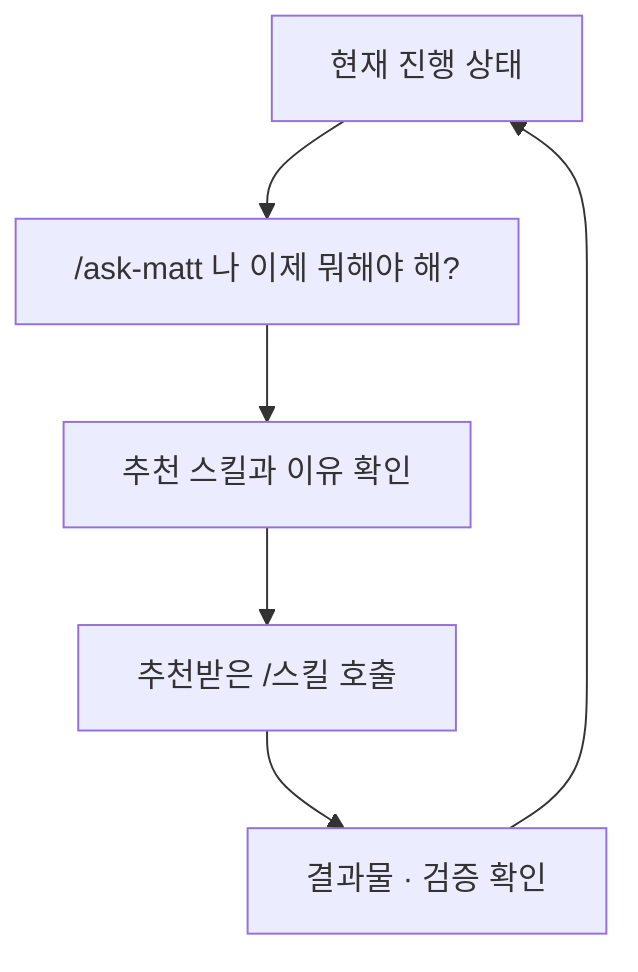

추천은 정해진 답이 아닙니다. 요구가 모호하면 인터뷰, 명세가 준비되면 티켓 분해, 구현 중 오류가 생기면 진단을 추천할 수 있습니다. 새 대화에서는 명세·티켓 경로와 완료한 작업을 함께 알려주면 다음 단계를 판단하기 쉽습니다.

## 그외 워크플로우 10개

**여기는 1강부터 이어서 전부 실행하는 추가 수업이 아닙니다.** 지금 상황에 맞는 예시 하나만 고르세요. 기존 기능을 고치는 예시는 작동하는 게시판 코드가 있어야 하고, 초기 계획 예시는 코드 없이도 시작할 수 있습니다.

**워크플로우는 상황에 맞춰 스킬을 이어 쓰는 순서**입니다. 열 가지를 모두 해야 하는 숙제가 아닙니다. 지금 겪는 상황과 가장 비슷한 하나를 골라 시작하세요.

> **학교생활 비유:** 체육복을 잃어버렸을 때는 ‘마지막으로 본 곳 확인 → 분실물함 확인’을 하고, 축제를 준비할 때는 ‘회의 → 준비물 정리 → 역할 분담’을 합니다. 둘 다 순서가 있지만 목적이 다르듯, 개발도 항상 같은 긴 절차가 필요한 것은 아닙니다.

### 잠깐: 컨텍스트와 용량은 무엇인가요?

**컨텍스트(context)**는 LLM이 지금 답하거나 작업할 때 참고하는 정보입니다. 현재 대화, 작업 지침, 읽어온 코드와 문서, 도구 실행 결과 등이 포함됩니다. 저장소의 모든 파일이 자동으로 전부 들어오는 것은 아닙니다. 필요한 파일을 읽어야 그 내용이 현재 작업에 전달됩니다.

> **책상 비유:** 프로젝트 폴더는 책장이고, 컨텍스트는 지금 책상 위에 펼쳐놓은 자료입니다. 책장에 책이 있다고 모든 페이지를 동시에 보고 있는 것은 아닙니다. `CONTEXT.md`는 책장에 있는 ‘우리 팀 용어 사전’이라는 파일 하나이며, 컨텍스트 전체와 같은 뜻이 아닙니다.

**컨텍스트 창(context window)**은 한 번의 처리에서 다룰 수 있는 정보량의 범위입니다. 보통 **토큰(token)**이라는 단위로 표시합니다. 토큰은 글을 모델이 처리하도록 나눈 조각으로, 한 글자나 한 단어와 항상 같지 않습니다. 한국어·영어·코드에 따라 나뉘는 방식도 달라집니다.

정확한 최대 용량과 실제 사용 가능한 공간은 모델·실행 환경·설정에 따라 달라집니다. ‘항상 몇 글자까지’ 또는 ‘모든 모델은 같은 용량’이라고 외우지 마세요. 사용하는 도구가 제공하는 컨텍스트 사용량·한도·자동 요약 안내를 확인합니다. 구독의 사용량 제한과 한 대화의 컨텍스트 용량도 서로 다른 개념입니다.

> **책상 크기 비유:** 큰 책상에도 책과 공책을 계속 펼치면 새 자료를 놓기 어려워집니다. 긴 로그와 관련 없는 코드까지 쌓으면 중요한 합의를 찾기도 어려워집니다. 그렇다고 책상을 매번 싹 비우면 방금 정한 내용까지 잃습니다. 필요한 자료를 남기고, 작업이 한 단계 끝났을 때 정리하는 것이 좋습니다.

### /handoff, /clear, /compact는 언제 쓰나요?

**`/handoff`는 다음 작업자가 이어받을 수 있도록 인계 문서를 작성하는 스킬**입니다. 현재 목표, 남은 일, 중요한 결정과 기존 자료의 경로를 남깁니다. 설치된 스킬은 운영체제의 임시 폴더에 문서를 저장하며, 다음 대화에서 사용할 추천 스킬도 적습니다. 비밀값은 제외합니다.

> **조별 과제 비유:** 내가 만들던 발표 자료를 친구에게 넘길 때 “3쪽까지 끝냈고, 통계 출처는 이 파일, 4쪽부터 이어서 하면 돼”라는 쪽지를 같이 주는 것입니다. 친구가 자동으로 내 머릿속까지 알게 되는 것은 아니므로 실제 인계 파일을 전달해야 합니다.

**새 대화는 설명을 나누는 공간이고, 새 폴더는 파일을 담는 공간입니다.** 같은 폴더에서 새 대화를 열면 기존 파일을 다시 읽을 수 있습니다. 빈 새 폴더에는 기존 코드도 설치된 프로젝트 패키지도 없습니다. `/handoff`는 코드·패키지·로그인 상태를 복사하지 않습니다. 기존 앱을 다른 폴더에서 실행하려면 코드 복제, 패키지 설치, 필요한 실행 설정까지 별도로 준비해야 합니다. 처음에는 이 이동을 생략하고 같은 프로젝트에서 진행하세요.

`/handoff` 자체는 대화를 지우거나 새 대화를 여는 명령이 아닙니다. **파일 생성 → 경로 확인 → 다른 대화에서 파일 읽기**까지 해야 인계가 됩니다. 임시 파일은 정리될 수 있으므로 장기 보관할 결정은 ADR·명세·티켓에 남깁니다. 다른 PC로 넘기면 내 PC의 경로만 알려주지 말고 파일과 참조 자료에 접근할 수 있게 전달해야 합니다.

| 선택 | 하는 일 | 쓰기 좋은 시점 |
| --- | --- | --- |
| 계속 진행 | 지금 대화의 맥락을 유지 | 다음 단계에 방금 논의가 필요하고 공간도 충분할 때 |
| `/handoff` | 이동 가능한 인계 문서 작성 | 다른 폴더·도구·사람에게 작업을 넘길 때 |
| `/clear` 또는 새 대화 | 현재 작업에서 쓸 대화 맥락을 새로 시작 | 필요한 정보가 문서에 남았고 이전 대화가 더는 필요 없을 때 |
| `/compact` 또는 도구의 요약 기능 | 필요한 맥락을 요약해 이어가기 | 같은 작업을 계속하지만 공간을 정리해야 할 때 |

**`/clear`와 `/compact`는 여기서 Matt 스킬 이름이 아니라 사용하는 도구의 대화 관리 기능을 가리킵니다.** 지원 여부와 동작은 도구마다 다릅니다. 해당 명령이 없다면 새 대화·요약 기능을 사용하고, 존재하지 않는 명령을 억지로 실행하지 않습니다. `/clear`가 프로젝트 파일을 지운다는 뜻은 아닙니다.

> **정리 비유:** `/handoff`는 친구에게 줄 인계 쪽지, `/compact`는 내가 계속 쓸 핵심 요약, `/clear`는 지금 펼친 대화 자료를 치우고 새 작업을 시작하는 것에 가깝습니다. 요약에는 빠지는 내용이 있을 수 있으므로 정확한 결정은 원본 문서로 확인합니다.

### 이 튜토리얼에서는 언제 대화를 바꾸나요?

1. **인터뷰 → 명세 → 티켓:** 가능한 한 같은 대화에서 이어갑니다. 아직 문서에 반영하지 않은 합의가 있으므로 중간에 `/clear`를 하지 않습니다.
2. **시제품 실험:** 아래 3번처럼 같은 프로젝트와 대화에서 진행합니다. 새 폴더·새 대화·`/handoff`·`/clear`가 필수 준비 단계는 아닙니다.
3. **티켓 하나의 구현·검증 완료 후:** 다음 티켓이 필요한 정보를 명세·티켓·커밋으로 모두 갖췄다면 새 대화나 지원되는 `/clear`로 시작할 수 있습니다. 검증 중인 작업을 끊어서 비우지는 않습니다.
4. **티켓 작성 전부터 대화가 너무 길어진 경우:** 합의된 내용을 먼저 문서에 반영하고 단계가 끝나는 지점에서 요약합니다. 다음 단계에 필요한 결정·미결정 질문·문서 경로를 보존합니다.

새 대화 또는 `/clear` 이후에는 다음처럼 실제 경로를 알려줍니다.

```text
.scratch/notice-board/spec.md와
.scratch/notice-board/issues/02-login-and-create.md를 읽어줘.
01 티켓은 구현·검증을 마쳤어. 해당 완료 기록도 확인해줘.
CONTEXT.md와 관련 ADR을 읽고 02 티켓을 시작하기 전에 갖춰야 할 조건을 확인한 뒤 진행해줘.
```

아래 표의 열 가지 흐름마다 `/clear`를 넣지 않은 이유는 **대화 초기화가 의무 단계가 아니기 때문**입니다. 필요한 맥락이 기록되어 있는지, 다음 단계가 그 맥락을 필요로 하는지 보고 결정합니다.

### 워크플로우를 실행하는 방법

**공통 준비:** 스킬이 설치된 에이전트에서 대상 프로젝트 폴더를 엽니다. “기존 공지”, “수정”, “오류”가 나오는 예시는 이미 만든 게시판이 있어야 합니다. 요청 안의 `[실제 경로]` 같은 표시는 그대로 입력하지 않고 본인의 파일 경로로 바꿉니다. 경로를 모르면 먼저 에이전트에게 찾아 달라고 하세요.

아래의 `A → B`는 **A의 결과를 확인한 다음 B를 호출한다**는 뜻입니다. 화살표 전체를 터미널에 붙여 넣지 않습니다. 각 `/스킬`은 에이전트 대화창에서 따로 실행합니다.

- 프로젝트의 첫 엔지니어링 작업 전에는 `/setup-matt-pocock-skills`를 실행합니다. 이미 설정한 저장소에서는 아래 경로의 setup을 반복하지 않습니다.
- 1강 명령으로 Matt Pocock 저장소의 전체 스킬을 Codex·Claude Code에 전역 설치합니다. 아래에는 1강의 소개 표에 없는 스킬도 등장하지만 별도로 골라 설치할 필요는 없습니다. 나중에 추가된 스킬이 필요하면 같은 전체 설치 명령을 다시 실행합니다.
- 인터뷰 → 명세 → 티켓은 가능한 한 같은 대화에서 이어가 합의 내용을 유지합니다. 구현을 새 대화에서 할 때는 명세·티켓 경로를 전달합니다.
- `/implement`는 테스트와 리뷰를 포함하는 흐름입니다. 표에서 리뷰를 따로 쓰지 않았다고 검증을 생략하는 뜻은 아닙니다.
- 아래 대화는 추천 예시입니다. 실제 `/ask-matt`는 대화와 파일의 현재 상태를 보고 다른 경로를 제안할 수 있습니다.

| 번호 | 이런 상황이면 선택 | 핵심 결과 |
| --- | --- | --- |
| 1 | 새 앱을 처음부터 만들고 싶다 | 명세·티켓·동작하는 앱 |
| 2 | 기존 앱의 작은 동작 하나를 바꾸고 싶다 | 필요한 만큼만 수정한 기능 |
| 3 | 화면이 어떤 게 좋은지 말로 결정하기 어렵다 | 실제로 눌러본 시제품과 결정 |
| 4 | 어떤 기술·서비스가 가능한지 모르겠다 | 근거 있는 조사와 구현 계획 |
| 5 | 다른 사람이 요청한 일이 쌓였다 | 정리된 요청과 처리할 작업 |
| 6 | 잘되던 기능이 고장 났다 | 재현·원인·수정·재발 방지 테스트 |
| 7 | 코드를 바꿀 때마다 여러 곳이 깨진다 | 구조 개선 계획과 검증된 변경 |
| 8 | 실제 사용자의 답이 없어서 결정을 못 한다 | 질문지·답변·합의된 명세 |
| 9 | 너무 큰 프로젝트라 무엇부터 정할지 모르겠다 | 결정 지도와 구현 가능한 계획 |
| 10 | 완성 직전인데 사람만 할 수 있는 설정이 남았다 | 설정 안내와 실제 배포 확인 |

### 1. 학교 축제 공지 게시판을 처음부터 만들기

**상황:** “반 친구들이 축제 공지를 볼 사이트가 필요해. 선생님만 공지를 올리면 좋겠어.” 아직 화면도 코드도 없습니다.

**순서:** `/setup-matt-pocock-skills` → `/grill-with-docs` → `/to-spec` → `/to-tickets` → `/implement`

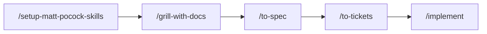

**왜 쓰나요?** ‘선생님만 작성’이라는 말에도 계정 수, 로그인 유지, 수정·삭제, 공개 시점 같은 질문이 숨어 있습니다. 먼저 합의하고, 완성 조건을 쓴 뒤, 작은 기능으로 나눠야 엉뚱한 게시판을 만드는 일을 줄일 수 있습니다.

> **축제 준비 비유:** 장소와 기록 규칙을 정하고 → 어떤 부스를 할지 회의하고 → 완성 조건을 쓰고 → 역할 카드를 나누고 → 실제로 준비하는 순서입니다.

**바로 물어보기:**

```text
/ask-matt 나 이제 뭐해야 해?
학교 축제 공지 게시판을 처음 만들 거야.
방문자는 읽고 관리자 한 명만 쓰게 하고 싶어. 아직 코드는 없어.
```

setup 추천을 받았다면 `/setup-matt-pocock-skills`부터 실행합니다. 설정이 끝나면 3강의 `/grill-with-docs` 요청을 이어갑니다.

**끝나면:** 명세에 적힌 등록·조회·수정·삭제가 실행되고, 티켓별 검증 결과가 남습니다. 계정 설정 때문에 배포가 안 됐다면 앱 구현과 배포 완료를 구분합니다.

### 2. 공지 제목이 너무 길 때 오류를 보여주기

**상황:** 게시판은 이미 있습니다. 제목을 100자보다 길게 쓰면 친절한 안내를 보여주고 싶습니다. 한 번의 대화에서 끝낼 수 있을 만큼 범위가 작습니다.

**순서:** `/grill-with-docs` → `/implement`

```text
/grill-with-docs
공지 제목을 앞뒤 공백 제거 후 1–100자로 제한하고 싶어.
길이 계산, 화면 안내 위치, API 오류 응답을 짧게 확인해줘.
기존 규칙과 충돌하는지도 확인해줘.
```

인터뷰에서 100자 허용·101자와 빈 제목 거부·실패 시 본문 보존까지 확인한 뒤:

```text
/implement
```

**왜 쓰나요?** 작은 변경까지 무조건 큰 명세와 여러 티켓으로 나누면 준비가 작업보다 커질 수 있습니다. 범위가 확실하고 한 대화에서 구현·검증할 수 있으면 짧은 경로가 적합합니다. 예상보다 복잡해지면 명세·티켓 경로로 옮깁니다.

> **학교생활 비유:** 안내문의 날짜 한 줄을 고치는 일에 축제 전체 회의를 다시 열 필요는 없습니다. 다만 날짜가 맞는지와 다른 안내문도 함께 바뀌어야 하는지는 확인해야 합니다.

**끝나면:** 제한을 넘긴 입력은 저장되지 않고 화면에 이유가 보입니다. 테스트가 100자와 101자처럼 허용되는 길이의 바로 안쪽과 바깥쪽을 확인합니다.

### 3. 목록을 표로 할지 카드로 할지 직접 보고 고르기

**상황:** 6강까지 진행해 공지 목록을 열 수 있습니다. 이제 표와 카드 중 휴대폰에서 읽기 편한 것을 직접 비교하고 싶습니다.

**시작 조건:** 기존 게시판 프로젝트가 열려 있고 로컬 실행 방법을 알고 있습니다. **아직 코드가 없다면** 1번 워크플로우로 기본 게시판을 먼저 만드세요. 빈 폴더에서 같은 화면이 저절로 재현되는 것은 아닙니다.

**순서:** `/grill-with-docs` → `/prototype` → 직접 비교·선택 → `/to-spec` → `/to-tickets` → `/implement`

**작업 장소:** 기존 프로젝트, 같은 대화에서 계속합니다. 새 폴더를 만들거나 `/handoff`, `/clear`를 실행하지 않습니다.

**왜 쓰나요?** 글로는 고르기 어려운 화면을 실제로 눌러보고 결정하기 위해서입니다. 기존 글꼴·버튼·전체 배치 안에서 비교하면 우리 앱에 어울리는지도 알 수 있습니다.

> **쉬운 비유:** 교실 게시판을 새로 만들기 전에 같은 게시판에 두 가지 종이 배치를 대어 봅니다. 실험하러 다른 학교로 옮길 필요가 없습니다.

**① 같은 대화에서 비교 기준을 정합니다.**

```text
/grill-with-docs
지금 프로젝트의 공지 목록을 표와 카드 중 어떤 방식으로 바꿀지 정하고 싶어.
현재 화면과 실행 방법을 먼저 확인해줘.
휴대폰에서 긴 제목과 날짜가 읽기 쉬운지가 중요해.
두 화면에서 함께 사용할 공지와 비교 기준을 정해줘.
아직 화면 코드를 수정하지 마.
```

**② 기준을 합의한 뒤, 같은 대화에서 실험을 요청합니다.** 코드 수정과 실행 준비는 에이전트가 수행합니다. 브랜치는 같은 프로젝트의 변경을 별도로 보관하는 작업 갈래입니다. 폴더를 새로 만드는 것과 다릅니다.

```text
/prototype
방금 합의한 기준으로 기존 공지 목록에서 표와 카드 두 가지를 비교해줘.
현재 변경 내용을 먼저 확인하고 보존한 뒤 실험용 브랜치에서 작업해줘.
브랜치를 만들고 전환하는 과정은 네가 진행해줘.
기존 화면 구조와 글꼴·버튼을 활용하고 두 안을 쉽게 전환할 수 있게 해줘.
비교할 데이터가 부족하면 같은 가상 공지 12개를 메모리에 준비해줘.
긴 제목도 넣고 운영 DB에는 실험 데이터를 저장하지 마.
새 서버·로그인 기능은 만들지 마.
준비가 끝나면 내가 실행할 명령, 실행할 폴더, 열 주소를 알려줘.
기존 서버가 필요하면 어떤 터미널을 켜 두어야 하는지도 알려줘.
```

**③ 안내받은 주소를 열어 직접 봅니다.** 별도의 명령이 필요하면 안내받은 폴더에서 실행합니다. 브라우저 창을 휴대폰 정도로 좁혀 보고 같은 공지를 표와 카드로 전환합니다. 이것은 좁은 화면 폭의 비교이며 실제 휴대폰 기기 검사를 대신하지는 않습니다.

| 직접 확인 | 판단할 내용 |
| --- | --- |
| 긴 제목 읽기 | 잘린 글 때문에 공지 내용을 구분하기 어려운가? |
| 날짜 찾기 | 제목과 날짜의 관계가 바로 보이는가? |
| 목록 훑기 | 여러 공지를 빠르게 비교할 수 있는가? |
| 공지 선택하기 | 누를 곳이 작거나 서로 붙어 있지 않은가? |

**④ 선택과 이유를 같은 대화에 남깁니다.** 아래 선택은 예시입니다. 실제로 본 결과에 맞춰 바꿉니다.

```text
좁은 화면에서는 카드형을 선택할게.
긴 제목과 날짜를 구분하기 더 쉬웠어.
이 선택과 실제 확인한 범위, 아직 확인하지 못한 점을 기록해줘.
시제품은 실험 브랜치에 보관하고, 결과를 참조할 경로를 남겨줘.
원래 작업 브랜치로 안전하게 돌아가는 과정까지 진행해줘.
실험용 화면이 운영에 그대로 포함되지 않게 해줘.
```

**⑤ 기존 명세에 변경을 반영합니다.** 새 게시판 전체를 다시 만드는 요청이 아닙니다.

```text
/to-spec
```

이번 작업 범위는 선택한 목록 화면의 변경입니다. 기존 완료 티켓은 유지하고 실험용 화면 전환 도구는 운영 구현에 포함하지 않는다는 조건을 명세에서 확인합니다. 그런 다음 아래를 **하나씩** 실행합니다.

```text
/to-tickets
```

```text
/implement
```

**끝나면:** 실험에서 고른 화면이 실제 게시판에 반영되고, 선택 이유와 검증 결과가 남습니다. 시제품과 운영용 구현은 구분합니다.

### 4. 배포 서비스에서 무엇이 가능한지 조사한 뒤 결정하기

**상황:** “Railway와 Pages를 같이 써도 로그인과 자동배포가 될까?” 아직 서비스 제약을 잘 모릅니다.

**순서:** `/research` → `/grill-with-docs` → `/to-spec` → `/to-tickets` → `/implement`

```text
/research
공지사항 게시판을 Railway API와 Cloudflare Pages로 나눠 배포하려고 해.
GitHub Actions 배포 방법, 환경변수 주입 시점, 서로 다른 도메인의
인증 연결 제약을 공식 문서로 조사해줘.
확인 날짜와 출처 링크를 포함한 Markdown 파일로 남겨줘.
```

조사 결과를 확인한 다음:

```text
/grill-with-docs
방금 작성한 조사 문서를 기준으로 배포와 인증 방식을 결정하자.
확인된 서비스 제약과 내가 선택해야 하는 조건을 구분해줘.
```

**왜 쓰나요?** 모르고 있는 사실은 조사하고, 선택해야 할 것은 함께 결정해야 합니다. ‘공식적으로 가능한가?’와 ‘우리 프로젝트에서 이 방식을 쓸까?’는 서로 다른 질문입니다.

> **수학여행 비유:** 버스 출발 시간과 입장 가능 인원은 찾아볼 사실입니다. 박물관과 과학관 중 어디에 갈지는 조사 후 반에서 정할 선택입니다.

**끝나면:** 출처가 있는 조사 문서와 그 결과를 반영한 결정·명세가 남습니다. 조사가 끝났다고 앱까지 만들어진 것은 아닙니다.

### 5. 친구들이 남긴 요청을 정리하고 처리하기

**상황:** “휴대폰에서 글자가 잘려요”, “검색이 있으면 좋겠어요”, “로그인이 안 돼요” 같은 요청이 한꺼번에 들어왔습니다.

**순서:** `/triage` → 필요한 정보 보완 → 준비된 티켓 `/implement`

```text
/triage
다른 사용자가 등록한 게시판 요청들을 분류해줘.
정보가 부족한 요청과 바로 구현 가능한 요청을 구분하고,
현재 프로젝트의 라벨 규칙을 사용해줘.
```

**왜 쓰나요?** ‘로그인이 안 돼요’만으로는 비밀번호 오류인지 서버 장애인지 알 수 없습니다. 먼저 정보를 보완해야 하는 요청과 바로 실행할 수 있는 요청을 나눕니다.

> **보건실 비유:** 들어온 학생을 모두 같은 순서로 치료하기 전에 무슨 일이 있었는지 듣고 필요한 처치를 구분합니다. 요청을 분류하는 단계이지 모든 문제를 그 자리에서 구현하는 단계는 아닙니다.

구현 준비가 끝난 실제 티켓 경로를 지정해 실행합니다.

```text
/implement
```

**끝나면:** 요청마다 현재 상태와 필요한 후속 행동이 보이고, 준비된 요청부터 구현합니다. `/to-tickets`가 만든 티켓은 이미 실행 가능한 형태이므로 다시 triage할 필요가 없습니다.

### 6. 공지 수정 버튼을 눌렀는데 500 오류가 날 때

**상황:** 어제는 됐는데 오늘은 수정 저장이 실패합니다. 화면만 보고는 왜 그런지 모릅니다.

**순서:** `/diagnosing-bugs` → 오류 재현 → 원인 확인 → 수정·같은 오류가 다시 생기지 않는지 확인하는 테스트

여기서 ‘재현 → 원인 확인 → 수정’은 `/diagnosing-bugs` 안에서 진행하는 단계입니다. 각각이 별도의 스킬 이름은 아닙니다.

```text
/diagnosing-bugs
관리자로 로그인해서 기존 공지 제목을 수정하고 저장하면 500이 나.
같은 문제를 다시 확인할 수 있는 테스트나 명령부터 확보해줘.
실제 요청과 오류 로그를 근거로 원인을 좁히고 수정해줘.
확인된 사실과 아직 추측인 원인을 구분해줘.
```

**왜 쓰나요?** 원인을 모른 채 여러 곳을 고치면 우연히 잠깐 해결되거나 다른 기능이 깨질 수 있습니다. 같은 실패를 반복 확인할 방법이 있어야 수정 전과 후를 비교할 수 있습니다.

> **자전거 비유:** 자전거가 덜컹거린다고 바퀴·브레이크·안장을 모두 바꾸지 않습니다. 어느 상황에서 소리가 나는지 재현하고 느슨한 부분을 찾은 뒤 고칩니다. 같은 오류가 다시 생기지 않는지 확인하는 테스트는 나중에 같은 나사가 다시 풀리지 않았는지 확인하는 점검표입니다.

**끝나면:** 같은 재현 절차가 수정 전에는 실패하고 수정 후에는 통과합니다. 단순한 새 기능 요청처럼 인터뷰부터 전부 다시 시작할 필요는 없습니다.

### 7. 작은 수정인데 다섯 군데를 고쳐야 할 때

**상황:** 제목 제한을 바꿀 때마다 화면·API·여러 서비스에서 같은 숫자를 고칩니다. 한 군데를 빠뜨리면 오류가 생깁니다.

**순서:** `/improve-codebase-architecture` → `/grill-with-docs` → `/to-spec` → `/to-tickets` → `/implement`

```text
/improve-codebase-architecture
공지 제목 검증을 바꿀 때 여러 곳을 수정해야 해.
현재 코드에서 책임이 흩어졌거나 중복된 부분을 찾아
구조 개선 후보와 이유를 보여줘.
```

후보를 확인하고 고른 다음:

```text
/grill-with-docs
방금 제안한 공지 검증 구조 개선을 구체화하자.
사용자가 보는 동작은 유지하고 내부 구조를 정리하고 싶어.
어떤 책임을 모으고 무엇을 테스트로 보장할지 합의해줘.
```

**왜 쓰나요?** 고장이 날 때마다 복사된 코드를 하나씩 고치는 대신, 변경이 어려운 구조 자체를 살펴볼 수 있습니다. 개선 후보를 찾는 단계와 실제 구조를 바꾸는 단계를 구분합니다.

> **교실 정리 비유:** 가위를 찾을 때마다 다섯 서랍을 뒤지는 상황이라면 매번 빨리 찾는 연습만 할 것이 아니라 공용 가위를 둘 장소와 관리 규칙을 정하는 편이 낫습니다.

**끝나면:** 같은 사용자 동작이 유지된다는 검증과 함께 변경 지점이 명확해집니다. 단순히 파일 수가 줄었다고 무조건 좋은 구조는 아닙니다.

### 8. 선생님이 답해줘야 요구사항을 정할 수 있을 때

**상황:** 공지를 누가 올리고, 누가 삭제할지 개발자인 내가 결정할 수 없습니다. 실제 사용하는 선생님의 답이 필요합니다.

**순서:** `/to-questionnaire` → 사용자 답변 수집 → `/grill-with-docs` → `/to-spec` → `/to-tickets` → `/implement`

```text
/to-questionnaire
게시판을 사용할 선생님께 질문지를 드리려고 해.
누가 공지를 작성·삭제하는지, 삭제 복구가 필요한지,
공지 수정 내역을 남겨야 하는지 결정에 필요한 질문을 정리해줘.
먼저 질문 대상과 질문지의 목적을 나와 확인해줘.
질문지는 작성만 하고 전송하지 마.
```

답을 받은 후:

```text
/grill-with-docs
선생님이 보내준 답변을 기준으로 게시판 요구사항을 정리하자.
답변끼리 충돌하거나 아직 모호한 부분을 확인해줘.
```

**왜 쓰나요?** 실제 운영자가 결정할 일을 AI나 개발자가 추측해서 정하면 나중에 다시 만들게 됩니다. 질문지를 작성하는 것과 답을 얻는 것은 별도 단계입니다.

> **학교생활 비유:** 반 티셔츠를 주문할 때 내 생각으로 친구들의 사이즈를 정하지 않습니다. 필요한 항목을 설문으로 받고 빠진 응답을 확인한 뒤 주문합니다.

**끝나면:** 실제 사용자의 답을 근거로 명세를 작성할 수 있습니다. 답변이 도착하지 않았다면 그 결정은 아직 미완료입니다.

### 9. 학교 전체 서비스를 만들려는데 너무 막막할 때

**상황:** 게시판뿐 아니라 급식, 동아리, 상담, 출결까지 한꺼번에 만들고 싶습니다. 어느 문제부터 결정해야 할지도 모르겠습니다.

**순서:** `/setup-matt-pocock-skills` → `/wayfinder` → `/to-spec` → `/to-tickets` → `/implement`

```text
/wayfinder
학교 공지, 동아리 신청, 상담 예약을 연결하는 서비스를 생각 중이야.
한 번에 전부 구현하지 말고 먼저 결정해야 할 문제의 지도를 만들어줘.
사용자·권한·데이터 공유·첫 출시 범위를 순서대로 정하고 싶어.
```

**왜 쓰나요?** 한 대화에 담기 어려울 정도로 큰 문제는, 바로 구현 티켓으로 나누기 전에 무엇을 결정해야 하는지부터 정리해야 합니다. `/wayfinder`가 만드는 것은 우선 **결정의 지도**이며 완성된 앱이 아닙니다.

> **여행 비유:** 목적지도 경유지도 모르는 상태에서 ‘매일 몇 시에 어디를 걸을지’ 정할 수 없습니다. 먼저 지역과 이동 순서를 고른 뒤 하루 계획을 짭니다.

길이 정리되면 `/to-spec`으로 연결된 결정을 구현 가능한 명세로 모으고, `/to-tickets`로 나눕니다. 결정 카드들을 곧바로 구현 카드처럼 사용하지 않습니다.

**끝나면:** ‘학교 서비스 전부’라는 막연한 목표가 ‘첫 출시는 공지와 동아리 신청’처럼 범위와 이유가 있는 계획이 됩니다. 작은 공지 게시판만 만들 때는 1번이 더 적합합니다.

### 10. 코드가 끝났는데 계정·배포 설정에서 막혔을 때

**상황:** 로컬 앱과 테스트는 되지만 Railway 계정 연결이나 Cloudflare 토큰 발급처럼 사람이 직접 처리해야 하는 단계가 남았습니다.

**순서:** `/implement` 중 누락 설정 확인 → `/wizard` → 설정 완료 → `/implement` 재개·배포 검증

```text
/ask-matt 나 이제 뭐해야 해?
앱 구현과 로컬 테스트는 끝났고 배포 티켓만 남았어.
외부 서비스 계정 승인과 배포 토큰 설정이 필요하대.
에이전트가 할 수 있는 작업과 내가 직접 해야 하는 작업을 구분해줘.
```

`/wizard`를 추천받았고 실제로 사람이 해야 하는 일이 남았다면:

```text
/wizard
배포 티켓에서 내가 직접 해야 하는 계정 승인과 토큰 설정만
한 단계씩 따라갈 수 있는 안내로 만들어줘.
각 단계의 목적과 성공 확인 방법을 설명하고,
비밀값은 채팅에 붙여 넣지 않고 필요한 저장 위치에 설정하게 해줘.
Windows를 사용하니 Bash 실행 환경이 필요한지도 먼저 확인해줘.
```

**왜 쓰나요?** 계정 승인이나 실제 계정·토큰 입력은 코드 작성과 다른 종류의 작업입니다. 설정을 ‘알아서 됐겠지’라고 넘기지 않고 필요한 값과 위치를 정확히 확인합니다. 에이전트가 직접 할 수 있는 일에는 이 우회 단계를 추가하지 않습니다.

> **학교 방송 비유:** 방송 원고와 장비 점검이 끝나도 방송실 열쇠를 가진 선생님의 승인이 필요할 수 있습니다. 열쇠를 받는 절차와 방송을 실제로 내보내는 절차를 구분하는 것입니다.

`/wizard`는 설치된 스킬 기준으로 Bash 안내 스크립트를 생성하는 도구입니다. Windows PowerShell에서 그대로 실행된다고 가정하지 않습니다. 설정을 끝내면 남은 티켓을 지정해 `/implement`를 재개하고 실제 배포·공개 화면·DB 저장 결과를 확인합니다.

**끝나면:** 설정값이 필요한 곳에 들어가고 배포가 확인됩니다. 안내 파일만 생성됐다면 아직 배포 완료가 아닙니다.

### 열 가지 중에서도 못 고르겠다면

아래 네 줄이면 시작할 수 있습니다. 대괄호 부분을 지금 상황으로 바꾸세요.

```text
/ask-matt 나 이제 뭐해야 해?
만들고 싶은 것: [예: 학교 축제 공지 게시판]
끝낸 것: [예: setup과 요구사항 인터뷰]
막힌 것: [예: 명세를 만들지, 화면부터 실험할지 모르겠어]
쉬운 비유로 추천 이유를 설명하고 다음에 복사할 명령을 알려줘.
```

추천을 받으면 **왜 이 단계인지 읽고 → 추천 스킬을 실행하고 → 결과물을 확인**합니다. 어려운 말 때문에 멈췄다면 `/wait-what`으로 방금 설명을 쉽게 다시 풀어달라고 요청할 수도 있습니다.

```text
/wait-what
방금 말한 '테스트에서 입력과 결과를 확인할 위치'와 '먼저 끝내야 할 티켓'을
공지사항 게시판의 실제 예와 학교생활 비유로 다시 설명해줘.
```


## 이 매뉴얼을 실제로 실행해 본 결과

### 강좌 번호와 같은 커밋 번호

**2강은 002, 3강은 003처럼 강좌 번호와 태그 번호가 같습니다.** 커밋 링크를 열면 해당 강에서 추가하거나 바꾼 파일이 바로 보입니다. 초록색은 추가, 빨간색은 삭제입니다.

> **쉬운 비유:** 교과서의 강 번호와 실습 결과물의 이름표를 같게 붙였습니다. 4강을 읽고 `004`를 열면 그 강에서 만든 명세가 보입니다.

| 태그 | 수업 | 결과 | 해당 강의 변경 내용 |
| --- | --- | --- | --- |
| 002 | 2강 · 하네스 세팅 | 작업 규칙과 에이전트 안내 | [002 커밋](https://github.com/jhs512/2nd-matt-user-guide/commit/002) |
| 003 | 3강 · 요구사항 정리 | CONTEXT.md와 ADR | [003 커밋](https://github.com/jhs512/2nd-matt-user-guide/commit/003) |
| 004 | 4강 · 명세 | 기능·완성 조건을 담은 spec.md | [004 커밋](https://github.com/jhs512/2nd-matt-user-guide/commit/004) |
| 005 | 5강 · 티켓 | 작업 5개와 실행 순서 | [005 커밋](https://github.com/jhs512/2nd-matt-user-guide/commit/005) |
| 006 | 6강 · 구현·검사·배포 | 게시판 코드·테스트·CI·배포 설정과 공개 결과 | [006 커밋](https://github.com/jhs512/2nd-matt-user-guide/commit/006) |

설치는 PC 환경에 적용되므로 별도 코드 커밋이 없습니다. 실제 앱의 실행·배포 방법과 검증 기록은 별도 저장소에서 확인합니다.

[실행 프로젝트 안내](https://github.com/jhs512/2nd-matt-user-guide#readme) · [운영 상태와 증거](https://github.com/jhs512/2nd-matt-user-guide/blob/main/docs/production-status.md)
